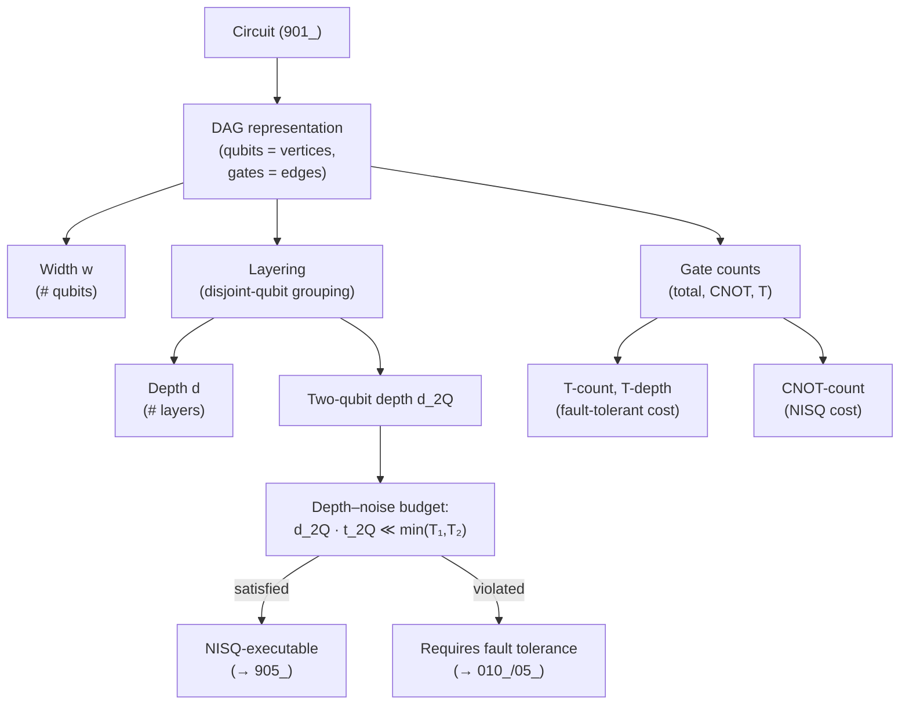

# QCSAA 900-909 · Section 00 · Subsection 030 · Subsubject 902 — Circuit Depth, Width and Parallelism

## 1. Purpose

Defines the **structural resource metrics** of a quantum circuit — depth, width, gate count (total and per-type, including the binding T-count and CNOT-count), critical path, and the parallelism that converts gate count into time — and establishes the relationship between these metrics and the per-gate budget exported by [`../020_gates/05_Gate-Implementation-Calibration-and-Error-Characterization.md`](../020_gates/05_Gate-Implementation-Calibration-and-Error-Characterization.md). These metrics are what every downstream resource estimate ultimately consumes; this subsubject is the slot where the program's "how big and how long" arguments land.

## 2. Scope

- Covers the *Circuit Depth, Width and Parallelism* subsubject (`902`) of subsection `030` *circuits* within section `00` *Fundamentos de Computación Cuántica*.
- Inherits Q-Division authority and ORB support from the parent row in [`../../README.md` §3](../../README.md#3-architecture-table)[^archtable].
- Concepts in scope:
  - **Width** $w$ — the number of qubits the circuit acts on (the size of the register defined in [`../010_Qubits/01_`](../010_Qubits/01_Qubit-Definition-and-Mathematical-Formalism.md)). Width is the **space** dimension of circuit cost; it is bounded by the number of physical qubits available on the target device, possibly inflated by the physical-to-logical ratio of [`../010_Qubits/05_Logical-Qubits-Encoding-and-Error-Correction.md`](../010_Qubits/05_Logical-Qubits-Encoding-and-Error-Correction.md).
  - **Depth** $d$ — the length of the longest path of dependent gates in the circuit's directed-acyclic-graph (DAG) representation, measured in **layers** of gates that act on disjoint qubits and can therefore execute in parallel. Depth is the **time** dimension of circuit cost; multiplied by the per-layer execution time of [`../020_gates/05_`](../020_gates/05_Gate-Implementation-Calibration-and-Error-Characterization.md), it gives wall-clock circuit duration.
  - **Two-qubit (entangling) depth.** A separate count of the depth restricted to two-qubit gates only. On every modality of [`../020_gates/05_`](../020_gates/05_Gate-Implementation-Calibration-and-Error-Characterization.md) the two-qubit gates are an order of magnitude slower and lower-fidelity than the one-qubit gates, so the two-qubit depth — not the total depth — is the **binding** wall-clock and noise driver.
  - **Gate counts (total and per-type).**
    - **Total gate count** $G$ — overall number of gate operations.
    - **CNOT count** (or two-qubit-gate count more generally) — drives the dominant noise contribution on every modality and is the standard cost metric for compiler benchmarks.
    - **T-count** — number of $T$ gates in a Clifford+T decomposition; the binding cost metric for **fault-tolerant** circuits because each $T$ gate consumes a magic-state resource at the logical layer (see [`../010_Qubits/05_`](../010_Qubits/05_Logical-Qubits-Encoding-and-Error-Correction.md) and [`../020_gates/04_Universal-Gate-Sets-and-Decomposition.md`](../020_gates/04_Universal-Gate-Sets-and-Decomposition.md) §3).
    - **T-depth** — depth restricted to $T$ gates; the wall-clock proxy for fault-tolerant circuits.
  - **Parallelism** — the number of gates the circuit can execute simultaneously in a given layer, bounded above by $\lfloor w/k \rfloor$ for $k$-qubit gates. Parallelism is the structural reason depth $\le$ gate count; circuits that fail to expose parallelism waste the substrate.
  - **Critical path.** The longest dependency chain through the DAG; equal to the depth. Optimisation passes in `904_` target the critical path, since reducing it is the only way to shorten the circuit's wall-clock duration without removing work.
  - **Connectivity-induced overhead.** When the logical circuit's two-qubit gates do not match the hardware's qubit-coupling graph, the compiler of `904_` must insert SWAP gates; SWAPs decompose into 3 CNOTs each, inflating the CNOT count and the two-qubit depth. The connectivity overhead is the principal reason the **logical** depth/width of a circuit is different from the **post-transpilation** depth/width on a given device.
  - **The depth–noise budget inequality.** A circuit can be executed without active error correction only if its two-qubit depth times the per-two-qubit-gate time is well below the qubit's coherence time: $d_{2Q} \cdot t_{2Q} \ll \min(T_1, T_2)$, with $T_1, T_2$ from [`../010_Qubits/04_`](../010_Qubits/04_Decoherence-Noise-and-Fidelity.md) and $t_{2Q}, F_{2Q}$ from [`../020_gates/05_`](../020_gates/05_Gate-Implementation-Calibration-and-Error-Characterization.md). This single inequality separates the NISQ regime addressed by `905_` from the fault-tolerant regime addressed by [`../010_Qubits/05_`](../010_Qubits/05_Logical-Qubits-Encoding-and-Error-Correction.md).
- Out of scope: the gate catalogue itself (`../020_gates/`), measurement and classical control (`903_`), the optimisation passes that *reduce* depth/width/T-count (`904_` is where reductions happen; `902_` is where the metrics are *defined*), and noise-aware circuit patterns (`905_`).

## 3. Diagram — From DAG to Resource Metrics

The diagram below shows how the structural metrics are derived from the circuit's directed-acyclic-graph representation, and how they feed into the depth–noise budget inequality that separates NISQ from fault-tolerant execution regimes.

## 4. Footprint

| Metric | Value |
|---|---|
| Architecture | `QCSAA` — Quantum Computing & Sentient Agency Architecture |
| Master range | `900–999` |
| Code range | `900-909` |
| Section | `00` — Fundamentos de Computación Cuántica |
| Subject | `00` — General Information |
| Subsection | `030` — circuits |
| Subsubject | `902` — Circuit Depth, Width and Parallelism |
| Primary Q-Division | Q-HORIZON[^qdiv] |
| Support Q-Divisions | Q-HPC, Q-DATAGOV |
| ORB support | ORB-PMO, ORB-LEG |
| Governance class | `restricted`[^gov] |
| Folder path | `Q+ATLANTIDE/900-999_QCSAA/900-909_Fundamentos-de-Computacion-Cuantica/030_circuits/` |
| Document | `902_Circuit-Depth-Width-and-Parallelism.md` (this file) |
| Parent subsection | [`README.md`](./README.md) · [`900_Overview.md`](./900_Overview.md) |
| Parent architecture | [`../../README.md`](../../README.md) |
| Parent baseline | [`organization/Q+ATLANTIDE.md`](../../../../organization/Q+ATLANTIDE.md) |

## 5. References & Citations

[^baseline]: **Q+ATLANTIDE controlled baseline (v1.0.0)** — [`organization/Q+ATLANTIDE.md`](../../../../organization/Q+ATLANTIDE.md). Defines the controlled `000-999` architecture-band taxonomy and the ATLAS-1000 register subpart.

[^archtable]: **QCSAA §3 Architecture Table** — [`../../README.md` §3](../../README.md#3-architecture-table). Authoritative source for the `900-909` row (Section `00` — Fundamentos de Computación Cuántica, Primary Q-Division Q-HORIZON).

[^qdiv]: **Q-Division authority** — Q-Divisions provide technical authority over an architecture row (Q+ATLANTIDE Note N-002). See [`organization/Q+ATLANTIDE.md` §4](../../../../organization/Q+ATLANTIDE.md#4-notes).

[^gov]: **Governance class** — Bands are classified as `baseline` or `restricted` per Q+ATLANTIDE §4 governance rules.

[^ieeep7130]: **IEEE P7130 — Standard for Quantum Computing Definitions** — Vocabulary baseline for the quantum computing scope of QCSAA `900-999`.

[^s1000d]: **S1000D Issue 6.0 — International specification for technical publications** — Common Source DataBase (CSDB) and Data Module Code (DMC) specification used for all Q+ATLANTIDE artefacts.

[^as9100d]: **AS9100D — Quality Management Systems — Aviation, Space and Defense Organizations** — Quality-management baseline for all Q+ATLANTIDE deliverables.

### Applicable industry standards

The following standards apply to this subsubject in addition to the cross-cutting Q+ATLANTIDE governance:

- IEEE P7130 — Standard for Quantum Computing Definitions[^ieeep7130]
- S1000D Issue 6.0 — International specification for technical publications[^s1000d]
- AS9100D — Quality Management Systems — Aviation, Space and Defense Organizations[^as9100d]
