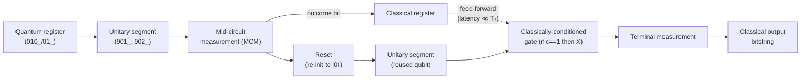

# QCSAA 900-909 · Section 00 · Subsection 030 · Subsubject 903 — Measurement, Mid-Circuit and Classical Control

## 1. Purpose

Defines the **non-unitary primitives** of a quantum circuit — terminal measurement in the computational basis, projective measurement in arbitrary bases, mid-circuit measurement, qubit reset, classical registers, and classical feed-forward (control flow conditioned on measurement outcomes) — and establishes the boundary at which the circuit-as-unitary view of `901_` breaks down. This subsubject is also the prerequisite for every quantum-error-correction syndrome cycle, every dynamic-circuit pattern, and every NISQ measurement-based mitigation pattern referenced by `905_`.

## 2. Scope

- Covers the *Measurement, Mid-Circuit and Classical Control* subsubject (`903`) of subsection `030` *circuits* within section `00` *Fundamentos de Computación Cuántica*.
- Inherits Q-Division authority and ORB support from the parent row in [`../../README.md` §3](../../README.md#3-architecture-table)[^archtable].
- Concepts in scope:
  - **Terminal measurement.** The standard end-of-circuit projective measurement in the computational basis $\{|0\rangle, |1\rangle\}$, returning a classical bitstring sampled with probability $|\langle x | \psi_{\text{final}} \rangle|^2$. This is the only place where the circuit's unitary evolution is collapsed to a classical outcome under the measurement postulate (Born rule); see [`../010_Qubits/03_Qubit-States-Operations-and-Measurement.md`](../010_Qubits/03_Qubit-States-Operations-and-Measurement.md).
  - **Measurement in arbitrary bases.** Implemented as a unitary basis-change before computational-basis measurement: an $X$-basis measurement is "$H$ then measure", a Bell-basis measurement is "CNOT then $H$ then measure", and so on. The convention of expressing every projective measurement as "rotate, then measure in the computational basis" keeps measurement as a single primitive in the circuit ISA.
  - **Mid-circuit measurement (MCM).** Measurement of a subset of qubits **before** the end of the circuit, with the remaining qubits continuing to evolve. MCM is the prerequisite for syndrome extraction in [`../010_Qubits/05_Logical-Qubits-Encoding-and-Error-Correction.md`](../010_Qubits/05_Logical-Qubits-Encoding-and-Error-Correction.md), for measurement-based quantum computation, and for every dynamic-circuit pattern. MCM is **non-trivial on hardware**: it requires the device to support measuring one qubit without destroying coherence on its neighbours and within a time short relative to $T_2$.
  - **Reset.** The classically-conditioned re-initialisation of a qubit to $|0\rangle$ after a mid-circuit measurement — usually a measurement followed by an $X$ gate conditioned on the measured `1`. Reset enables qubit reuse, which trades depth for width and is often the only way to keep a circuit within the available physical-qubit budget.
  - **Classical registers.** A circuit operates over **two** registers: a quantum register (the qubits) and a classical register (the bits that hold measurement outcomes). The classical register has a fixed bit-width per measurement and is the medium for all in-circuit classical computation.
  - **Classical feed-forward / classical control.** Subsequent gates may be **conditioned** on classical-register values: `if c == 1 then apply X to qubit q`. The combination of MCM + reset + feed-forward is the **dynamic-circuit** primitive set; it is what turns a static unitary circuit into a measurement-and-control program. The end-to-end latency of measurement → classical decision → conditioned gate must remain short relative to $T_2$ for the conditioned operation to be coherent on the still-quantum qubits.
  - **Deferred-measurement principle.** Any circuit using MCM and feed-forward can in principle be rewritten — at the cost of additional qubits — as a measurement-free unitary circuit followed by terminal measurements (replace each classical-controlled gate with the corresponding quantum-controlled gate, defer all measurements to the end). This is the bridge between the dynamic-circuit picture of this subsubject and the unitary picture of `901_`. The principle is not a free lunch: deferred-measurement rewrites can blow up width, which is precisely why dynamic circuits exist on hardware.
  - **The non-unitarity boundary.** Every primitive in this subsubject is **non-unitary** at the level of the qubit register (measurement collapses superposition; reset re-initialises; feed-forward inserts a classically-controlled choice). The circuit-as-unitary view of `901_` applies only to the measurement-free segments **between** these primitives.
- Out of scope: the underlying single-qubit measurement physics, POVMs, and readout-error model (already in [`../010_Qubits/03_`](../010_Qubits/03_Qubit-States-Operations-and-Measurement.md) and [`../010_Qubits/04_`](../010_Qubits/04_Decoherence-Noise-and-Fidelity.md)); the unitary gate catalogue (`../020_gates/`); compilation of dynamic circuits to a hardware ISA (`904_`); and noise-resilient mitigation patterns that *use* MCM and feed-forward (`905_`).

## 3. Diagram — Dynamic Circuit Primitives

The diagram shows the four primitives of a dynamic circuit and their data dependencies. The dotted edge marks the latency-bounded classical path that is the binding hardware requirement: measurement → classical decision → conditioned gate must complete well within $T_2$ on the qubits that remain coherent.

## 4. Footprint

| Metric | Value |
|---|---|
| Architecture | `QCSAA` — Quantum Computing & Sentient Agency Architecture |
| Master range | `900–999` |
| Code range | `900-909` |
| Section | `00` — Fundamentos de Computación Cuántica |
| Subject | `00` — General Information |
| Subsection | `030` — circuits |
| Subsubject | `903` — Measurement, Mid-Circuit and Classical Control |
| Primary Q-Division | Q-HORIZON[^qdiv] |
| Support Q-Divisions | Q-HPC, Q-DATAGOV |
| ORB support | ORB-PMO, ORB-LEG |
| Governance class | `restricted`[^gov] |
| Folder path | `Q+ATLANTIDE/900-999_QCSAA/900-909_Fundamentos-de-Computacion-Cuantica/030_circuits/` |
| Document | `903_Measurement-Mid-Circuit-and-Classical-Control.md` (this file) |
| Parent subsection | [`README.md`](./README.md) · [`900_Overview.md`](./900_Overview.md) |
| Parent architecture | [`../../README.md`](../../README.md) |
| Parent baseline | [`organization/Q+ATLANTIDE.md`](../../../../organization/Q+ATLANTIDE.md) |

## 5. References & Citations

[^baseline]: **Q+ATLANTIDE controlled baseline (v1.0.0)** — [`organization/Q+ATLANTIDE.md`](../../../../organization/Q+ATLANTIDE.md). Defines the controlled `000-999` architecture-band taxonomy and the ATLAS-1000 register subpart.

[^archtable]: **QCSAA §3 Architecture Table** — [`../../README.md` §3](../../README.md#3-architecture-table). Authoritative source for the `900-909` row (Section `00` — Fundamentos de Computación Cuántica, Primary Q-Division Q-HORIZON).

[^qdiv]: **Q-Division authority** — Q-Divisions provide technical authority over an architecture row (Q+ATLANTIDE Note N-002). See [`organization/Q+ATLANTIDE.md` §4](../../../../organization/Q+ATLANTIDE.md#4-notes).

[^gov]: **Governance class** — Bands are classified as `baseline` or `restricted` per Q+ATLANTIDE §4 governance rules.

[^ieeep7130]: **IEEE P7130 — Standard for Quantum Computing Definitions** — Vocabulary baseline for the quantum computing scope of QCSAA `900-999`.

[^s1000d]: **S1000D Issue 6.0 — International specification for technical publications** — Common Source DataBase (CSDB) and Data Module Code (DMC) specification used for all Q+ATLANTIDE artefacts.

[^as9100d]: **AS9100D — Quality Management Systems — Aviation, Space and Defense Organizations** — Quality-management baseline for all Q+ATLANTIDE deliverables.

### Applicable industry standards

The following standards apply to this subsubject in addition to the cross-cutting Q+ATLANTIDE governance:

- IEEE P7130 — Standard for Quantum Computing Definitions[^ieeep7130]
- S1000D Issue 6.0 — International specification for technical publications[^s1000d]
- AS9100D — Quality Management Systems — Aviation, Space and Defense Organizations[^as9100d]
