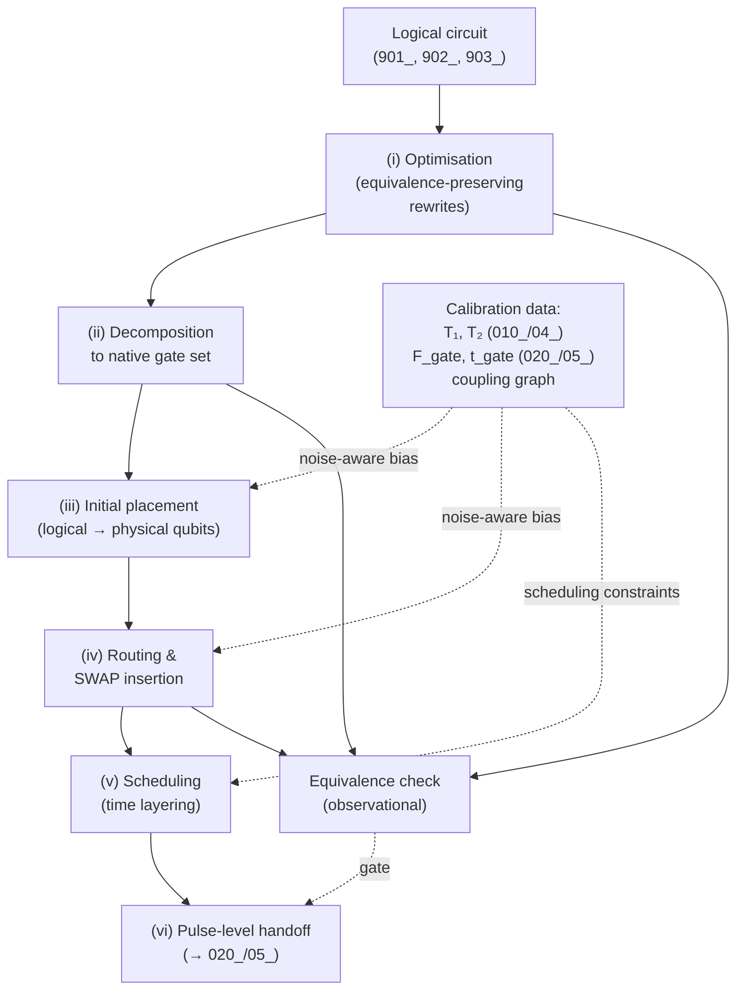

# QCSAA 900-909 · Section 00 · Subsection 030 · Subsubject 904 — Circuit Optimization, Compilation and Transpilation

## 1. Purpose

Records the **engineering pipeline** that maps a logical circuit (as defined in `901_`, with metrics from `902_` and primitives from `903_`) into a hardware-executable instruction stream on a specific device's instruction set architecture (ISA) and qubit-coupling graph: optimisation passes that exploit the equivalence classes of `901_` to reduce depth/T-count/CNOT-count, gate decomposition into the device's native gate set, qubit-routing/SWAP insertion to satisfy connectivity constraints, scheduling, and pulse-level handoff to the gate-implementation layer of [`../020_gates/05_`](../020_gates/05_Gate-Implementation-Calibration-and-Error-Characterization.md).

## 2. Scope

- Covers the *Circuit Optimization, Compilation and Transpilation* subsubject (`904`) of subsection `030` *circuits* within section `00` *Fundamentos de Computación Cuántica*.
- Inherits Q-Division authority and ORB support from the parent row in [`../../README.md` §3](../../README.md#3-architecture-table)[^archtable].
- Concepts in scope:
  - **Logical → physical pipeline.** A typical pipeline has the stages **(i) optimisation in the abstract gate set** → **(ii) decomposition into the device's native gate set** (the universal set of [`../020_gates/04_`](../020_gates/04_Universal-Gate-Sets-and-Decomposition.md) restricted to the modality's hardware-implemented gates from [`../020_gates/05_`](../020_gates/05_Gate-Implementation-Calibration-and-Error-Characterization.md)) → **(iii) qubit placement / initial mapping** of logical qubits to physical qubits → **(iv) routing and SWAP insertion** to satisfy the connectivity graph → **(v) scheduling** of gates into time-respecting layers → **(vi) pulse-level handoff** to the calibrated control electronics.
  - **Optimisation passes (logical layer).** Equivalence-preserving rewrites that exploit the identities of `901_`: gate cancellation ($H \cdot H = I$, $\text{CNOT} \cdot \text{CNOT} = I$), commutation moves (commute through $Z$ on a control wire to expose cancellations), template matching (replace a known multi-gate fragment with a shorter equivalent fragment), peephole optimisation, T-count minimisation (Clifford+T resynthesis), and unitary resynthesis of small subcircuits. Each pass is judged on the metrics of `902_`.
  - **Decomposition into native gates.** Every device exposes a finite native gate set; the universal-set guarantees of [`../020_gates/04_`](../020_gates/04_Universal-Gate-Sets-and-Decomposition.md) ensure an arbitrary unitary can be expressed in it, but the **cost** is paid in this stage. Examples: an arbitrary single-qubit unitary becomes 3 rotations on most modalities (Euler / U3); a CNOT becomes one or more native two-qubit gates plus surrounding single-qubit gates; a Toffoli decomposes to ~6 CNOTs + Clifford+T overhead.
  - **Connectivity graph and qubit routing.** A device's two-qubit gates are physically supported only between **coupled** pairs of physical qubits (heavy-hex on superconducting transmons, all-to-all within an ion chain, fixed lattice on neutral atoms, etc.). When a logical CNOT is required between qubits not directly coupled, the compiler inserts SWAPs (3 CNOTs each) to bring the operands together. Routing decisions cascade — a poor initial placement can multiply CNOT count by an order of magnitude.
  - **Scheduling.** Once gates are decomposed and routed, the compiler **schedules** them into time-respecting layers, choosing a pulse-level alignment that minimises wall-clock duration (reducing decoherence exposure per `902_`) and respects any pulse-cross-talk constraints exposed by [`../020_gates/05_`](../020_gates/05_Gate-Implementation-Calibration-and-Error-Characterization.md).
  - **Hardware-aware (noise-aware) compilation.** Modern compilers consume per-qubit and per-pair calibration data — $T_1, T_2$ from [`../900_Qubits/004_`](../900_Qubits/004_Decoherence-Noise-and-Fidelity.md) and per-gate fidelities from [`../020_gates/05_`](../020_gates/05_Gate-Implementation-Calibration-and-Error-Characterization.md) — to bias placement and routing toward the highest-fidelity qubits and couplings.
  - **Optimisation levels.** Compilers commonly expose tiered optimisation levels (e.g. `O0`–`O3`): higher levels enable more aggressive (and slower) passes. The trade-off is compile time vs. circuit cost; for repeated execution in a variational-circuit loop the compile-cost amortises and the highest level is appropriate, while for one-shot execution it may not.
  - **Verification and equivalence checking.** Every transformation in the pipeline is required to preserve **observational equivalence** with the input circuit (per `901_` §2). Unit tests and equivalence-checking tooling (statevector comparison for small circuits, randomized testing for larger circuits, formal Clifford-equivalence checks for stabiliser fragments) gate the deployment of each pass.
- **Boundary against [`../040_quantum-algorithms/`](../040_quantum-algorithms/) (binding for contributors).** This is the slot where the temptation to drift into algorithm-specific arguments is strongest, because a "good compiler" can exploit algorithm-specific structure (e.g. QFT-aware optimisation, QAOA layer fusion). The rule is: passes that exploit **circuit-level structure** (Clifford+T resynthesis, two-qubit-block resynthesis, peephole) belong here; passes that exploit **algorithm-level structure** (QFT decomposition theorems, QAOA-specific ansatz simplification, oracle-aware Grover bookkeeping) are properly part of the algorithm in `040_` and are merely *consumed* by the compiler. The compiler must not be allowed to encode algorithmic semantics; if a pass becomes algorithm-specific, it has crossed the boundary.
- Out of scope: the gate catalogue and per-gate physical realisation (`../020_gates/`), the abstract circuit definition and equivalence laws being *applied* by the optimiser (`901_`), the resource metrics being *minimised* (`902_`), the dynamic-circuit primitives being *compiled* (`903_`), and the noise-resilient circuit patterns that *consume* the compiler's output (`905_`).

## 3. Diagram — Logical-to-Physical Compilation Pipeline

The diagram below shows the canonical six-stage pipeline. The dotted edges mark the calibration data drawn from upstream chapters; the verification gate at the end of each stage enforces observational equivalence with the input circuit.

## 4. Footprint

| Metric | Value |
|---|---|
| Architecture | `QCSAA` — Quantum Computing & Sentient Agency Architecture |
| Master range | `900–999` |
| Code range | `900-909` |
| Section | `00` — Fundamentos de Computación Cuántica |
| Subject | `00` — General Information |
| Subsection | `030` — circuits |
| Subsubject | `904` — Circuit Optimization, Compilation and Transpilation |
| Primary Q-Division | Q-HORIZON[^qdiv] |
| Support Q-Divisions | Q-HPC, Q-DATAGOV |
| ORB support | ORB-PMO, ORB-LEG |
| Governance class | `restricted`[^gov] |
| Folder path | `Q+ATLANTIDE/900-999_QCSAA/900-909_Fundamentos-de-Computacion-Cuantica/030_circuits/` |
| Document | `904_Circuit-Optimization-Compilation-and-Transpilation.md` (this file) |
| Parent subsection | [`README.md`](./README.md) · [`900_Overview.md`](./900_Overview.md) |
| Parent architecture | [`../../README.md`](../../README.md) |
| Parent baseline | [`organization/Q+ATLANTIDE.md`](../../../../organization/Q+ATLANTIDE.md) |

## 5. References & Citations

[^baseline]: **Q+ATLANTIDE controlled baseline (v1.0.0)** — [`organization/Q+ATLANTIDE.md`](../../../../organization/Q+ATLANTIDE.md). Defines the controlled `000-999` architecture-band taxonomy and the ATLAS-1000 register subpart.

[^archtable]: **QCSAA §3 Architecture Table** — [`../../README.md` §3](../../README.md#3-architecture-table). Authoritative source for the `900-909` row (Section `00` — Fundamentos de Computación Cuántica, Primary Q-Division Q-HORIZON).

[^qdiv]: **Q-Division authority** — Q-Divisions provide technical authority over an architecture row (Q+ATLANTIDE Note N-002). See [`organization/Q+ATLANTIDE.md` §4](../../../../organization/Q+ATLANTIDE.md#4-notes).

[^gov]: **Governance class** — Bands are classified as `baseline` or `restricted` per Q+ATLANTIDE §4 governance rules.

[^ieeep7130]: **IEEE P7130 — Standard for Quantum Computing Definitions** — Vocabulary baseline for the quantum computing scope of QCSAA `900-999`.

[^s1000d]: **S1000D Issue 6.0 — International specification for technical publications** — Common Source DataBase (CSDB) and Data Module Code (DMC) specification used for all Q+ATLANTIDE artefacts.

[^as9100d]: **AS9100D — Quality Management Systems — Aviation, Space and Defense Organizations** — Quality-management baseline for all Q+ATLANTIDE deliverables.

### Applicable industry standards

The following standards apply to this subsubject in addition to the cross-cutting Q+ATLANTIDE governance:

- IEEE P7130 — Standard for Quantum Computing Definitions[^ieeep7130]
- S1000D Issue 6.0 — International specification for technical publications[^s1000d]
- AS9100D — Quality Management Systems — Aviation, Space and Defense Organizations[^as9100d]
