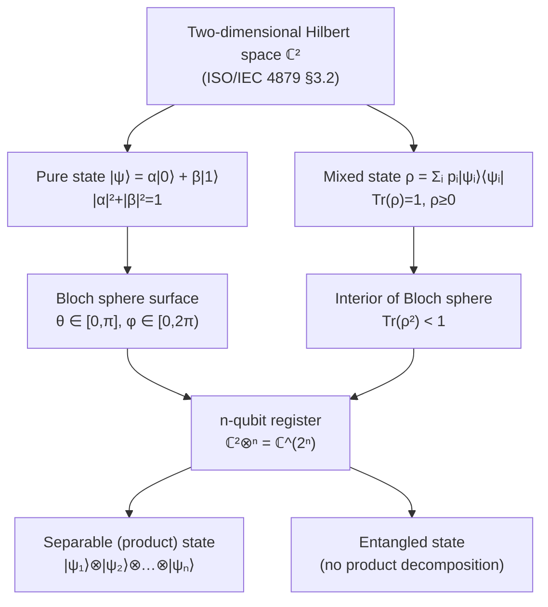

# QCSAA 900–909 · Section 00 · Subsection 900 · Subsubject 001 — Qubit Definition and Mathematical Formalism

## 1. Purpose

Defines the **qubit** as a two-dimensional quantum-mechanical system — the fundamental unit of quantum information — and establishes the mathematical formalism that all downstream QCSAA subsections rely on. Introduces Hilbert-space state vectors, the superposition principle, Dirac (bra-ket) notation, the density-matrix representation, and the Bloch sphere geometry, conforming to the vocabulary standard ISO/IEC 4879[^isoiec4879] and the canonical treatment in Nielsen & Chuang[^nielchung].

## 2. Scope

- Covers the *Qubit Definition and Mathematical Formalism* subsubject (`001`) of subsection `900` *Qubits* within section `00` *Fundamentos de Computación Cuántica*.
- Inherits Q-Division authority and ORB support from the parent row in [`README.md`](./README.md)[^archtable].
- Concepts in scope:
  - **Two-level quantum system** — a qubit is any quantum system with a two-dimensional complex Hilbert space ℂ²; the computational basis states are |0⟩ and |1⟩ (column vectors [1,0]ᵀ and [0,1]ᵀ respectively).
  - **Superposition** — the general pure qubit state |ψ⟩ = α|0⟩ + β|1⟩ with α, β ∈ ℂ and |α|² + |β|² = 1; the Born-rule probabilities p(0) = |α|² and p(1) = |β|².
  - **Dirac notation** — ket |ψ⟩ as a column vector, bra ⟨ψ| as its conjugate-transpose, inner product ⟨φ|ψ⟩, outer product |ψ⟩⟨φ|, and Hermitian observables.
  - **Bloch sphere** — the parameterisation |ψ⟩ = cos(θ/2)|0⟩ + e^(iφ)sin(θ/2)|1⟩ mapping every pure qubit state to a point on the unit sphere in ℝ³; mixed states lie strictly inside the sphere as density matrices ρ with 0 ≤ Tr(ρ²) ≤ 1.
  - **Density matrix** — ρ = Σᵢ pᵢ|ψᵢ⟩⟨ψᵢ| for a classical mixture; ρ is Hermitian positive-semidefinite with Tr(ρ) = 1; pure states satisfy ρ² = ρ.
  - **Multi-qubit systems** — the Hilbert space of n qubits is the tensor product ℂ²⊗ⁿ = ℂ^(2ⁿ); entangled states cannot be written as product states.
- Out of scope: physical implementations (`002_`), gate operations and measurement (`003_`), noise and decoherence (`004_`), and error correction (`005_`).

## 3. Diagram — Qubit State-Space Hierarchy

The Bloch sphere visualises pure and mixed single-qubit states; tensor products extend the formalism to multi-qubit registers.

## 4. Footprint

| Metric | Value |
|---|---|
| Architecture | `QCSAA` — Quantum Computing & Sentient Agency Architecture |
| Master range | `900–999` |
| Code range | `900-909` |
| Section | `00` — Fundamentos de Computación Cuántica |
| Subsection | `900` — Qubits |
| Subsubject | `001` — Qubit Definition and Mathematical Formalism |
| Primary Q-Division | Q-HORIZON[^qdiv] |
| Support Q-Divisions | Q-HPC, Q-DATAGOV |
| ORB support | ORB-PMO, ORB-LEG |
| Governance class | `restricted`[^gov] |
| Folder path | `Q+ATLANTIDE/900-999_QCSAA/900-909_Fundamentos-de-Computacion-Cuantica/900_Qubits/` |
| Document | `001_Qubit-Definition-and-Mathematical-Formalism.md` (this file) |
| Parent subsection | [`README.md`](./README.md) · [`000_Overview.md`](./000_Overview.md) |
| Parent architecture | [`../../README.md`](../../README.md) |
| Parent baseline | [`organization/Q+ATLANTIDE.md`](../../../../organization/Q+ATLANTIDE.md) |

## 5. References & Citations

[^baseline]: **Q+ATLANTIDE controlled baseline (v1.0.0)** — [`organization/Q+ATLANTIDE.md`](../../../../organization/Q+ATLANTIDE.md). Defines the controlled `000-999` architecture-band taxonomy and the ATLAS-1000 register subpart.

[^archtable]: **§3 — Subsubject Index (parent README)** — [`README.md` §3](./README.md#3-subsubject-index). Authoritative source for the `900` subsection row (Primary Q-Division Q-HORIZON).

[^qdiv]: **Q-Division authority** — Q-Divisions provide technical authority over an architecture row (Q+ATLANTIDE Note N-002). See [`organization/Q+ATLANTIDE.md` §4](../../../../organization/Q+ATLANTIDE.md#4-notes).

[^gov]: **Governance class** — `restricted` denotes documents requiring additional governance, evidence packages and access controls (rule N-006[^n006]).

[^n006]: **Note N-006 (Restricted bands)** — Quantum-related (`900-999` QCSAA) bands require additional governance, evidence packages and access controls. See [`organization/Q+ATLANTIDE.md` §5.3](../../../../organization/Q+ATLANTIDE.md#53-restricted-band-templates-n-006).

[^nielchung]: **Nielsen, M. A. & Chuang, I. L. (2010)** — *Quantum Computation and Quantum Information* (10th Anniversary Edition). Cambridge University Press. Chapters 1–2 define the qubit, Dirac notation, density matrices, and the Bloch sphere parameterisation.

[^divincenzo]: **DiVincenzo, D. P. (2000)** — "The Physical Implementation of Quantum Computation." *Fortschritte der Physik*, 48(9–11), 771–783. Criterion 1 requires a scalable physical system with well-characterised two-level qubits.

[^isoiec4879]: **ISO/IEC 4879:2023** — *Quantum computing — Vocabulary*. Defines qubit (§3.2), quantum state (§3.3), superposition (§3.4), and entanglement (§3.6).

### Applicable standards

The following standards apply to this subsubject in addition to the cross-cutting Q+ATLANTIDE governance:

- Nielsen & Chuang (2010) — *Quantum Computation and Quantum Information*[^nielchung]
- DiVincenzo (2000) — "The Physical Implementation of Quantum Computation"[^divincenzo]
- ISO/IEC 4879:2023 — *Quantum computing — Vocabulary*[^isoiec4879]
