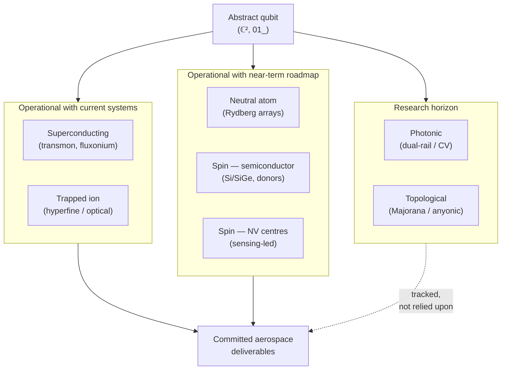

# QCSAA 900-909 · Section 00 · Subsection 900 · Subsubject 002 — Physical Qubit Implementations

## 1. Purpose

Catalogues the **physical implementation families** that realise the abstract qubit defined in `001_` and records, for each family, the engineering parameters that drive system-level decisions: operating temperature, characteristic coherence times ($T_1$, $T_2$), gate time, single- and two-qubit gate fidelity, and scalability profile. Provides the program with an **honest, technology-readiness-aware** view of the modality landscape so that QCSAA does not read as utopian.

## 2. Scope

- Covers the *Physical Qubit Implementations* subsubject (`002`) of subsection `900` *Qubits* within section `00` *Fundamentos de Computación Cuántica*.
- Inherits Q-Division authority and ORB support from the parent row in [`../../README.md` §3](../../README.md#3-architecture-table)[^archtable].
- Implementation families in scope:
  - **Superconducting** — transmon, fluxonium (and related charge/flux qubits).
  - **Trapped ion** — hyperfine and optical qubits in linear / segmented Paul traps.
  - **Neutral atom** — optical-tweezer arrays, Rydberg-mediated interactions.
  - **Photonic** — dual-rail and continuous-variable photonic qubits (measurement-based and gate-based).
  - **Spin** — NV centres in diamond; semiconductor spin qubits (Si/SiGe quantum dots, donor spins).
  - **Topological** — Majorana-based and other anyonic encodings (research horizon).
- Out of scope: gate algebra and measurement (`003_`), noise characterisation (`004_`), logical-qubit overhead (`005_`).

## 3. Modality Compatibility Matrix

The matrix below mirrors the structural pattern of the GSE compatibility matrix in ATLAS `010-019/060_GSE/012_`: three columns expressing **engineering posture**, not just physics. This is the slice of the QCSAA register where technology-readiness honesty must live; every reader making an engineering decision should be able to read the column headers and understand which modalities are operational, which are roadmap, and which remain research.

| Modality | Op. temp. (typ.) | $T_1$ / $T_2$ (order) | 1Q gate time | 2Q gate fidelity (typ.) | Scalability profile | Posture |
|---|---|---|---|---|---|---|
| **Superconducting (transmon, fluxonium)** | ~10–20 mK (dilution) | 50–500 µs / 50–300 µs | 10–50 ns | 99.0–99.7 % | Lithographically scalable; cryogenic and wiring overhead dominate | **Operational with current systems** |
| **Trapped ion (hyperfine / optical)** | UHV at room temp. (lasers); ions cooled to mK motionally | 1 s – hours / 1–10 s | 1–100 µs | 99.5–99.9 % | All-to-all within trap; modular ion-shuttling or photonic links for scale-out | **Operational with current systems** |
| **Neutral atom (Rydberg arrays)** | UHV at room temp.; atoms ~µK | 1–10 s / 1–10 ms | 0.1–1 µs (Rydberg) | 99.0–99.5 % | Reconfigurable arrays of 100s–1000s of atoms; rapidly maturing | **Operational with near-term roadmap** |
| **Spin — NV centres in diamond** | room temp. to 4 K | 1–10 ms / 0.01–1 ms | 10–100 ns | 95–99 % (in-register) | Excellent for sensing; less mature for large-scale computation | **Operational with near-term roadmap** (sensing); research horizon (compute) |
| **Spin — semiconductor (Si/SiGe, donors)** | ~10–100 mK | 1–100 ms / 1–100 µs | 10–100 ns | 98–99.5 % | CMOS-process compatible; small device counts so far | **Operational with near-term roadmap** |
| **Photonic (dual-rail / CV)** | room temp. (sources / detectors often cryogenic) | photon-loss limited | sub-ns | 90–99 % (heralded) | Naturally networkable; deterministic 2Q gates remain hard | **Research horizon → near-term roadmap** |
| **Topological (Majorana / anyonic)** | sub-100 mK | not yet measured at qubit level | — | — | Protected by topology in principle; existence of computational anyons not yet demonstrated | **Research horizon, no near-term aerospace integration** |

> **Interpretation.** Numbers above are order-of-magnitude indicative values for the published state of the art; specific devices vary. The right-hand *Posture* column, not the parameter columns, is the one that matters for program planning: it is what prevents the register from over-promising. Aerospace deployments in the strategic horizon shall preferentially target **operational** and **near-term roadmap** modalities; **research horizon** modalities are tracked but not relied upon for committed deliverables.

## 4. Diagram — Modality Landscape by Engineering Posture

The diagram below groups the implementation families of §3 by the *Posture* column rather than by physics, mirroring the way the program plans against them.

## 5. Footprint

| Metric | Value |
|---|---|
| Architecture | `QCSAA` — Quantum Computing & Sentient Agency Architecture |
| Master range | `900–999` |
| Code range | `900-909` |
| Section | `00` — Fundamentos de Computación Cuántica |
| Subject | `00` — General Information |
| Subsection | `900` — Qubits |
| Subsubject | `002` — Physical Qubit Implementations |
| Primary Q-Division | Q-HORIZON[^qdiv] |
| Support Q-Divisions | Q-HPC, Q-DATAGOV |
| ORB support | ORB-PMO, ORB-LEG |
| Governance class | `restricted`[^gov] |
| Folder path | `Q+ATLANTIDE/900-999_QCSAA/900-909_Fundamentos-de-Computacion-Cuantica/900_Qubits/` |
| Document | `002_Physical-Qubit-Implementations.md` (this file) |
| Parent subsection | [`README.md`](./README.md) · [`000_Overview.md`](./000_Overview.md) |
| Parent architecture | [`../../README.md`](../../README.md) |
| Parent baseline | [`organization/Q+ATLANTIDE.md`](../../../../organization/Q+ATLANTIDE.md) |

## 6. References & Citations

[^baseline]: **Q+ATLANTIDE controlled baseline (v1.0.0)** — [`organization/Q+ATLANTIDE.md`](../../../../organization/Q+ATLANTIDE.md). Defines the controlled `000-999` architecture-band taxonomy and the ATLAS-1000 register subpart.

[^archtable]: **QCSAA §3 Architecture Table** — [`../../README.md` §3](../../README.md#3-architecture-table). Authoritative source for the `900-909` row (Section `00` — Fundamentos de Computación Cuántica, Primary Q-Division Q-HORIZON).

[^qdiv]: **Q-Division authority** — Q-Divisions provide technical authority over an architecture row (Q+ATLANTIDE Note N-002). See [`organization/Q+ATLANTIDE.md` §4](../../../../organization/Q+ATLANTIDE.md#4-notes).

[^gov]: **Governance class** — Bands are classified as `baseline` or `restricted` per Q+ATLANTIDE §4 governance rules.

[^ieeep7130]: **IEEE P7130 — Standard for Quantum Computing Definitions** — Vocabulary baseline for the quantum computing scope of QCSAA `900-999`.

[^s1000d]: **S1000D Issue 6.0 — International specification for technical publications** — Common Source DataBase (CSDB) and Data Module Code (DMC) specification used for all Q+ATLANTIDE artefacts.

[^as9100d]: **AS9100D — Quality Management Systems — Aviation, Space and Defense Organizations** — Quality-management baseline for all Q+ATLANTIDE deliverables.

### Applicable industry standards

The following standards apply to this subsubject in addition to the cross-cutting Q+ATLANTIDE governance:

- IEEE P7130 — Standard for Quantum Computing Definitions[^ieeep7130]
- S1000D Issue 6.0 — International specification for technical publications[^s1000d]
- AS9100D — Quality Management Systems — Aviation, Space and Defense Organizations[^as9100d]
