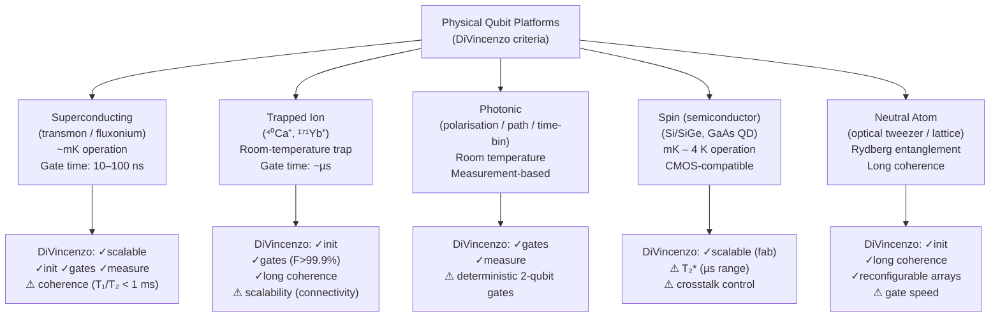

# QCSAA 900–909 · Section 00 · Subsection 900 · Subsubject 002 — Physical Qubit Implementations

## 1. Purpose

Surveys the principal **physical qubit platforms** — superconducting circuits, trapped ions, photonic systems, semiconductor spin qubits, and neutral atoms — and evaluates each against the DiVincenzo criteria[^divincenzo] for a viable quantum computer. Provides the Q+ATLANTIDE baseline[^baseline] taxonomy of physical implementations that informs technology-selection decisions in downstream QCSAA architecture documents.

## 2. Scope

- Covers the *Physical Qubit Implementations* subsubject (`002`) of subsection `900` *Qubits* within section `00` *Fundamentos de Computación Cuántica*.
- Inherits Q-Division authority and ORB support from the parent row in [`README.md`](./README.md)[^archtable].
- Concepts in scope:
  - **DiVincenzo criteria** — the five necessary conditions for a physical quantum computer: (1) scalable system of well-characterised qubits, (2) initialisation to a fiducial state, (3) long coherence times relative to gate times, (4) universal set of quantum gates, and (5) qubit-specific measurement capability; plus two network criteria for quantum communication.
  - **Superconducting transmon qubits** — Josephson-junction-based artificial atoms operating at millikelvin temperatures (~10–20 mK); gate times of ~10–100 ns; T₁ and T₂ typically in the range 10 µs–1 ms; leading commercial platforms (IBM, Google, Rigetti).
  - **Trapped-ion qubits** — hyperfine or optical transitions in laser-cooled ions (e.g. ⁴⁰Ca⁺, ¹⁷¹Yb⁺); very long coherence times (seconds to minutes); slower gate times (~µs); high gate fidelities (>99.9%); platforms from IonQ, Quantinuum.
  - **Photonic qubits** — polarisation, path, or time-bin encoding of photons; room-temperature operation; limited deterministic two-qubit gates without ancilla; boson-sampling and measurement-based architectures (PsiQuantum, QuiX).
  - **Semiconductor spin qubits** — electron or hole spin in gate-defined quantum dots (Si/SiGe, GaAs); sub-nanometre footprint enabling CMOS-compatible fabrication; T₂* in µs range; Intel Horse Ridge control electronics.
  - **Neutral-atom (optical-lattice/tweezer) qubits** — ground-state hyperfine levels of neutral atoms (e.g. ⁸⁷Rb, ¹³³Cs) trapped in optical tweezers; long coherence; entanglement via Rydberg blockade; platforms from Atom Computing, QuEra, Pasqal.
- Out of scope: abstract mathematical formalism (`001_`), quantum gate operations (`003_`), decoherence metrics and noise channels (`004_`), and error-correcting codes (`005_`).

## 3. Diagram — Physical Platform Taxonomy

## 4. Footprint

| Metric | Value |
|---|---|
| Architecture | `QCSAA` — Quantum Computing & Sentient Agency Architecture |
| Master range | `900–999` |
| Code range | `900-909` |
| Section | `00` — Fundamentos de Computación Cuántica |
| Subsection | `900` — Qubits |
| Subsubject | `002` — Physical Qubit Implementations |
| Primary Q-Division | Q-HORIZON[^qdiv] |
| Support Q-Divisions | Q-HPC, Q-DATAGOV |
| ORB support | ORB-PMO, ORB-LEG |
| Governance class | `restricted`[^gov] |
| Folder path | `Q+ATLANTIDE/900-999_QCSAA/900-909_Fundamentos-de-Computacion-Cuantica/900_Qubits/` |
| Document | `002_Physical-Qubit-Implementations.md` (this file) |
| Parent subsection | [`README.md`](./README.md) · [`000_Overview.md`](./000_Overview.md) |
| Parent architecture | [`../../README.md`](../../README.md) |
| Parent baseline | [`organization/Q+ATLANTIDE.md`](../../../../organization/Q+ATLANTIDE.md) |

## 5. References & Citations

[^baseline]: **Q+ATLANTIDE controlled baseline (v1.0.0)** — [`organization/Q+ATLANTIDE.md`](../../../../organization/Q+ATLANTIDE.md). Defines the controlled `000-999` architecture-band taxonomy and the ATLAS-1000 register subpart.

[^archtable]: **§3 — Subsubject Index (parent README)** — [`README.md` §3](./README.md#3-subsubject-index). Authoritative source for the `900` subsection row (Primary Q-Division Q-HORIZON).

[^qdiv]: **Q-Division authority** — Q-Divisions provide technical authority over an architecture row (Q+ATLANTIDE Note N-002). See [`organization/Q+ATLANTIDE.md` §4](../../../../organization/Q+ATLANTIDE.md#4-notes).

[^gov]: **Governance class** — `restricted` denotes documents requiring additional governance, evidence packages and access controls (rule N-006[^n006]).

[^n006]: **Note N-006 (Restricted bands)** — Quantum-related (`900-999` QCSAA) bands require additional governance, evidence packages and access controls. See [`organization/Q+ATLANTIDE.md` §5.3](../../../../organization/Q+ATLANTIDE.md#53-restricted-band-templates-n-006).

[^nielchung]: **Nielsen, M. A. & Chuang, I. L. (2010)** — *Quantum Computation and Quantum Information* (10th Anniversary Edition). Cambridge University Press. Chapter 7 surveys physical implementations and discusses DiVincenzo criteria in detail.

[^divincenzo]: **DiVincenzo, D. P. (2000)** — "The Physical Implementation of Quantum Computation." *Fortschritte der Physik*, 48(9–11), 771–783. Defines the five criteria a physical system must satisfy to serve as a practical qubit platform.

[^isoiec4879]: **ISO/IEC 4879:2023** — *Quantum computing — Vocabulary*. Provides standardised definitions for qubit, quantum gate, coherence time, and related concepts used in platform evaluation.

### Applicable standards

The following standards apply to this subsubject in addition to the cross-cutting Q+ATLANTIDE governance:

- Nielsen & Chuang (2010) — *Quantum Computation and Quantum Information*[^nielchung]
- DiVincenzo (2000) — "The Physical Implementation of Quantum Computation"[^divincenzo]
- ISO/IEC 4879:2023 — *Quantum computing — Vocabulary*[^isoiec4879]
