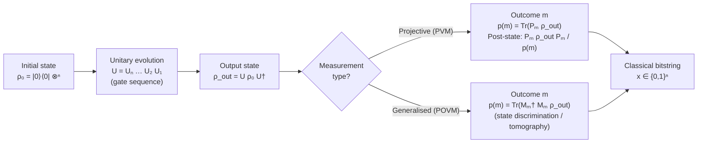

# QCSAA 900–909 · Section 00 · Subsection 900 · Subsubject 003 — Qubit States, Operations and Measurement

## 1. Purpose

Defines the **dynamics and observability** of qubit systems: how quantum states evolve under unitary operations, how multi-qubit entanglement arises, how quantum measurements are modelled (projective and generalised POVM), and how the Born rule yields classical outcome probabilities. Establishes the vocabulary and notational conventions used across all gate (`901_`) and circuit (`902_`) subsections within the QCSAA band, conforming to Nielsen & Chuang[^nielchung] and ISO/IEC 4879[^isoiec4879].

## 2. Scope

- Covers the *Qubit States, Operations and Measurement* subsubject (`003`) of subsection `900` *Qubits* within section `00` *Fundamentos de Computación Cuántica*.
- Inherits Q-Division authority and ORB support from the parent row in [`README.md`](./README.md)[^archtable].
- Concepts in scope:
  - **Unitary evolution** — a closed quantum system evolves by a unitary operator U (UU† = I); for a single qubit, U ∈ U(2) (modulo global phase, SU(2)); for n qubits, U ∈ U(2ⁿ). Time evolution is governed by the Schrödinger equation iℏ d|ψ⟩/dt = H|ψ⟩ where H is the system Hamiltonian.
  - **Single-qubit gates** — Pauli operators X, Y, Z (bit-flip, combined flip, phase-flip); Hadamard H mapping |0⟩ → |+⟩; phase gates S and T; general rotation gates Rₓ(θ), R_y(θ), R_z(θ).
  - **Multi-qubit entanglement** — the CNOT gate (controlled-X) as the canonical entangling operation; Bell states |Φ⁺⟩, |Φ⁻⟩, |Ψ⁺⟩, |Ψ⁻⟩ as maximally entangled two-qubit states; the Toffoli and Fredkin gates as universal reversible classical gates embedded in quantum circuits.
  - **Projective measurement** — observable M = Σₘ m Pₘ with orthogonal projectors Pₘ; measurement outcome m occurs with probability p(m) = Tr(Pₘ ρ) and post-measurement state ρ → PₘρPₘ / p(m); computation-basis measurement collapses |ψ⟩ to |0⟩ or |1⟩.
  - **POVM (Positive Operator-Valued Measure)** — generalised measurement described by positive operators Mₘ with Σₘ Mₘ†Mₘ = I; used in quantum tomography and optimal state discrimination.
  - **Born rule** — the fundamental postulate connecting quantum amplitudes to measurement probabilities: p(x) = |⟨x|ψ⟩|² for pure states, p(x) = Tr(|x⟩⟨x| ρ) for mixed states.
- Out of scope: abstract mathematical state-space formalism (`001_`), physical platform details (`002_`), decoherence and open-system noise (`004_`), and error-correcting encoding (`005_`).

## 3. Diagram — Qubit Evolution and Measurement Pipeline

## 4. Footprint

| Metric | Value |
|---|---|
| Architecture | `QCSAA` — Quantum Computing & Sentient Agency Architecture |
| Master range | `900–999` |
| Code range | `900-909` |
| Section | `00` — Fundamentos de Computación Cuántica |
| Subsection | `900` — Qubits |
| Subsubject | `003` — Qubit States, Operations and Measurement |
| Primary Q-Division | Q-HORIZON[^qdiv] |
| Support Q-Divisions | Q-HPC, Q-DATAGOV |
| ORB support | ORB-PMO, ORB-LEG |
| Governance class | `restricted`[^gov] |
| Folder path | `Q+ATLANTIDE/900-999_QCSAA/900-909_Fundamentos-de-Computacion-Cuantica/900_Qubits/` |
| Document | `003_Qubit-States-Operations-and-Measurement.md` (this file) |
| Parent subsection | [`README.md`](./README.md) · [`000_Overview.md`](./000_Overview.md) |
| Parent architecture | [`../../README.md`](../../README.md) |
| Parent baseline | [`organization/Q+ATLANTIDE.md`](../../../../organization/Q+ATLANTIDE.md) |

## 5. References & Citations

[^baseline]: **Q+ATLANTIDE controlled baseline (v1.0.0)** — [`organization/Q+ATLANTIDE.md`](../../../../organization/Q+ATLANTIDE.md). Defines the controlled `000-999` architecture-band taxonomy and the ATLAS-1000 register subpart.

[^archtable]: **§3 — Subsubject Index (parent README)** — [`README.md` §3](./README.md#3-subsubject-index). Authoritative source for the `900` subsection row (Primary Q-Division Q-HORIZON).

[^qdiv]: **Q-Division authority** — Q-Divisions provide technical authority over an architecture row (Q+ATLANTIDE Note N-002). See [`organization/Q+ATLANTIDE.md` §4](../../../../organization/Q+ATLANTIDE.md#4-notes).

[^gov]: **Governance class** — `restricted` denotes documents requiring additional governance, evidence packages and access controls (rule N-006[^n006]).

[^n006]: **Note N-006 (Restricted bands)** — Quantum-related (`900-999` QCSAA) bands require additional governance, evidence packages and access controls. See [`organization/Q+ATLANTIDE.md` §5.3](../../../../organization/Q+ATLANTIDE.md#53-restricted-band-templates-n-006).

[^nielchung]: **Nielsen, M. A. & Chuang, I. L. (2010)** — *Quantum Computation and Quantum Information* (10th Anniversary Edition). Cambridge University Press. Chapters 2–4 cover unitary evolution, quantum gates, measurement postulates, POVM, and the Born rule.

[^divincenzo]: **DiVincenzo, D. P. (2000)** — "The Physical Implementation of Quantum Computation." *Fortschritte der Physik*, 48(9–11), 771–783. Criteria 4 and 5 specify universal gate sets and qubit-specific readout, grounding the operational requirements set out here.

[^isoiec4879]: **ISO/IEC 4879:2023** — *Quantum computing — Vocabulary*. Defines quantum gate (§3.7), measurement (§3.8), unitary operation (§3.9), and entanglement (§3.6).

### Applicable standards

The following standards apply to this subsubject in addition to the cross-cutting Q+ATLANTIDE governance:

- Nielsen & Chuang (2010) — *Quantum Computation and Quantum Information*[^nielchung]
- DiVincenzo (2000) — "The Physical Implementation of Quantum Computation"[^divincenzo]
- ISO/IEC 4879:2023 — *Quantum computing — Vocabulary*[^isoiec4879]
