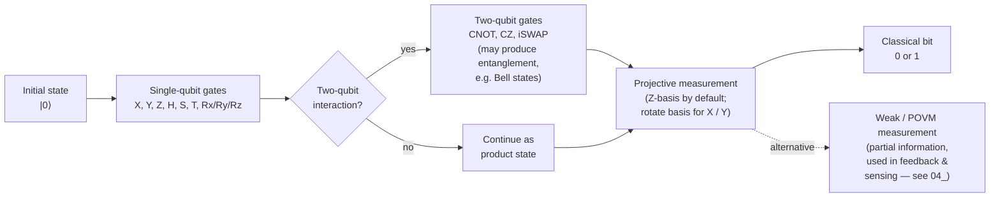

# QCSAA 900-909 · Section 00 · Subsection 900 · Subsubject 003 — Qubit States, Operations and Measurement

## 1. Purpose

Defines the **operational layer** on top of the qubit formalism established in `001_`: state preparation, the canonical single- and two-qubit gates, the entangled states they produce (Bell states), and the measurement model. The objects defined here — gates and measurements — are the primitives consumed by `901_gates/`, `902_circuits/` and `903_quantum-algorithms/` downstream.

## 2. Scope

- Covers the *Qubit States, Operations and Measurement* subsubject (`003`) of subsection `900` *Qubits* within section `00` *Fundamentos de Computación Cuántica*.
- Inherits Q-Division authority and ORB support from the parent row in [`../../README.md` §3](../../README.md#3-architecture-table)[^archtable].
- Concepts in scope:
  - **State preparation** — initialisation into a known reference state (commonly $|0\rangle$); reset protocols (passive thermal, active feedback).
  - **Single-qubit gates** — Pauli operators $X$, $Y$, $Z$; Hadamard $H$; phase gates $S$, $T$; arbitrary rotations $R_x(\theta)$, $R_y(\theta)$, $R_z(\theta)$.
  - **Two-qubit gates** — controlled-NOT (CNOT), controlled-Z (CZ), iSWAP; equivalence classes under local unitaries.
  - **Entanglement** — the four Bell states $|\Phi^\pm\rangle$, $|\Psi^\pm\rangle$ as the canonical maximally entangled basis on two qubits; entanglement as a non-classical resource for downstream algorithms.
  - **Measurement** — projective measurement in the computational basis ($Z$-basis); rotation of basis to enable $X$- and $Y$-basis measurement; **weak / generalised (POVM) measurement** as a generalisation that returns less-than-full collapse and is foundational for feedback-driven protocols and quantum sensing.
- Out of scope: implementation-level pulse shaping (`002_`), gate-error characterisation (`004_`), error-correcting code construction (`005_`).

## 3. Diagram — A Qubit in a Quantum Circuit

### 3.1 Canonical example: Bell-state preparation and measurement

The smallest non-trivial quantum circuit involving more than one qubit is the **Bell-state preparation circuit**. It takes two qubits initialised in $|0\rangle$, applies a Hadamard gate to the first qubit and a CNOT with the first as control and the second as target, then measures both. The output state before measurement is the entangled Bell state $|\Phi^+\rangle = (|00\rangle + |11\rangle)/\sqrt{2}$, and the measurement outcomes are perfectly correlated: either both qubits read `0` or both read `1`, each with probability $1/2$.

Drawn in the standard quantum-circuit notation (time flows left → right; horizontal lines are qubit wires; double lines are classical wires carrying measurement results):

```
            ┌───┐                      ┌─┐
   q_0 : ───┤ H ├──────■───────────────┤M├═══════ c_0
            └───┘      │               └╥┘
                     ┌─┴─┐              ║   ┌─┐
   q_1 : ────────────┤ X ├──────────────╫───┤M├══ c_1
                     └───┘              ║   └╥┘
                                        ║    ║
                  prepare      entangle  measure   classical
                  |0⟩, |0⟩    H ⊗ I,     in Z      register
                              CNOT       basis     (correlated
                                                    bits)
```

Reading the circuit:

| Stage | Operation | State after stage |
|---|---|---|
| Init | both qubits prepared in $\lvert 0\rangle$ | $\lvert 00\rangle$ |
| 1 | $H$ on $q_0$ (single-qubit gate, §2) | $\tfrac{1}{\sqrt{2}}(\lvert 0\rangle + \lvert 1\rangle) \otimes \lvert 0\rangle$ |
| 2 | $\mathrm{CNOT}$ with control $q_0$, target $q_1$ (two-qubit gate, §2) | $\lvert \Phi^+\rangle = \tfrac{1}{\sqrt{2}}(\lvert 00\rangle + \lvert 11\rangle)$ |
| 3 | projective $Z$-measurement on each qubit (§2) | $\lvert 00\rangle$ with $p = \tfrac{1}{2}$, or $\lvert 11\rangle$ with $p = \tfrac{1}{2}$ |

This three-stage pattern — **prepare → evolve under unitary gates → measure** — is the universal template into which every gate-based quantum algorithm in `903_quantum-algorithms/` decomposes.

### 3.2 Per-qubit lifecycle (Mermaid)

The same lifecycle, expressed for a single qubit traversing the circuit, follows the canonical *prepare → unitary evolution → projective measurement → classical bit* pipeline:



### 3.3 Notation legend

| Symbol | Meaning |
|---|---|
| `q_i` | $i$-th qubit wire (single line) |
| `c_i` | $i$-th classical bit wire (double line) |
| `┤ H ├` | Hadamard gate on the wire it sits on |
| `■` over a wire, `┤ X ├` below, joined by `│` | CNOT — control is the filled square, target is the boxed $X$ |
| `┤M├` | Projective measurement (Z-basis unless otherwise indicated) |
| `═══` | Classical wire (carries a measured bit) |

This notation — used by Qiskit, Cirq, and the wider literature — is the convention adopted across QCSAA `902_circuits/` and downstream.

## 4. Footprint

| Metric | Value |
|---|---|
| Architecture | `QCSAA` — Quantum Computing & Sentient Agency Architecture |
| Master range | `900–999` |
| Code range | `900-909` |
| Section | `00` — Fundamentos de Computación Cuántica |
| Subject | `00` — General Information |
| Subsection | `900` — Qubits |
| Subsubject | `003` — Qubit States, Operations and Measurement |
| Primary Q-Division | Q-HORIZON[^qdiv] |
| Support Q-Divisions | Q-HPC, Q-DATAGOV |
| ORB support | ORB-PMO, ORB-LEG |
| Governance class | `restricted`[^gov] |
| Folder path | `Q+ATLANTIDE/900-999_QCSAA/900-909_Fundamentos-de-Computacion-Cuantica/900_Qubits/` |
| Document | `003_Qubit-States-Operations-and-Measurement.md` (this file) |
| Parent subsection | [`README.md`](./README.md) · [`000_Overview.md`](./000_Overview.md) |
| Parent architecture | [`../../README.md`](../../README.md) |
| Parent baseline | [`organization/Q+ATLANTIDE.md`](../../../../organization/Q+ATLANTIDE.md) |

## 5. References & Citations


[^baseline]: **Q+ATLANTIDE controlled baseline (v1.0.0)** — [`organization/Q+ATLANTIDE.md`](../../../../organization/Q+ATLANTIDE.md). Defines the controlled `000-999` architecture-band taxonomy and the ATLAS-1000 register subpart.

[^archtable]: **QCSAA §3 Architecture Table** — [`../../README.md` §3](../../README.md#3-architecture-table). Authoritative source for the `900-909` row (Section `00` — Fundamentos de Computación Cuántica, Primary Q-Division Q-HORIZON).

[^qdiv]: **Q-Division authority** — Q-Divisions provide technical authority over an architecture row (Q+ATLANTIDE Note N-002). See [`organization/Q+ATLANTIDE.md` §4](../../../../organization/Q+ATLANTIDE.md#4-notes).

[^gov]: **Governance class** — Bands are classified as `baseline` or `restricted` per Q+ATLANTIDE §4 governance rules.

[^ieeep7130]: **IEEE P7130 — Standard for Quantum Computing Definitions** — Vocabulary baseline for the quantum computing scope of QCSAA `900-999`.

[^s1000d]: **S1000D Issue 6.0 — International specification for technical publications** — Common Source DataBase (CSDB) and Data Module Code (DMC) specification used for all Q+ATLANTIDE artefacts.

[^as9100d]: **AS9100D — Quality Management Systems — Aviation, Space and Defense Organizations** — Quality-management baseline for all Q+ATLANTIDE deliverables.

### Applicable industry standards

The following standards apply to this subsubject in addition to the cross-cutting Q+ATLANTIDE governance:

- IEEE P7130 — Standard for Quantum Computing Definitions[^ieeep7130]
- S1000D Issue 6.0 — International specification for technical publications[^s1000d]
- AS9100D — Quality Management Systems — Aviation, Space and Defense Organizations[^as9100d]
