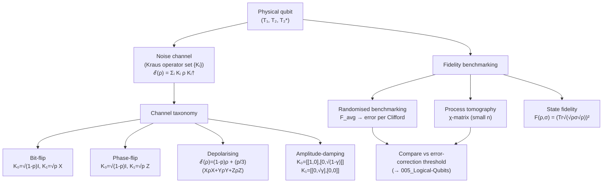

# QCSAA 900–909 · Section 00 · Subsection 900 · Subsubject 004 — Decoherence, Noise and Fidelity

## 1. Purpose

Characterises the principal **error mechanisms** that degrade qubit performance in realistic hardware: energy relaxation (T₁), pure dephasing and transverse decoherence (T₂, T₂*), and standard quantum noise channels. Defines the fidelity metrics — gate fidelity, state fidelity, and average process fidelity — that form the engineering acceptance criteria for physical qubit platforms within the Q+ATLANTIDE baseline[^baseline]. These metrics are the quantitative link between the physical implementations catalogued in `002_` and the error-correction overhead specified in `005_`.

## 2. Scope

- Covers the *Decoherence, Noise and Fidelity* subsubject (`004`) of subsection `900` *Qubits* within section `00` *Fundamentos de Computación Cuántica*.
- Inherits Q-Division authority and ORB support from the parent row in [`README.md`](./README.md)[^archtable].
- Concepts in scope:
  - **T₁ — energy relaxation time** — characteristic time for a qubit to spontaneously decay from |1⟩ to |0⟩ via interaction with the environment; governed by the amplitude-damping channel; determines the maximum depth of coherent quantum circuits.
  - **T₂ — transverse decoherence time** — decay of off-diagonal density-matrix elements (quantum coherence); T₂ ≤ 2T₁; set by a combination of energy relaxation and pure dephasing (T_φ): 1/T₂ = 1/(2T₁) + 1/T_φ.
  - **T₂* — free-induction-decay time** — effective transverse relaxation under inhomogeneous broadening (quasistatic noise); T₂* ≤ T₂; measured by Ramsey interferometry; relevant for semiconductor spin qubits in nuclear-spin environments.
  - **Quantum noise channels (Kraus operators)** — four canonical single-qubit channels: bit-flip (X error with probability p), phase-flip (Z error), bit-phase-flip (Y error), and depolarising (uniform mixture of I, X, Y, Z errors); each described by a completely positive trace-preserving (CPTP) map.
  - **Gate fidelity** — average fidelity F_avg = ∫ dψ ⟨ψ|U†ℰ(|ψ⟩⟨ψ|)U|ψ⟩ between ideal unitary U and implemented channel ℰ; relates to process fidelity via F_avg = (d F_process + 1)/(d+1) for d-dimensional systems.
  - **State fidelity** — F(ρ, σ) = (Tr√(√ρ σ √ρ))² measuring overlap between two density matrices; F = 1 for identical states; used in state-preparation-and-measurement (SPAM) characterisation.
  - **Randomised benchmarking (RB)** — protocol that extracts average gate error per Clifford gate from exponential decay of survival probability across random Clifford sequences; decouples SPAM errors from gate errors.
  - **Process tomography** — complete characterisation of a quantum channel via the χ-matrix or Choi-state representation; exponential classical overhead (4ⁿ parameters for n qubits); used for small system validation.
- Out of scope: abstract formalism (`001_`), physical platform descriptions (`002_`), ideal gate operations (`003_`), and active error-correction codes (`005_`).

## 3. Diagram — Decoherence and Fidelity Measurement Pipeline

## 4. Footprint

| Metric | Value |
|---|---|
| Architecture | `QCSAA` — Quantum Computing & Sentient Agency Architecture |
| Master range | `900–999` |
| Code range | `900-909` |
| Section | `00` — Fundamentos de Computación Cuántica |
| Subsection | `900` — Qubits |
| Subsubject | `004` — Decoherence, Noise and Fidelity |
| Primary Q-Division | Q-HORIZON[^qdiv] |
| Support Q-Divisions | Q-HPC, Q-DATAGOV |
| ORB support | ORB-PMO, ORB-LEG |
| Governance class | `restricted`[^gov] |
| Folder path | `Q+ATLANTIDE/900-999_QCSAA/900-909_Fundamentos-de-Computacion-Cuantica/900_Qubits/` |
| Document | `004_Decoherence-Noise-and-Fidelity.md` (this file) |
| Parent subsection | [`README.md`](./README.md) · [`000_Overview.md`](./000_Overview.md) |
| Parent architecture | [`../../README.md`](../../README.md) |
| Parent baseline | [`organization/Q+ATLANTIDE.md`](../../../../organization/Q+ATLANTIDE.md) |

## 5. References & Citations

[^baseline]: **Q+ATLANTIDE controlled baseline (v1.0.0)** — [`organization/Q+ATLANTIDE.md`](../../../../organization/Q+ATLANTIDE.md). Defines the controlled `000-999` architecture-band taxonomy and the ATLAS-1000 register subpart.

[^archtable]: **§3 — Subsubject Index (parent README)** — [`README.md` §3](./README.md#3-subsubject-index). Authoritative source for the `900` subsection row (Primary Q-Division Q-HORIZON).

[^qdiv]: **Q-Division authority** — Q-Divisions provide technical authority over an architecture row (Q+ATLANTIDE Note N-002). See [`organization/Q+ATLANTIDE.md` §4](../../../../organization/Q+ATLANTIDE.md#4-notes).

[^gov]: **Governance class** — `restricted` denotes documents requiring additional governance, evidence packages and access controls (rule N-006[^n006]).

[^n006]: **Note N-006 (Restricted bands)** — Quantum-related (`900-999` QCSAA) bands require additional governance, evidence packages and access controls. See [`organization/Q+ATLANTIDE.md` §5.3](../../../../organization/Q+ATLANTIDE.md#53-restricted-band-templates-n-006).

[^nielchung]: **Nielsen, M. A. & Chuang, I. L. (2010)** — *Quantum Computation and Quantum Information* (10th Anniversary Edition). Cambridge University Press. Chapters 8–9 cover quantum noise and quantum operations (Kraus operators, CPTP maps, process tomography, and fidelity measures).

[^divincenzo]: **DiVincenzo, D. P. (2000)** — "The Physical Implementation of Quantum Computation." *Fortschritte der Physik*, 48(9–11), 771–783. DiVincenzo criterion 3 (long coherence relative to gate time) quantifies the T₁/T₂ requirements set out here.

[^isoiec4879]: **ISO/IEC 4879:2023** — *Quantum computing — Vocabulary*. Defines decoherence (§3.10), coherence time (§3.11), fidelity (§3.12), and quantum noise channel (§3.13).

### Applicable standards

The following standards apply to this subsubject in addition to the cross-cutting Q+ATLANTIDE governance:

- Nielsen & Chuang (2010) — *Quantum Computation and Quantum Information*[^nielchung]
- DiVincenzo (2000) — "The Physical Implementation of Quantum Computation"[^divincenzo]
- ISO/IEC 4879:2023 — *Quantum computing — Vocabulary*[^isoiec4879]
