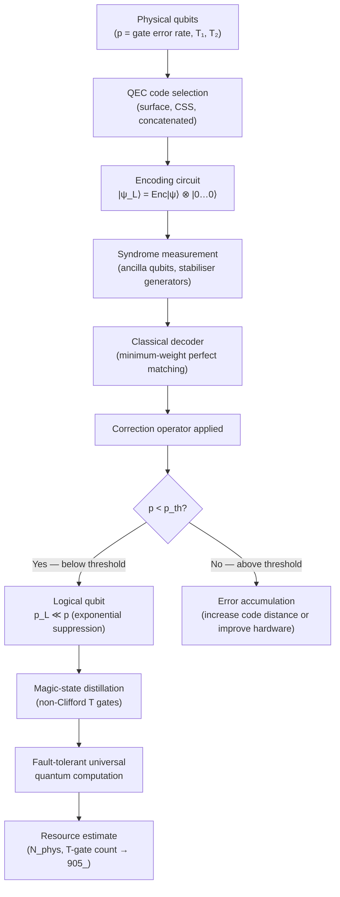

# QCSAA 900–909 · Section 00 · Subsection 900 · Subsubject 005 — Logical Qubits, Encoding and Error Correction

## 1. Purpose

Defines **logical qubits** — information-bearing degrees of freedom protected by quantum error-correcting codes — and establishes the encoding, syndrome-measurement, and decoding framework that makes fault-tolerant quantum computation possible. Introduces the stabiliser formalism, the surface code as the leading near-term architecture, fault-tolerance thresholds, and the physical-to-logical qubit overhead model used across QCSAA subsections. This subsubject closes the qubit subsection by linking the noise metrics of `004_` to the resource estimates required in `905_` (Quantum Complexity and Resource Theory) and `906_` (Hamiltonian Methods and Adiabatic Computation), conforming to Nielsen & Chuang[^nielchung] and ISO/IEC 4879[^isoiec4879].

## 2. Scope

- Covers the *Logical Qubits, Encoding and Error Correction* subsubject (`005`) of subsection `900` *Qubits* within section `00` *Fundamentos de Computación Cuántica*.
- Inherits Q-Division authority and ORB support from the parent row in [`README.md`](./README.md)[^archtable].
- Concepts in scope:
  - **Quantum error correction (QEC) fundamentals** — the three-qubit bit-flip and phase-flip repetition codes as pedagogical examples; the Knill-Laflamme conditions for a code space to correct a set of errors; the no-cloning theorem as the motivation for indirect syndrome measurement rather than copying.
  - **Stabiliser formalism** — the stabiliser group S as an abelian subgroup of the n-qubit Pauli group; the code space as the +1 eigenspace of all stabiliser generators; syndrome measurement projects onto the ±1 eigenspaces without collapsing the logical information.
  - **CSS codes (Calderbank-Shor-Steane)** — construction from two classical linear codes C₁ ⊇ C₂; the [[7,1,3]] Steane code as the smallest CSS code; transversal implementation of Clifford gates.
  - **Surface code** — planar stabiliser code on a 2D square lattice of physical qubits; distance-d code requires O(d²) physical qubits per logical qubit; logical X and Z operators traverse non-contractible paths on the lattice; leading architecture for superconducting and spin-qubit platforms due to high threshold (~1%) and nearest-neighbour connectivity.
  - **Fault-tolerance threshold** — the physical gate error rate p_th below which increasing code distance d exponentially suppresses the logical error rate p_L ∝ (p/p_th)^⌈(d+1)/2⌉; typical values: surface code ~0.5–1%, concatenated Steane ~10⁻⁴.
  - **Physical-to-logical qubit overhead** — the number of physical qubits N_phys required per logical qubit as a function of target logical error rate p_L and physical error rate p; for surface code: N_phys ≈ 2d² where d ≈ log(p_L / A) / log(p / p_th) and A is a code-specific prefactor; resource estimation links to `905_`.
  - **Magic-state distillation** — non-Clifford T gates require injecting "magic states" |T⟩ via distillation protocols that consume many noisy ancilla copies to produce one high-fidelity logical T gate; dominant source of overhead in fault-tolerant Clifford+T universal gate sets.
- Out of scope: abstract state-space formalism (`001_`), physical implementations (`002_`), ideal unitary operations (`003_`), and decoherence characterisation (`004_`).

## 3. Diagram — Logical Qubit Encoding and Fault-Tolerance Pipeline

## 4. Footprint

| Metric | Value |
|---|---|
| Architecture | `QCSAA` — Quantum Computing & Sentient Agency Architecture |
| Master range | `900–999` |
| Code range | `900-909` |
| Section | `00` — Fundamentos de Computación Cuántica |
| Subsection | `900` — Qubits |
| Subsubject | `005` — Logical Qubits, Encoding and Error Correction |
| Primary Q-Division | Q-HORIZON[^qdiv] |
| Support Q-Divisions | Q-HPC, Q-DATAGOV |
| ORB support | ORB-PMO, ORB-LEG |
| Governance class | `restricted`[^gov] |
| Folder path | `Q+ATLANTIDE/900-999_QCSAA/900-909_Fundamentos-de-Computacion-Cuantica/900_Qubits/` |
| Document | `005_Logical-Qubits-Encoding-and-Error-Correction.md` (this file) |
| Parent subsection | [`README.md`](./README.md) · [`000_Overview.md`](./000_Overview.md) |
| Parent architecture | [`../../README.md`](../../README.md) |
| Parent baseline | [`organization/Q+ATLANTIDE.md`](../../../../organization/Q+ATLANTIDE.md) |

## 5. References & Citations

[^baseline]: **Q+ATLANTIDE controlled baseline (v1.0.0)** — [`organization/Q+ATLANTIDE.md`](../../../../organization/Q+ATLANTIDE.md). Defines the controlled `000-999` architecture-band taxonomy and the ATLAS-1000 register subpart.

[^archtable]: **§3 — Subsubject Index (parent README)** — [`README.md` §3](./README.md#3-subsubject-index). Authoritative source for the `900` subsection row (Primary Q-Division Q-HORIZON).

[^qdiv]: **Q-Division authority** — Q-Divisions provide technical authority over an architecture row (Q+ATLANTIDE Note N-002). See [`organization/Q+ATLANTIDE.md` §4](../../../../organization/Q+ATLANTIDE.md#4-notes).

[^gov]: **Governance class** — `restricted` denotes documents requiring additional governance, evidence packages and access controls (rule N-006[^n006]).

[^n006]: **Note N-006 (Restricted bands)** — Quantum-related (`900-999` QCSAA) bands require additional governance, evidence packages and access controls. See [`organization/Q+ATLANTIDE.md` §5.3](../../../../organization/Q+ATLANTIDE.md#53-restricted-band-templates-n-006).

[^nielchung]: **Nielsen, M. A. & Chuang, I. L. (2010)** — *Quantum Computation and Quantum Information* (10th Anniversary Edition). Cambridge University Press. Chapters 10–11 cover quantum error-correcting codes, the stabiliser formalism, fault tolerance, and the threshold theorem.

[^divincenzo]: **DiVincenzo, D. P. (2000)** — "The Physical Implementation of Quantum Computation." *Fortschritte der Physik*, 48(9–11), 771–783. The DiVincenzo criteria frame the physical requirements that motivate logical-qubit encoding for fault tolerance.

[^isoiec4879]: **ISO/IEC 4879:2023** — *Quantum computing — Vocabulary*. Defines quantum error correction (§3.14), logical qubit (§3.15), stabiliser code (§3.16), and fault tolerance (§3.17).

### Applicable standards

The following standards apply to this subsubject in addition to the cross-cutting Q+ATLANTIDE governance:

- Nielsen & Chuang (2010) — *Quantum Computation and Quantum Information*[^nielchung]
- DiVincenzo (2000) — "The Physical Implementation of Quantum Computation"[^divincenzo]
- ISO/IEC 4879:2023 — *Quantum computing — Vocabulary*[^isoiec4879]
