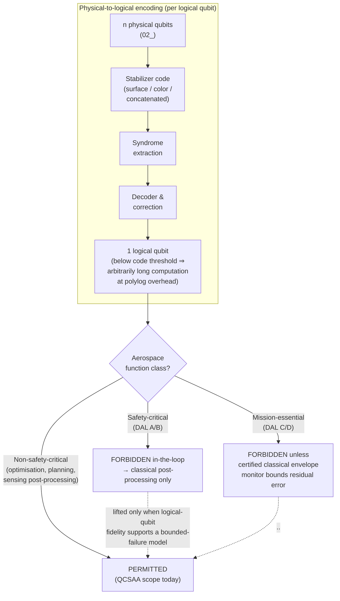

# QCSAA 900-909 · Section 00 · Subsection 900 · Subsubject 005 — Logical Qubits, Encoding and Error Correction

## 1. Purpose

Defines the **logical qubit** as a noise-protected encoding of multiple physical qubits, introduces the stabilizer formalism and the canonical code families (surface, color, concatenated), states the threshold theorem, and quantifies fault-tolerant overhead. This subsubject also carries the **bridge between QCSAA and aerospace certification**: it is the slice of the register where the program states explicitly which aerospace functions can ever realistically use quantum computation directly, versus which must be restricted to *classical post-processing of quantum outputs*.

## 2. Scope

- Covers the *Logical Qubits, Encoding and Error Correction* subsubject (`005`) of subsection `900` *Qubits* within section `00` *Fundamentos de Computación Cuántica*.
- Inherits Q-Division authority and ORB support from the parent row in [`../../README.md` §3](../../README.md#3-architecture-table)[^archtable].
- Concepts in scope:
  - **Physical-vs-logical distinction** — physical qubits are the device-level objects of `902_`; a logical qubit is an encoded subspace of $n$ physical qubits with active syndrome extraction and correction.
  - **Stabilizer formalism** — Pauli stabilizer groups, code distance $d$, encoded logical operators, syndrome measurement.
  - **Code families** —
    - **Surface code** (planar topological code) — leading candidate for superconducting and neutral-atom platforms; high threshold (~1 %), local syndrome extraction.
    - **Color codes** — admit transversal Clifford gates at the cost of higher overhead.
    - **Concatenated codes** — recursive encoding (e.g. Steane, Shor) with provable threshold via the threshold theorem.
  - **Threshold theorem** — if the per-gate physical error rate is below the code's threshold, arbitrarily long quantum computations are possible at polylogarithmic overhead.
  - **Fault-tolerant overhead** — current estimates of physical-to-logical qubit ratios range from $10^3$ to $10^6$ depending on physical error rate, target logical error rate, and circuit depth.
  - **Demonstrations** — current state of the art on near-term hardware (sub-threshold and at-threshold demonstrations on superconducting and neutral-atom platforms) and the gap to algorithmically useful logical qubit counts.

## 3. Aerospace-Certification Bridge

Aerospace certification (DO-178C software, DO-254 airborne electronic hardware, ARP4754A development of civil aircraft systems) is built on **deterministic systems with bounded failure modes**. Qubits are non-deterministic by design and have failure modes that are **statistical, not bounded**.

Logical qubits with active error correction *can*, in principle, be made to behave deterministically enough for safety-critical use, but only at the overhead documented above ($10^3$–$10^6$ physical qubits per logical qubit). Until that overhead is realised in hardware, the program shall enforce the following restriction:

| Aerospace function class | Permitted use of QCSAA technology | Rationale |
|---|---|---|
| **Safety-critical (DAL A/B, DO-178C; equivalent DO-254/ARP4754A)** | **Forbidden** for direct in-the-loop quantum computation. Permitted only for **classical post-processing of quantum outputs** validated by deterministic classical software/hardware. | Statistical, unbounded failure modes of physical qubits cannot satisfy DAL A/B determinism and bounded-failure requirements. Logical qubits at sufficient fidelity do not yet exist. |
| **Mission-essential / DAL C/D** | **Forbidden** as in-the-loop unless surrounded by certified classical envelope monitors that bound the residual quantum error. | Same physical reasoning, with limited tolerance for monitored, bounded use. |
| **Non-safety-critical (optimisation, planning, sensing post-processing, design-time tooling)** | **Permitted** — this is the explicit scope envisaged for the §1.4 strategic objective ("deploy non-critical quantum-enabled optimization and sensing capabilities" by 2035+). | No certification bar; quantum failure modes are absorbed into engineering margins, not safety arguments. |

The restriction shall be **lifted only when** logical-qubit fidelity reaches the level at which a quantum subsystem can present, to a certifying authority, a bounded-failure model equivalent to that of a deterministic classical subsystem. Until that point, QCSAA remains in non-safety-critical paths.

## 4. Diagram — Encoding Pipeline and Certification Decision

The first half shows the **physical → logical** encoding pipeline (stabilizer measurement → syndrome → correction). The second half is the **certification decision tree** of §3, expressed as a flowchart so that contributors authoring downstream QCSAA functions can see at a glance which path they fall into.

## 5. Footprint

| Metric | Value |
|---|---|
| Architecture | `QCSAA` — Quantum Computing & Sentient Agency Architecture |
| Master range | `900–999` |
| Code range | `900-909` |
| Section | `00` — Fundamentos de Computación Cuántica |
| Subject | `00` — General Information |
| Subsection | `900` — Qubits |
| Subsubject | `005` — Logical Qubits, Encoding and Error Correction |
| Primary Q-Division | Q-HORIZON[^qdiv] |
| Support Q-Divisions | Q-HPC, Q-DATAGOV |
| ORB support | ORB-PMO, ORB-LEG |
| Governance class | `restricted`[^gov] |
| Folder path | `Q+ATLANTIDE/900-999_QCSAA/900-909_Fundamentos-de-Computacion-Cuantica/900_Qubits/` |
| Document | `005_Logical-Qubits-Encoding-and-Error-Correction.md` (this file) |
| Parent subsection | [`README.md`](./README.md) · [`000_Overview.md`](./000_Overview.md) |
| Parent architecture | [`../../README.md`](../../README.md) |
| Parent baseline | [`organization/Q+ATLANTIDE.md`](../../../../organization/Q+ATLANTIDE.md) |

## 6. References & Citations

[^baseline]: **Q+ATLANTIDE controlled baseline (v1.0.0)** — [`organization/Q+ATLANTIDE.md`](../../../../organization/Q+ATLANTIDE.md). Defines the controlled `000-999` architecture-band taxonomy and the ATLAS-1000 register subpart.

[^archtable]: **QCSAA §3 Architecture Table** — [`../../README.md` §3](../../README.md#3-architecture-table). Authoritative source for the `900-909` row (Section `00` — Fundamentos de Computación Cuántica, Primary Q-Division Q-HORIZON).

[^qdiv]: **Q-Division authority** — Q-Divisions provide technical authority over an architecture row (Q+ATLANTIDE Note N-002). See [`organization/Q+ATLANTIDE.md` §4](../../../../organization/Q+ATLANTIDE.md#4-notes).

[^gov]: **Governance class** — Bands are classified as `baseline` or `restricted` per Q+ATLANTIDE §4 governance rules.

[^ieeep7130]: **IEEE P7130 — Standard for Quantum Computing Definitions** — Vocabulary baseline for the quantum computing scope of QCSAA `900-999`.

[^do178c]: **RTCA DO-178C — Software Considerations in Airborne Systems and Equipment Certification** — Reference framework for airborne software certification (DAL A–E); imposes deterministic, bounded-failure requirements at higher DALs.

[^do254]: **RTCA DO-254 — Design Assurance Guidance for Airborne Electronic Hardware** — Hardware analogue of DO-178C; governs complex airborne electronic hardware certification.

[^arp4754a]: **SAE ARP4754A — Guidelines for Development of Civil Aircraft and Systems** — System-level development assurance and integration guidance for civil aircraft.

[^s1000d]: **S1000D Issue 6.0 — International specification for technical publications** — Common Source DataBase (CSDB) and Data Module Code (DMC) specification used for all Q+ATLANTIDE artefacts.

[^as9100d]: **AS9100D — Quality Management Systems — Aviation, Space and Defense Organizations** — Quality-management baseline for all Q+ATLANTIDE deliverables.

### Applicable industry standards

The following standards apply to this subsubject in addition to the cross-cutting Q+ATLANTIDE governance:

- IEEE P7130 — Standard for Quantum Computing Definitions[^ieeep7130]
- RTCA DO-178C — Software Considerations in Airborne Systems and Equipment Certification[^do178c]
- RTCA DO-254 — Design Assurance Guidance for Airborne Electronic Hardware[^do254]
- SAE ARP4754A — Guidelines for Development of Civil Aircraft and Systems[^arp4754a]
- S1000D Issue 6.0 — International specification for technical publications[^s1000d]
- AS9100D — Quality Management Systems — Aviation, Space and Defense Organizations[^as9100d]
