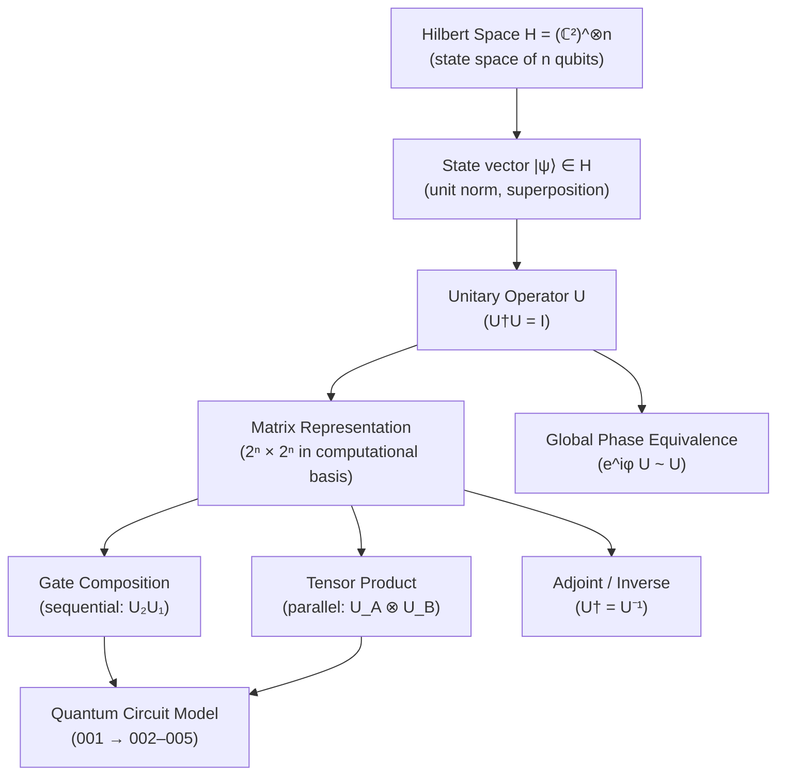

# QCSAA 900-909 · Section 00 · Subsection 901 · Subsubject 001 — Gate Definition and Unitary Formalism

## 1. Purpose

Establishes the **mathematical foundation of quantum gates**: the definition of a quantum gate as a unitary operator on a Hilbert space, the matrix representation in the computational basis, Dirac bra-ket notation, and the operator algebra — including composition, tensor products, and adjoints — that underpins all downstream subsubjects, circuit constructions, and hardware implementations in subsection `901` *Gates*[^nielsen_chuang][^iso4879].

## 2. Scope

- Covers the *Gate Definition and Unitary Formalism* subsubject (`001`) of subsection `901` *Gates* within section `00` *Fundamentos de Computación Cuántica*.
- Inherits Q-Division authority and ORB support from the parent row in [`../../README.md` §3](../../README.md#3-architecture-table)[^archtable].
- Concepts in scope:
  - **Hilbert space and state vectors** — n-qubit Hilbert space H = (ℂ²)^⊗n, computational basis states |0⟩ and |1⟩, superposition, and the Born rule.
  - **Unitary operators** — formal definition U†U = UU† = I, preservation of inner products, and reversibility as the distinguishing property of quantum gates.
  - **Matrix representation** — 2ⁿ × 2ⁿ unitary matrices in the computational basis; conventions for row/column ordering and endianness across OpenQASM[^openqasm3] and standard frameworks.
  - **Dirac notation** — bra-ket formalism ⟨ψ|, |ψ⟩, outer products |ψ⟩⟨φ|, and their matrix correspondences; used consistently across all `901` subsubjects.
  - **Operator algebra** — sequential gate composition (matrix multiplication), tensor product for parallel application, partial-trace semantics, and adjoint (Hermitian conjugate) for gate inversion.
  - **Global vs. relative phase** — physical irrelevance of global phase; gauge convention adopted across this subsection.
- Out of scope: specific gate catalogs (`002_`–`003_`), universality proofs (`004_`), and physical realization (`005_`).

## 3. Diagram — Unitary Formalism Hierarchy

## 4. Footprint

| Metric | Value |
|---|---|
| Architecture | `QCSAA` — Quantum Computing & Sentient Agency Architecture |
| Master range | `900–999` |
| Code range | `900-909` |
| Section | `00` — Fundamentos de Computación Cuántica |
| Subsection | `901` — Gates |
| Subsubject | `001` — Gate Definition and Unitary Formalism |
| Primary Q-Division | Q-HORIZON[^qdiv] |
| Support Q-Divisions | Q-HPC, Q-DATAGOV |
| ORB support | ORB-PMO, ORB-LEG |
| Governance class | `restricted`[^gov] |
| Folder path | `Q+ATLANTIDE/900-999_QCSAA/900-909_Fundamentos-de-Computacion-Cuantica/901_Gates/` |
| Document | `001_Gate-Definition-and-Unitary-Formalism.md` (this file) |
| Parent subsection | [`README.md`](./README.md) · [`000_Overview.md`](./000_Overview.md) |
| Parent architecture | [`../../README.md`](../../README.md) |
| Parent baseline | [`organization/Q+ATLANTIDE.md`](../../../../organization/Q+ATLANTIDE.md) |

## 5. References & Citations

[^baseline]: **Q+ATLANTIDE controlled baseline (v1.0.0)** — [`organization/Q+ATLANTIDE.md`](../../../../organization/Q+ATLANTIDE.md). Defines the controlled `000-999` architecture-band taxonomy and the ATLAS-1000 register subpart.

[^archtable]: **QCSAA §3 Architecture Table** — [`../../README.md` §3](../../README.md#3-architecture-table). Authoritative source for the `900-909` row (Section `00` — Fundamentos de Computación Cuántica, Primary Q-Division Q-HORIZON).

[^qdiv]: **Q-Division authority** — Q-Divisions provide technical authority over an architecture row (Q+ATLANTIDE Note N-002). See [`organization/Q+ATLANTIDE.md` §4](../../../../organization/Q+ATLANTIDE.md#4-notes).

[^gov]: **Governance class** — `restricted` denotes documents requiring additional governance, evidence packages and access controls (rule N-006[^n006]).

[^n006]: **Note N-006 (Restricted bands)** — Quantum-related (`900-999` QCSAA) bands require additional governance, evidence packages and access controls. See [`organization/Q+ATLANTIDE.md` §5.3](../../../../organization/Q+ATLANTIDE.md#53-restricted-band-templates-n-006).

[^nielsen_chuang]: **Nielsen, M. A. & Chuang, I. L. — *Quantum Computation and Quantum Information* (10th anniversary ed., Cambridge University Press, 2010)** — Primary reference for unitary formalism, Dirac notation, and quantum gate operator algebra. ISBN 978-1-107-00217-3.

[^iso4879]: **ISO/IEC 4879:2023 — Information technology — Quantum computing — Vocabulary** — Normative vocabulary for quantum gate, unitary operator, Hilbert space, qubit, and related terms.

[^openqasm3]: **Cross, A. W. et al. — *OpenQASM 3: A Broader and Deeper Quantum Assembly Language* (ACM TQCA 2022)** — Defines the gate-matrix and phase conventions adopted in this subsection for circuit-level representation. [arXiv:2104.14722](https://arxiv.org/abs/2104.14722).

### Applicable standards

- Nielsen & Chuang — *Quantum Computation and Quantum Information* (Cambridge, 2010)[^nielsen_chuang]
- ISO/IEC 4879:2023 — Quantum computing — Vocabulary[^iso4879]
- OpenQASM 3.0 — Open Quantum Assembly Language specification[^openqasm3]
