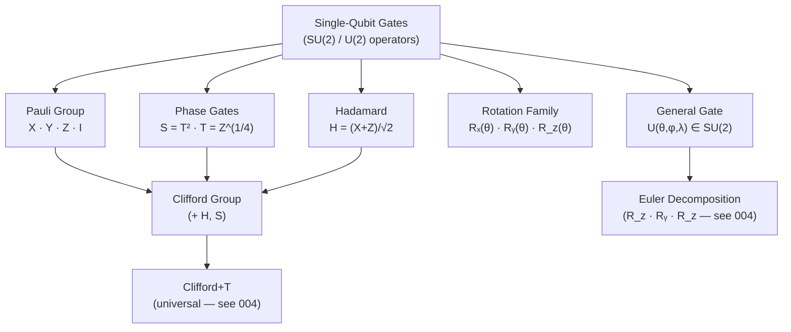

# QCSAA 900-909 · Section 00 · Subsection 901 · Subsubject 002 — Single-Qubit Gates

## 1. Purpose

Catalogues and formally characterises the **canonical single-qubit gate family**: Pauli operators (X, Y, Z), the Hadamard gate (H), phase gates (S, T and their adjoints), and the continuous rotation family (Rₓ, Rᵧ, R_z, U3). For each gate this document specifies the 2×2 unitary matrix, the Bloch-sphere geometric action, and the standard OpenQASM identifier, providing the reference set consumed by `003_` (multi-qubit gates), `004_` (decomposition), and `005_` (calibration)[^nielsen_chuang][^openqasm3].

## 2. Scope

- Covers the *Single-Qubit Gates* subsubject (`002`) of subsection `901` *Gates* within section `00` *Fundamentos de Computación Cuántica*.
- Inherits Q-Division authority and ORB support from the parent row in [`../../README.md` §3](../../README.md#3-architecture-table)[^archtable].
- Concepts in scope:
  - **Pauli gates** — X (bit-flip), Y (combined bit/phase-flip), Z (phase-flip); their matrix forms and eigenspaces; relation to Pauli group generators.
  - **Hadamard gate (H)** — equal superposition map, self-inverse property, and role as the primary basis-change primitive.
  - **Phase gates (S, T, S†, T†)** — S = √Z, T = Z^(1/4); their positions in the Clifford+T hierarchy[^gottesman_chuang] and relevance to fault-tolerant implementations.
  - **Rotation gates (Rₓ, Rᵧ, R_z)** — continuous single-axis rotations on the Bloch sphere parameterised by angle θ; matrix forms and composition identities.
  - **General single-qubit gate (U3 / U)** — three-parameter form U(θ, φ, λ) covering the full SU(2) group; Euler-angle decomposition and its use in hardware transpilation.
  - **Bloch-sphere geometry** — geometric interpretation of each gate class as a rotation about a Bloch-sphere axis; intuition for gate effect on arbitrary superpositions.
  - **Controlled versions** — promotion to controlled-single-qubit gates (covered in depth by `003_`); referenced here for completeness.
- Out of scope: multi-qubit gates (`003_`), universality proofs and decomposition algorithms (`004_`), and physical pulse implementation (`005_`).

## 3. Diagram — Single-Qubit Gate Taxonomy

## 4. Footprint

| Metric | Value |
|---|---|
| Architecture | `QCSAA` — Quantum Computing & Sentient Agency Architecture |
| Master range | `900–999` |
| Code range | `900-909` |
| Section | `00` — Fundamentos de Computación Cuántica |
| Subsection | `901` — Gates |
| Subsubject | `002` — Single-Qubit Gates |
| Primary Q-Division | Q-HORIZON[^qdiv] |
| Support Q-Divisions | Q-HPC, Q-DATAGOV |
| ORB support | ORB-PMO, ORB-LEG |
| Governance class | `restricted`[^gov] |
| Folder path | `Q+ATLANTIDE/900-999_QCSAA/900-909_Fundamentos-de-Computacion-Cuantica/901_Gates/` |
| Document | `002_Single-Qubit-Gates.md` (this file) |
| Parent subsection | [`README.md`](./README.md) · [`000_Overview.md`](./000_Overview.md) |
| Parent architecture | [`../../README.md`](../../README.md) |
| Parent baseline | [`organization/Q+ATLANTIDE.md`](../../../../organization/Q+ATLANTIDE.md) |

## 5. References & Citations

[^baseline]: **Q+ATLANTIDE controlled baseline (v1.0.0)** — [`organization/Q+ATLANTIDE.md`](../../../../organization/Q+ATLANTIDE.md). Defines the controlled `000-999` architecture-band taxonomy and the ATLAS-1000 register subpart.

[^archtable]: **QCSAA §3 Architecture Table** — [`../../README.md` §3](../../README.md#3-architecture-table). Authoritative source for the `900-909` row (Section `00` — Fundamentos de Computación Cuántica, Primary Q-Division Q-HORIZON).

[^qdiv]: **Q-Division authority** — Q-Divisions provide technical authority over an architecture row (Q+ATLANTIDE Note N-002). See [`organization/Q+ATLANTIDE.md` §4](../../../../organization/Q+ATLANTIDE.md#4-notes).

[^gov]: **Governance class** — `restricted` denotes documents requiring additional governance, evidence packages and access controls (rule N-006[^n006]).

[^n006]: **Note N-006 (Restricted bands)** — Quantum-related (`900-999` QCSAA) bands require additional governance, evidence packages and access controls. See [`organization/Q+ATLANTIDE.md` §5.3](../../../../organization/Q+ATLANTIDE.md#53-restricted-band-templates-n-006).

[^nielsen_chuang]: **Nielsen, M. A. & Chuang, I. L. — *Quantum Computation and Quantum Information* (10th anniversary ed., Cambridge University Press, 2010)** — Definitive reference for Pauli, Hadamard, phase, and rotation gate matrices and Bloch-sphere geometry. ISBN 978-1-107-00217-3.

[^openqasm3]: **Cross, A. W. et al. — *OpenQASM 3: A Broader and Deeper Quantum Assembly Language* (ACM TQCA 2022)** — Source of canonical gate identifiers (h, x, y, z, s, t, rx, ry, rz, u) used throughout this document. [arXiv:2104.14722](https://arxiv.org/abs/2104.14722).

[^gottesman_chuang]: **Gottesman, D. & Chuang, I. L. — "Demonstrating the Viability of Universal Quantum Computation Using Teleportation and Single-Qubit Operations" (*Nature* 402, 1999)** — Foundational paper establishing the Clifford+T gate hierarchy and the role of the T gate in fault-tolerant universality.

### Applicable standards

- Nielsen & Chuang — *Quantum Computation and Quantum Information* (Cambridge, 2010)[^nielsen_chuang]
- OpenQASM 3.0 — Open Quantum Assembly Language specification[^openqasm3]
- Gottesman & Chuang — Clifford+T universality (1999)[^gottesman_chuang]
- ISO/IEC 4879:2023 — Quantum computing — Vocabulary
