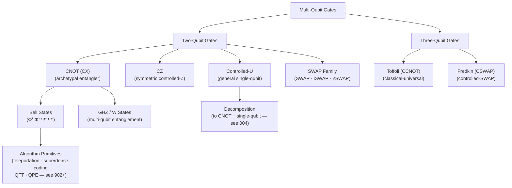

# QCSAA 900-909 · Section 00 · Subsection 901 · Subsubject 003 — Multi-Qubit Gates and Entangling Operations

## 1. Purpose

Defines the **canonical multi-qubit gate family** and the theory of entangling operations: controlled-NOT (CNOT), controlled-Z (CZ), controlled-U, SWAP and its variants (iSWAP, √SWAP), and the three-qubit Toffoli (CCNOT) and Fredkin (CSWAP) gates. For each gate this document specifies the unitary matrix in the computational basis, the circuit symbol, the entanglement structure it generates, and its role in Bell-state preparation and quantum algorithm primitives[^nielsen_chuang][^openqasm3].

## 2. Scope

- Covers the *Multi-Qubit Gates and Entangling Operations* subsubject (`003`) of subsection `901` *Gates* within section `00` *Fundamentos de Computación Cuántica*.
- Inherits Q-Division authority and ORB support from the parent row in [`../../README.md` §3](../../README.md#3-architecture-table)[^archtable].
- Concepts in scope:
  - **Two-qubit controlled gates** — CNOT (controlled-X): 4×4 matrix, control/target semantics, and role as the archetypal entangling gate; CZ (controlled-Z): symmetric form, equivalence to CNOT up to single-qubit rotations; general controlled-U for arbitrary single-qubit U.
  - **SWAP family** — SWAP: permutes two qubit states, decomposes to three CNOTs; iSWAP and √SWAP: native to superconducting and photonic platforms, used in hardware-efficient decompositions.
  - **Three-qubit gates** — Toffoli (CCNOT): doubly-controlled NOT, universal for classical reversible computation[^nielsen_chuang]; Fredkin (CSWAP): controlled-SWAP, applications in quantum sorting and fingerprinting.
  - **Entanglement generation** — Bell states (Φ⁺, Φ⁻, Ψ⁺, Ψ⁻) from H⊗I followed by CNOT; GHZ and W state preparation circuits; Schmidt decomposition and entanglement entropy as measures of gate entangling power.
  - **Two-qubit gate classification** — local equivalence classes under single-qubit unitaries (Weyl chamber representation); perfect entanglers; entangling power.
  - **Native gate sets** — relationship between the canonical catalog here and hardware-native two-qubit primitives (e.g., ECR, ZZmax) handled in `005_`.
- Out of scope: single-qubit gate definitions (`002_`), universality decomposition algorithms (`004_`), and physical calibration (`005_`).

## 3. Diagram — Multi-Qubit Gate Hierarchy and Entanglement Flow

## 4. Footprint

| Metric | Value |
|---|---|
| Architecture | `QCSAA` — Quantum Computing & Sentient Agency Architecture |
| Master range | `900–999` |
| Code range | `900-909` |
| Section | `00` — Fundamentos de Computación Cuántica |
| Subsection | `901` — Gates |
| Subsubject | `003` — Multi-Qubit Gates and Entangling Operations |
| Primary Q-Division | Q-HORIZON[^qdiv] |
| Support Q-Divisions | Q-HPC, Q-DATAGOV |
| ORB support | ORB-PMO, ORB-LEG |
| Governance class | `restricted`[^gov] |
| Folder path | `Q+ATLANTIDE/900-999_QCSAA/900-909_Fundamentos-de-Computacion-Cuantica/901_Gates/` |
| Document | `003_Multi-Qubit-Gates-and-Entangling-Operations.md` (this file) |
| Parent subsection | [`README.md`](./README.md) · [`000_Overview.md`](./000_Overview.md) |
| Parent architecture | [`../../README.md`](../../README.md) |
| Parent baseline | [`organization/Q+ATLANTIDE.md`](../../../../organization/Q+ATLANTIDE.md) |

## 5. References & Citations

[^baseline]: **Q+ATLANTIDE controlled baseline (v1.0.0)** — [`organization/Q+ATLANTIDE.md`](../../../../organization/Q+ATLANTIDE.md). Defines the controlled `000-999` architecture-band taxonomy and the ATLAS-1000 register subpart.

[^archtable]: **QCSAA §3 Architecture Table** — [`../../README.md` §3](../../README.md#3-architecture-table). Authoritative source for the `900-909` row (Section `00` — Fundamentos de Computación Cuántica, Primary Q-Division Q-HORIZON).

[^qdiv]: **Q-Division authority** — Q-Divisions provide technical authority over an architecture row (Q+ATLANTIDE Note N-002). See [`organization/Q+ATLANTIDE.md` §4](../../../../organization/Q+ATLANTIDE.md#4-notes).

[^gov]: **Governance class** — `restricted` denotes documents requiring additional governance, evidence packages and access controls (rule N-006[^n006]).

[^n006]: **Note N-006 (Restricted bands)** — Quantum-related (`900-999` QCSAA) bands require additional governance, evidence packages and access controls. See [`organization/Q+ATLANTIDE.md` §5.3](../../../../organization/Q+ATLANTIDE.md#53-restricted-band-templates-n-006).

[^nielsen_chuang]: **Nielsen, M. A. & Chuang, I. L. — *Quantum Computation and Quantum Information* (10th anniversary ed., Cambridge University Press, 2010)** — Primary reference for CNOT, Toffoli, SWAP, Bell-state generation, and entanglement entropy. ISBN 978-1-107-00217-3.

[^openqasm3]: **Cross, A. W. et al. — *OpenQASM 3: A Broader and Deeper Quantum Assembly Language* (ACM TQCA 2022)** — Canonical identifiers cx, cz, swap, iswap, ccx, cswap used throughout this document. [arXiv:2104.14722](https://arxiv.org/abs/2104.14722).

[^zhang_weyl]: **Zhang, J. et al. — "Geometric Theory of Nonlocal Two-Qubit Operations" (*Physical Review A* 67, 2003)** — Foundational paper on the Weyl chamber classification of two-qubit gates and local equivalence classes including perfect entanglers.

### Applicable standards

- Nielsen & Chuang — *Quantum Computation and Quantum Information* (Cambridge, 2010)[^nielsen_chuang]
- OpenQASM 3.0 — Open Quantum Assembly Language specification[^openqasm3]
- Zhang et al. — Weyl chamber classification of two-qubit gates (2003)[^zhang_weyl]
- ISO/IEC 4879:2023 — Quantum computing — Vocabulary
