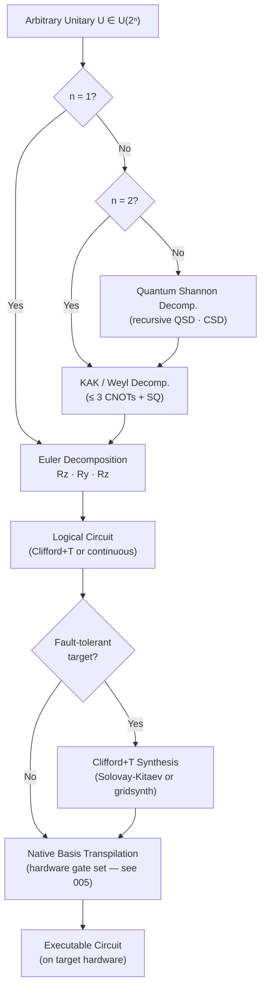

# QCSAA 900-909 · Section 00 · Subsection 901 · Subsubject 004 — Universal Gate Sets and Decomposition

## 1. Purpose

Establishes the **theory and practice of quantum gate universality**: the conditions under which a finite gate set can approximate any unitary to arbitrary precision, the key universal sets (Clifford+T, {H, T, CNOT}, and continuous-parameter families), the Solovay-Kitaev theorem on approximation efficiency, and the standard decomposition algorithms (Euler-angle, KAK/Weyl, QSD) used to transpile arbitrary unitaries into sequences executable on a target hardware gate set[^nielsen_chuang][^dawson_nielsen].

## 2. Scope

- Covers the *Universal Gate Sets and Decomposition* subsubject (`004`) of subsection `901` *Gates* within section `00` *Fundamentos de Computación Cuántica*.
- Inherits Q-Division authority and ORB support from the parent row in [`../../README.md` §3](../../README.md#3-architecture-table)[^archtable].
- Concepts in scope:
  - **Universality definition** — density of finite-gate-set closures in U(2ⁿ) under composition; approximate vs. exact universality; distinction from classical Boolean universality.
  - **Clifford group and its limitations** — Gottesman-Knill theorem: Clifford circuits are classically simulable; non-universality of the Clifford group; need for at least one non-Clifford gate (e.g., T) for quantum advantage.
  - **Clifford+T universal set** — {H, S, T, CNOT} as the standard fault-tolerant universal set; T-count as a resource metric; magic-state distillation connection.
  - **Continuous universal sets** — {CNOT, all single-qubit gates} and {CNOT, H, Rz(θ)} for irrational θ/π; relevance to variational quantum algorithms.
  - **Solovay-Kitaev theorem** — any SU(2) gate can be approximated to precision ε using O(log^c(1/ε)) gates from a dense universal set; algorithmic construction and practical implications for compilation overhead[^dawson_nielsen].
  - **Single-qubit decomposition** — Euler-angle (ZYZ / ZXZ) decomposition: any U ∈ SU(2) = Rz(α)·Ry(β)·Rz(γ); Bloch-sphere interpretation.
  - **Two-qubit decomposition (KAK / Weyl)** — any U ∈ SU(4) decomposes into at most 3 CNOT gates plus single-qubit operations; circuit depth bounds and hardware-native basis transpilation.
  - **n-qubit Quantum Shannon Decomposition (QSD)** — recursive cosine-sine decomposition reducing an arbitrary n-qubit unitary to a circuit of size O(4ⁿ); CSD-based and multiplexor techniques.
  - **Transpilation and hardware basis mapping** — mapping a logical gate sequence to a physical native gate set (e.g., {ECR, Rz, X} for IBM, {CZ, Rz, X} for Google); optimization passes: gate cancellation, commutation, peephole replacement, and routing-aware decomposition as addressed in `005_`.
- Out of scope: physical pulse-level implementation and calibration (`005_`); specific gate matrices (`001_`–`003_`).

## 3. Diagram — Universality and Decomposition Pipeline

## 4. Footprint

| Metric | Value |
|---|---|
| Architecture | `QCSAA` — Quantum Computing & Sentient Agency Architecture |
| Master range | `900–999` |
| Code range | `900-909` |
| Section | `00` — Fundamentos de Computación Cuántica |
| Subsection | `901` — Gates |
| Subsubject | `004` — Universal Gate Sets and Decomposition |
| Primary Q-Division | Q-HORIZON[^qdiv] |
| Support Q-Divisions | Q-HPC, Q-DATAGOV |
| ORB support | ORB-PMO, ORB-LEG |
| Governance class | `restricted`[^gov] |
| Folder path | `Q+ATLANTIDE/900-999_QCSAA/900-909_Fundamentos-de-Computacion-Cuantica/901_Gates/` |
| Document | `004_Universal-Gate-Sets-and-Decomposition.md` (this file) |
| Parent subsection | [`README.md`](./README.md) · [`000_Overview.md`](./000_Overview.md) |
| Parent architecture | [`../../README.md`](../../README.md) |
| Parent baseline | [`organization/Q+ATLANTIDE.md`](../../../../organization/Q+ATLANTIDE.md) |

## 5. References & Citations

[^baseline]: **Q+ATLANTIDE controlled baseline (v1.0.0)** — [`organization/Q+ATLANTIDE.md`](../../../../organization/Q+ATLANTIDE.md). Defines the controlled `000-999` architecture-band taxonomy and the ATLAS-1000 register subpart.

[^archtable]: **QCSAA §3 Architecture Table** — [`../../README.md` §3](../../README.md#3-architecture-table). Authoritative source for the `900-909` row (Section `00` — Fundamentos de Computación Cuántica, Primary Q-Division Q-HORIZON).

[^qdiv]: **Q-Division authority** — Q-Divisions provide technical authority over an architecture row (Q+ATLANTIDE Note N-002). See [`organization/Q+ATLANTIDE.md` §4](../../../../organization/Q+ATLANTIDE.md#4-notes).

[^gov]: **Governance class** — `restricted` denotes documents requiring additional governance, evidence packages and access controls (rule N-006[^n006]).

[^n006]: **Note N-006 (Restricted bands)** — Quantum-related (`900-999` QCSAA) bands require additional governance, evidence packages and access controls. See [`organization/Q+ATLANTIDE.md` §5.3](../../../../organization/Q+ATLANTIDE.md#53-restricted-band-templates-n-006).

[^nielsen_chuang]: **Nielsen, M. A. & Chuang, I. L. — *Quantum Computation and Quantum Information* (10th anniversary ed., Cambridge University Press, 2010)** — Universality theorems, Clifford+T, Euler decomposition, and KAK/Weyl two-qubit decomposition. ISBN 978-1-107-00217-3.

[^dawson_nielsen]: **Dawson, C. M. & Nielsen, M. A. — "The Solovay-Kitaev Algorithm" (*Quantum Information and Computation* 6(1), 2006)** — Constructive proof and algorithmic description of the Solovay-Kitaev theorem and its compilation implications. [arXiv:quant-ph/0505030](https://arxiv.org/abs/quant-ph/0505030).

[^shende_qsd]: **Shende, V. V., Markov, I. L. & Bullock, S. S. — "Synthesis of Quantum Logic Circuits" (*IEEE TCAD* 25(6), 2006)** — Quantum Shannon Decomposition and exact lower bounds on CNOT count for arbitrary n-qubit unitaries. [arXiv:quant-ph/0406176](https://arxiv.org/abs/quant-ph/0406176).

[^openqasm3]: **Cross, A. W. et al. — *OpenQASM 3: A Broader and Deeper Quantum Assembly Language* (ACM TQCA 2022)** — Gate set specification and transpilation pass conventions. [arXiv:2104.14722](https://arxiv.org/abs/2104.14722).

### Applicable standards

- Nielsen & Chuang — *Quantum Computation and Quantum Information* (Cambridge, 2010)[^nielsen_chuang]
- Dawson & Nielsen — Solovay-Kitaev Algorithm (2006)[^dawson_nielsen]
- Shende, Markov & Bullock — Quantum Shannon Decomposition (2006)[^shende_qsd]
- OpenQASM 3.0 — Open Quantum Assembly Language specification[^openqasm3]
- ISO/IEC 4879:2023 — Quantum computing — Vocabulary
