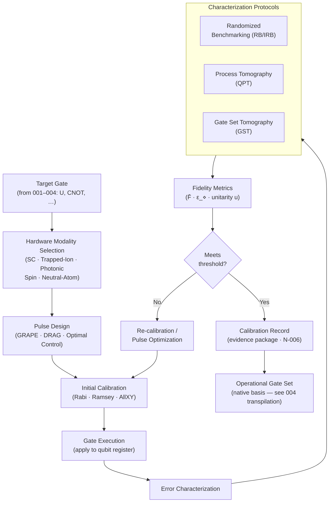

# QCSAA 900-909 · Section 00 · Subsection 901 · Subsubject 005 — Gate Implementation, Calibration and Error Characterization

## 1. Purpose

Addresses the **physical realisation, calibration workflow, and error characterisation** of quantum gates across the primary qubit modalities (superconducting transmon, trapped-ion, photonic, spin-qubit, and neutral-atom). For each modality this document specifies the native gate set, the pulse-level control model, the key calibration parameters and schedules, the principal error channels (decoherence, leakage, crosstalk), and the standard characterisation protocols — Randomized Benchmarking (RB), Gate Set Tomography (GST), and process tomography — used to quantify and track gate fidelity in operational quantum hardware[^krantz_review][^nielsen_chuang][^ieee_p7131].

## 2. Scope

- Covers the *Gate Implementation, Calibration and Error Characterization* subsubject (`005`) of subsection `901` *Gates* within section `00` *Fundamentos de Computación Cuántica*.
- Inherits Q-Division authority and ORB support from the parent row in [`../../README.md` §3](../../README.md#3-architecture-table)[^archtable].
- Concepts in scope:
  - **Physical gate realisation by modality** — superconducting qubits (microwave-pulse-driven cross-resonance / iSWAP / CZ); trapped ions (laser-driven Mølmer-Sørensen / geometric phase gates); photonic qubits (KLM beam-splitter networks, postselection-based CNOT); spin qubits (exchange-interaction gates, EDSR pulses); neutral atoms (Rydberg blockade CZ).
  - **Pulse-level control model** — quantum optimal control (GRAPE, DRAG), rotating-frame Hamiltonian, baseband/modulated I/Q drives, and the mapping from gate matrix to pulse envelope.
  - **Calibration workflow** — Rabi oscillation and Ramsey experiments for frequency and pulse-amplitude calibration; AllXY / amplified phase error sequences; two-qubit gate calibration (cross-resonance tone, Mølmer-Sørensen laser phase); drift monitoring and auto-recalibration schedules.
  - **Key calibration parameters** — gate time T_g, π-pulse amplitude, detuning δ, drive frequency ω_d, ZZ coupling strength; acceptance thresholds per IEEE P7131[^ieee_p7131].
  - **Error channels** — coherent errors (over-rotation, off-resonance); incoherent errors (T₁ relaxation, T₂ dephasing); leakage to non-computational subspace; two-qubit crosstalk; readout errors and their decoupling from gate benchmarking.
  - **Randomized Benchmarking (RB)** — standard RB for average gate fidelity; interleaved RB (IRB) for individual gate fidelity; purity benchmarking; simultaneous RB for cross-talk quantification[^emerson_rb].
  - **Process Tomography (QPT / GST)** — quantum process tomography (QPT) for full χ-matrix reconstruction; Gate Set Tomography (GST) for self-consistent characterisation of gate sets without fiducial state/measurement errors[^blume_kohout_gst].
  - **Gate fidelity metrics** — average gate fidelity F̄, diamond-norm error ε_⋄, unitarity u; reporting conventions per IEEE P7131[^ieee_p7131].
  - **Traceability and records** — calibration data-module structure per S1000D[^s1000d]; version-controlled pulse-library artefacts; evidence-package linkage per N-006[^n006].
- Out of scope: abstract gate definitions (`001_`); single- and multi-qubit gate catalogs (`002_`–`003_`); decomposition algorithms (`004_`).

## 3. Diagram — Gate Calibration and Characterization Lifecycle

## 4. Footprint

| Metric | Value |
|---|---|
| Architecture | `QCSAA` — Quantum Computing & Sentient Agency Architecture |
| Master range | `900–999` |
| Code range | `900-909` |
| Section | `00` — Fundamentos de Computación Cuántica |
| Subsection | `901` — Gates |
| Subsubject | `005` — Gate Implementation, Calibration and Error Characterization |
| Primary Q-Division | Q-HORIZON[^qdiv] |
| Support Q-Divisions | Q-HPC, Q-DATAGOV |
| ORB support | ORB-PMO, ORB-LEG |
| Governance class | `restricted`[^gov] |
| Folder path | `Q+ATLANTIDE/900-999_QCSAA/900-909_Fundamentos-de-Computacion-Cuantica/901_Gates/` |
| Document | `005_Gate-Implementation-Calibration-and-Error-Characterization.md` (this file) |
| Parent subsection | [`README.md`](./README.md) · [`000_Overview.md`](./000_Overview.md) |
| Parent architecture | [`../../README.md`](../../README.md) |
| Parent baseline | [`organization/Q+ATLANTIDE.md`](../../../../organization/Q+ATLANTIDE.md) |

## 5. References & Citations

[^baseline]: **Q+ATLANTIDE controlled baseline (v1.0.0)** — [`organization/Q+ATLANTIDE.md`](../../../../organization/Q+ATLANTIDE.md). Defines the controlled `000-999` architecture-band taxonomy and the ATLAS-1000 register subpart.

[^archtable]: **QCSAA §3 Architecture Table** — [`../../README.md` §3](../../README.md#3-architecture-table). Authoritative source for the `900-909` row (Section `00` — Fundamentos de Computación Cuántica, Primary Q-Division Q-HORIZON).

[^qdiv]: **Q-Division authority** — Q-Divisions provide technical authority over an architecture row (Q+ATLANTIDE Note N-002). See [`organization/Q+ATLANTIDE.md` §4](../../../../organization/Q+ATLANTIDE.md#4-notes).

[^gov]: **Governance class** — `restricted` denotes documents requiring additional governance, evidence packages and access controls (rule N-006[^n006]).

[^n006]: **Note N-006 (Restricted bands)** — Quantum-related (`900-999` QCSAA) bands require additional governance, evidence packages and access controls. Templates must declare `evidence_package_id` and `access_control_profile`. See [`organization/Q+ATLANTIDE.md` §5.3](../../../../organization/Q+ATLANTIDE.md#53-restricted-band-templates-n-006).

[^nielsen_chuang]: **Nielsen, M. A. & Chuang, I. L. — *Quantum Computation and Quantum Information* (10th anniversary ed., Cambridge University Press, 2010)** — Process tomography formalism, error channels, and average gate fidelity. ISBN 978-1-107-00217-3.

[^krantz_review]: **Krantz, P. et al. — "A Quantum Engineer's Guide to Superconducting Qubits" (*Applied Physics Reviews* 6(2), 2019)** — Comprehensive reference for superconducting-qubit gate implementation, pulse design, and calibration workflows. [DOI:10.1063/1.5089550](https://doi.org/10.1063/1.5089550).

[^emerson_rb]: **Emerson, J. et al. — "Scalable Noise Estimation with Random Unitary Operators" (*J. Optics B* 7, 2005)** — Foundational paper for Randomized Benchmarking protocol for average gate fidelity estimation.

[^blume_kohout_gst]: **Blume-Kohout, R. et al. — "Demonstration of Qubit Operations Below a Rigorous Fault Tolerance Threshold with Gate Set Tomography" (*Nature Communications* 8, 2017)** — Gate Set Tomography methodology and self-consistent characterisation without SPAM errors. [DOI:10.1038/ncomms14485](https://doi.org/10.1038/ncomms14485).

[^ieee_p7131]: **IEEE P7131 — Standard for Quantum Computing Performance Metrics and Benchmarking** — Defines gate fidelity reporting conventions (F̄, ε_⋄, unitarity), acceptance thresholds, and calibration record structures.

[^s1000d]: **S1000D Issue 6.0 — International Specification for Technical Publications** — Common Source DataBase (CSDB) and data-module structure applied to calibration records and pulse-library artefacts within Q+ATLANTIDE.

### Applicable standards

- Nielsen & Chuang — *Quantum Computation and Quantum Information* (Cambridge, 2010)[^nielsen_chuang]
- Krantz et al. — A Quantum Engineer's Guide to Superconducting Qubits (2019)[^krantz_review]
- Emerson et al. — Randomized Benchmarking (2005)[^emerson_rb]
- Blume-Kohout et al. — Gate Set Tomography (2017)[^blume_kohout_gst]
- IEEE P7131 — Quantum Computing Performance Metrics and Benchmarking[^ieee_p7131]
- S1000D Issue 6.0 — International Specification for Technical Publications[^s1000d]
- ISO/IEC 4879:2023 — Quantum computing — Vocabulary
