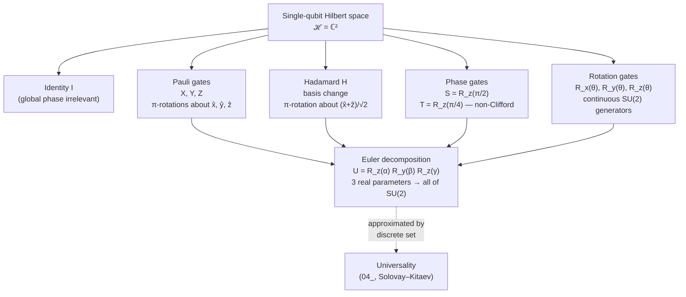

# QCSAA 900-909 · Section 00 · Subsection 901 · Subsubject 002 — Single-Qubit Gates

## 1. Purpose

Catalogues the **single-qubit unitary gates** that act on one qubit at a time, fixes their canonical matrix forms and Bloch-sphere geometric meanings, and states the Euler decomposition that lets any single-qubit unitary be reconstructed from a small parameterised set. This subsubject is the SU(2) layer of the chapter; multi-qubit (entangling) gates are deferred to `003_`.

## 2. Scope

- Covers the *Single-Qubit Gates* subsubject (`002`) of subsection `901` *gates* within section `00` *Fundamentos de Computación Cuántica*.
- Inherits Q-Division authority and ORB support from the parent row in [`../../README.md` §3](../../README.md#3-architecture-table)[^archtable].
- Gate families in scope:
  - **Identity and global phase** — $I$ acts as the no-op; an overall global phase $e^{i\gamma}$ on a state vector is **physically unobservable**, so single-qubit gates are conventionally specified up to global phase (i.e. as elements of PSU(2) when global phase is irrelevant). Relative phases between branches of a superposition, by contrast, **are** observable.
  - **Pauli gates X, Y, Z** — bit flip, bit-and-phase flip, and phase flip respectively. Geometric meaning on the Bloch sphere: $\pi$-rotations about the $\hat{x}$, $\hat{y}$, $\hat{z}$ axes (up to global phase).
  - **Hadamard H** — basis change between the computational basis $\{|0\rangle, |1\rangle\}$ and the Hadamard basis $\{|+\rangle, |-\rangle\}$; the canonical generator of single-qubit superposition. Geometrically a $\pi$-rotation about the $\hat{x}+\hat{z}$ axis.
  - **Phase gates S and T** — diagonal gates inducing relative phases of $\pi/2$ (S, the "phase gate") and $\pi/4$ (T, the "$\pi/8$ gate"). $T$ is the canonical **non-Clifford** single-qubit gate and is the principal cost driver in fault-tolerant compilation (see `004_`).
  - **Rotation gates** $R_x(\theta) = e^{-i\theta X/2}$, $R_y(\theta) = e^{-i\theta Y/2}$, $R_z(\theta) = e^{-i\theta Z/2}$ — continuous one-parameter rotations about the Bloch axes; native primitives on most hardware modalities.
  - **Arbitrary single-qubit unitaries via Euler decomposition.** Any $U \in \mathrm{SU}(2)$ can be written, up to global phase, as $U = R_z(\alpha) R_y(\beta) R_z(\gamma)$ for some $(\alpha, \beta, \gamma)$, or equivalently in the $ZXZ$ convention. Three real parameters specify the gate, matching the dimension of SU(2).
- Out of scope: multi-qubit entangling gates and their decompositions (`003_`); the discrete-set approximation problem and Solovay–Kitaev (`004_`); pulse-level realization, calibration, and fidelity (`005_`).

## 3. Diagram — Single-Qubit Gate Taxonomy on the Bloch Sphere

The diagram groups the gates of §2 by their **geometric action on the Bloch sphere**, which is the most useful mental model for reasoning about single-qubit circuits. The continuous rotations $R_x, R_y, R_z$ subsume the Paulis (as $\pi$-rotations) and the phase gates (as $R_z$ at fixed angles), and the Euler box on the right closes the algebra: every single-qubit gate is an element of the same three-parameter family.

## 4. Footprint

| Metric | Value |
|---|---|
| Architecture | `QCSAA` — Quantum Computing & Sentient Agency Architecture |
| Master range | `900–999` |
| Code range | `900-909` |
| Section | `00` — Fundamentos de Computación Cuántica |
| Subject | `00` — General Information |
| Subsection | `901` — gates |
| Subsubject | `002` — Single-Qubit Gates |
| Primary Q-Division | Q-HORIZON[^qdiv] |
| Support Q-Divisions | Q-HPC, Q-DATAGOV |
| ORB support | ORB-PMO, ORB-LEG |
| Governance class | `restricted`[^gov] |
| Folder path | `Q+ATLANTIDE/900-999_QCSAA/900-909_Fundamentos-de-Computacion-Cuantica/901_gates/` |
| Document | `002_Single-Qubit-Gates.md` (this file) |
| Parent subsection | [`README.md`](./README.md) · [`000_Overview.md`](./000_Overview.md) |
| Parent architecture | [`../../README.md`](../../README.md) |
| Parent baseline | [`organization/Q+ATLANTIDE.md`](../../../../organization/Q+ATLANTIDE.md) |

## 5. References & Citations

[^baseline]: **Q+ATLANTIDE controlled baseline (v1.0.0)** — [`organization/Q+ATLANTIDE.md`](../../../../organization/Q+ATLANTIDE.md). Defines the controlled `000-999` architecture-band taxonomy and the ATLAS-1000 register subpart.

[^archtable]: **QCSAA §3 Architecture Table** — [`../../README.md` §3](../../README.md#3-architecture-table). Authoritative source for the `900-909` row (Section `00` — Fundamentos de Computación Cuántica, Primary Q-Division Q-HORIZON).

[^qdiv]: **Q-Division authority** — Q-Divisions provide technical authority over an architecture row (Q+ATLANTIDE Note N-002). See [`organization/Q+ATLANTIDE.md` §4](../../../../organization/Q+ATLANTIDE.md#4-notes).

[^gov]: **Governance class** — Bands are classified as `baseline` or `restricted` per Q+ATLANTIDE §4 governance rules.

[^ieeep7130]: **IEEE P7130 — Standard for Quantum Computing Definitions** — Vocabulary baseline for the quantum computing scope of QCSAA `900-999`.

[^s1000d]: **S1000D Issue 6.0 — International specification for technical publications** — Common Source DataBase (CSDB) and Data Module Code (DMC) specification used for all Q+ATLANTIDE artefacts.

[^as9100d]: **AS9100D — Quality Management Systems — Aviation, Space and Defense Organizations** — Quality-management baseline for all Q+ATLANTIDE deliverables.

### Applicable industry standards

The following standards apply to this subsubject in addition to the cross-cutting Q+ATLANTIDE governance:

- IEEE P7130 — Standard for Quantum Computing Definitions[^ieeep7130]
- S1000D Issue 6.0 — International specification for technical publications[^s1000d]
- AS9100D — Quality Management Systems — Aviation, Space and Defense Organizations[^as9100d]
