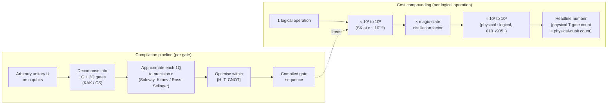

# QCSAA 900-909 · Section 00 · Subsection 901 · Subsubject 004 — Universal Gate Sets and Decomposition

## 1. Purpose

Defines what **universality** means for a quantum gate set, lists the canonical universal sets used across the program, states the **Solovay–Kitaev theorem** as the bridge from "any unitary in principle" to "this many gates in practice", and **derives the headline fault-tolerant overhead numbers honestly** so that the program does not silently inherit them from the popular press. This subsubject is also the slot where contributors are most tempted to drift across the boundary into `030_circuits/`; §3 restates that boundary explicitly.

## 2. Scope

- Covers the *Universal Gate Sets and Decomposition* subsubject (`004`) of subsection `901` *gates* within section `00` *Fundamentos de Computación Cuántica*.
- Inherits Q-Division authority and ORB support from the parent row in [`../../README.md` §3](../../README.md#3-architecture-table)[^archtable].
- Concepts in scope:
  - **Definition of universality.** A finite gate set $\mathcal{G}$ is **universal for quantum computation** iff, for every unitary $U$ on any number of qubits and every $\varepsilon > 0$, there exists a finite sequence of gates from $\mathcal{G}$ whose composition $U_{\mathcal{G}}$ satisfies $\|U - U_{\mathcal{G}}\| < \varepsilon$ in the operator norm. Universality is **approximation, not exact synthesis** — the discrete set $\mathcal{G}$ generates a dense subgroup of $\mathrm{SU}(2^n)$ but cannot reach every unitary exactly in finitely many steps.
  - **Solovay–Kitaev theorem.** For any finite universal single-qubit set $\mathcal{G}$ closed under inversion, an arbitrary single-qubit unitary can be approximated to operator-norm precision $\varepsilon$ using $O(\log^c(1/\varepsilon))$ gates from $\mathcal{G}$, where $c \approx 3.97$ for the original constructive proof and improved variants reach $c \approx 1$ asymptotically.
  - **Common universal sets used across the program:**
    - $\{H, T, \text{CNOT}\}$ — the canonical fault-tolerant universal set, with $T$ as the only non-Clifford primitive.
    - **Clifford + T** — the operational form of the same set: every Clifford gate can be implemented transversally on common stabilizer codes (cheap), while $T$ requires magic-state distillation (expensive). This is the cost asymmetry that drives §4.
    - $\{H, \text{CNOT}, R_z(\pi/4)\}$ — equivalent to Clifford + T with the non-Clifford gate stated as a $\pi/4$ rotation.
    - **Toffoli + H** — alternative universal set, useful when classical reversible structure dominates.
  - **Gate compilation and decomposition.** The pipeline from a high-level unitary to an executable sequence of gates from $\mathcal{G}$:
    1. **Decomposition** of an arbitrary multi-qubit unitary into single-qubit and two-qubit gates (KAK / cosine-sine decomposition; $O(4^n)$ two-qubit gates in the worst case).
    2. **Approximation** of each single-qubit gate to precision $\varepsilon$ via Solovay–Kitaev or modern direct synthesis (Ross–Selinger for the Clifford+T set, with near-optimal $T$-counts).
    3. **Optimisation** within $\mathcal{G}$ (commutation, cancellation, peephole rewriting).
  - **Trade-offs.** Gate count, $T$-count specifically (the cost-driver in fault-tolerant compilation), and ancilla usage are independent axes; reducing one typically increases another. The trade-off **between gate count and parallelisation / circuit depth** is **not** addressed here — see §3.
- Out of scope: physical realization of any gate in $\mathcal{G}$ on a given modality (`005_`); the construction of complete circuits from compiled gate sequences, including depth, scheduling, and mid-circuit measurement (`030_circuits/`).

## 3. Boundary Against `030_circuits/` (Binding Reminder)

This subsubject is the slot where gate counts naturally invite circuit-level reasoning, and contributors will be tempted to add material such as "circuit depth as a function of $T$-count" or "parallelisation of decomposed CNOT chains". **Such material does not belong here.** The chapter boundary stated in the parent [`000_Overview.md`](./000_Overview.md) §2 applies in full at this slot:

| Belongs in `901_gates/904_` (this file) | Belongs in `030_circuits/` |
|---|---|
| What "universal" means for a gate set | What "universal" means for a quantum circuit family |
| Solovay–Kitaev gate-count overhead per single-qubit gate | Total circuit gate count and circuit depth as algorithm-level resources |
| Decomposition of *one* unitary into a sequence of gates | Composition of decomposed sequences into a complete algorithm |
| $T$-count as a per-gate compilation metric | $T$-count budget allocated to a complete computation |
| Existence of a compiled sequence | Scheduling, parallelisation, mid-circuit measurement, classical control flow |

## 4. Honest Derivation of the Fault-Tolerant Overhead Headline

Most introductory material treats "universal gate set" as a checkbox: once the program has $\{H, T, \text{CNOT}\}$, universality is declared and the discussion stops. This subsubject **does not stop there**, because the Solovay–Kitaev overhead and its compounding with the physical-to-logical overhead from [`../010_Qubits/905_Logical-Qubits-Encoding-and-Error-Correction.md`](../010_Qubits/905_Logical-Qubits-Encoding-and-Error-Correction.md) is what actually produces the headline numbers ("billions of physical qubits to factor RSA-2048") that the popular press reports. The program shall derive those numbers here, not cite them from elsewhere.

| Stage | Multiplier | Derivation |
|---|---|---|
| **Logical algorithm operation** (e.g. one logical $T$ in Shor's algorithm) | $\times 1$ | Reference unit. |
| **Solovay–Kitaev / Ross–Selinger expansion** of an arbitrary single-qubit rotation to precision $\varepsilon \sim 10^{-15}$ (a representative target for fault-tolerant computations of cryptographic interest) | $\sim 10^2$ to $10^3$ physical $T$-gates per logical rotation, depending on synthesis algorithm and the specific $c$ in $O(\log^c(1/\varepsilon))$ | Direct application of the Solovay–Kitaev bound at $\varepsilon \sim 10^{-15}$. The constant $c$ is improved by Ross–Selinger and successors but does not vanish. |
| **Magic-state distillation** to produce each $T$ at the target logical error rate | additional protocol-dependent factor (typically $\sim 10$–$10^2$ raw magic states per distilled $T$, multiple rounds) | Out of scope here — see `010_Qubits/905_` for the encoding side and downstream chapters for the distillation protocols. |
| **Physical-to-logical qubit ratio** of the chosen code at the target error rate | $\sim 10^3$ to $10^6$ physical qubits per logical qubit | From [`../010_Qubits/905_Logical-Qubits-Encoding-and-Error-Correction.md`](../010_Qubits/905_Logical-Qubits-Encoding-and-Error-Correction.md) §2 (range determined by code family, threshold margin, and target logical error rate). |

The product of these factors is what the popular press summarises as "billions of physical qubits". The role of this subsubject in the chain is the **second row** — the Solovay–Kitaev expansion — and that row alone is responsible for the multiplier of $10^2$–$10^3$ on every algorithmic operation. Reducing this multiplier (better synthesis algorithms, alternative non-Clifford primitives, code-aware compilation) is therefore one of the most direct levers the program has on the headline number, **and is the right kind of work to plan against `901_gates/904_`** rather than against the encoding chapter or the algorithm chapter.

## 5. Diagram — Compilation Pipeline and Cost Compounding

The diagram on the left is the **per-gate** compilation pipeline of §2; the diagram on the right is the **cost compounding** of §4. They share an axis: every step on the left contributes a multiplier on the right.

## 6. Footprint

| Metric | Value |
|---|---|
| Architecture | `QCSAA` — Quantum Computing & Sentient Agency Architecture |
| Master range | `900–999` |
| Code range | `900-909` |
| Section | `00` — Fundamentos de Computación Cuántica |
| Subject | `00` — General Information |
| Subsection | `901` — gates |
| Subsubject | `004` — Universal Gate Sets and Decomposition |
| Primary Q-Division | Q-HORIZON[^qdiv] |
| Support Q-Divisions | Q-HPC, Q-DATAGOV |
| ORB support | ORB-PMO, ORB-LEG |
| Governance class | `restricted`[^gov] |
| Folder path | `Q+ATLANTIDE/900-999_QCSAA/900-909_Fundamentos-de-Computacion-Cuantica/901_gates/` |
| Document | `004_Universal-Gate-Sets-and-Decomposition.md` (this file) |
| Parent subsection | [`README.md`](./README.md) · [`000_Overview.md`](./000_Overview.md) |
| Parent architecture | [`../../README.md`](../../README.md) |
| Parent baseline | [`organization/Q+ATLANTIDE.md`](../../../../organization/Q+ATLANTIDE.md) |

## 7. References & Citations

[^baseline]: **Q+ATLANTIDE controlled baseline (v1.0.0)** — [`organization/Q+ATLANTIDE.md`](../../../../organization/Q+ATLANTIDE.md). Defines the controlled `000-999` architecture-band taxonomy and the ATLAS-1000 register subpart.

[^archtable]: **QCSAA §3 Architecture Table** — [`../../README.md` §3](../../README.md#3-architecture-table). Authoritative source for the `900-909` row (Section `00` — Fundamentos de Computación Cuántica, Primary Q-Division Q-HORIZON).

[^qdiv]: **Q-Division authority** — Q-Divisions provide technical authority over an architecture row (Q+ATLANTIDE Note N-002). See [`organization/Q+ATLANTIDE.md` §4](../../../../organization/Q+ATLANTIDE.md#4-notes).

[^gov]: **Governance class** — Bands are classified as `baseline` or `restricted` per Q+ATLANTIDE §4 governance rules.

[^ieeep7130]: **IEEE P7130 — Standard for Quantum Computing Definitions** — Vocabulary baseline for the quantum computing scope of QCSAA `900-999`.

[^s1000d]: **S1000D Issue 6.0 — International specification for technical publications** — Common Source DataBase (CSDB) and Data Module Code (DMC) specification used for all Q+ATLANTIDE artefacts.

[^as9100d]: **AS9100D — Quality Management Systems — Aviation, Space and Defense Organizations** — Quality-management baseline for all Q+ATLANTIDE deliverables.

### Applicable industry standards

The following standards apply to this subsubject in addition to the cross-cutting Q+ATLANTIDE governance:

- IEEE P7130 — Standard for Quantum Computing Definitions[^ieeep7130]
- S1000D Issue 6.0 — International specification for technical publications[^s1000d]
- AS9100D — Quality Management Systems — Aviation, Space and Defense Organizations[^as9100d]
