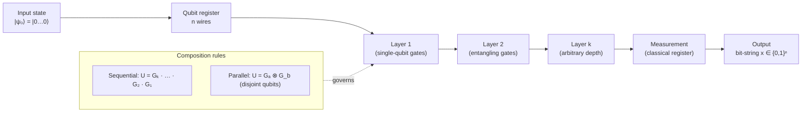

# QCSAA 900–909 · Section 00 · Subsection 902 · Subsubject 001 — Circuit Definition and Composition

## 1. Purpose

Defines the **quantum circuit model** — the universal framework in which quantum computation is specified as an ordered sequence of quantum gates acting on a register of qubits. Establishes the controlled vocabulary for circuit notation, gate composition rules, unitary semantics, and the relationship between circuit structure and the underlying Hilbert-space formalism, in conformance with IEEE Std 7130-2023[^ieee7130] and ISO/IEC 4879:2023[^iso4879]. This vocabulary is the foundational reference for all subsequent subsection documents (`002`–`005`) and for downstream QCSAA subsubjects that reference circuits.

## 2. Scope

- Covers the *Circuit Definition and Composition* subsubject (`001`) of subsection `902` *Circuits* within section `00` *Fundamentos de Computación Cuántica*.
- Inherits Q-Division authority and ORB support from the parent row in [`../../README.md` §3](../../README.md#3-architecture-table)[^archtable].
- Concepts in scope:
  - **Quantum circuit model** — the directed acyclic graph (DAG) representation of computation: nodes are gate operations and edges represent qubit/classical wires flowing left-to-right in standard notation.
  - **Qubit registers** — ordered collections of two-state quantum systems (`|0⟩`, `|1⟩`); classical registers that store measurement outcomes and feed classical-control logic.
  - **Quantum gates** — unitary operators on one or more qubits; categorised as single-qubit rotations (Pauli X/Y/Z, H, S, T, Rx/Ry/Rz), controlled gates (CNOT, CZ, Toffoli), and multi-qubit entangling operations (SWAP, iSWAP).
  - **Gate composition** — sequential composition (matrix product of unitaries applied left-to-right on state vector), parallel composition (tensor product of independent gates acting on disjoint qubit subsets), and the resulting overall circuit unitary.
  - **Circuit notation** — standard wire-and-box diagram notation; OpenQASM 3.0[^openqasm3] textual representation; and the DAG internal representation used by compilation toolchains.
  - **Universal gate sets** — conditions under which a finite gate set generates all unitaries to arbitrary precision; canonical universal sets (Clifford+T; Solovay–Kitaev approximation).
- Out of scope: structural circuit metrics (`002_`), measurement and classical control (`003_`), transpilation for physical hardware (`004_`), and noise-resilient patterns (`005_`).

## 3. Diagram — Quantum Circuit Structure

A quantum circuit maps an input state across a sequence of gate layers and terminates with measurement. The DAG representation captures data dependencies between gates.

## 4. Footprint

| Metric | Value |
|---|---|
| Architecture | `QCSAA` — Quantum Computing & Sentient Agency Architecture |
| Master range | `900–999` |
| Code range | `900-909` |
| Section | `00` — Fundamentos de Computación Cuántica |
| Subsection | `902` — Circuits |
| Subsubject | `001` — Circuit Definition and Composition |
| Primary Q-Division | Q-HORIZON[^qdiv] |
| Support Q-Divisions | Q-HPC, Q-DATAGOV |
| ORB support | ORB-PMO, ORB-LEG |
| Governance class | `restricted`[^gov] |
| Folder path | `Q+ATLANTIDE/900-999_QCSAA/900-909_Fundamentos-de-Computacion-Cuantica/902_Circuits/` |
| Document | `001_Circuit-Definition-and-Composition.md` (this file) |
| Parent subsection | [`README.md`](./README.md) · [`000_Overview.md`](./000_Overview.md) |
| Parent architecture | [`../../README.md`](../../README.md) |
| Parent baseline | [`organization/Q+ATLANTIDE.md`](../../../../organization/Q+ATLANTIDE.md) |

## 5. References & Citations

[^baseline]: **Q+ATLANTIDE controlled baseline (v1.0.0)** — [`organization/Q+ATLANTIDE.md`](../../../../organization/Q+ATLANTIDE.md). Defines the controlled `000-999` architecture-band taxonomy and the ATLAS-1000 register subpart.

[^archtable]: **QCSAA §3 Architecture Table** — [`../../README.md` §3](../../README.md#3-architecture-table). Authoritative source for the `900-909` row (Section `00` — Fundamentos de Computación Cuántica, Primary Q-Division Q-HORIZON).

[^qdiv]: **Q-Division authority** — Q-Divisions provide technical authority over an architecture row (Q+ATLANTIDE Note N-002). See [`organization/Q+ATLANTIDE.md` §4](../../../../organization/Q+ATLANTIDE.md#4-notes).

[^gov]: **Governance class** — `restricted` denotes documents requiring additional governance, evidence packages and access controls (rule N-006). See [`organization/Q+ATLANTIDE.md` §5.3](../../../../organization/Q+ATLANTIDE.md#53-restricted-band-templates-n-006).

[^ieee7130]: **IEEE Std 7130-2023 — IEEE Standard for Quantum Computing Definitions** — Establishes the controlled vocabulary for quantum circuit, gate, qubit, and unitary concepts used throughout this document.

[^iso4879]: **ISO/IEC 4879:2023 — Quantum computing — Concepts and terminology** — International standard providing foundational quantum-computing definitions aligned with IEEE Std 7130.

[^openqasm3]: **OpenQASM 3.0 — Open Quantum Assembly Language** — Reference specification for circuit textual representation, gate declarations, qubit and classical registers, and subroutine composition.

### Applicable standards

The following standards apply to this subsubject in addition to the cross-cutting Q+ATLANTIDE governance:

- IEEE Std 7130-2023 — IEEE Standard for Quantum Computing Definitions[^ieee7130]
- ISO/IEC 4879:2023 — Quantum computing — Concepts and terminology[^iso4879]
- OpenQASM 3.0 — Open Quantum Assembly Language[^openqasm3]
