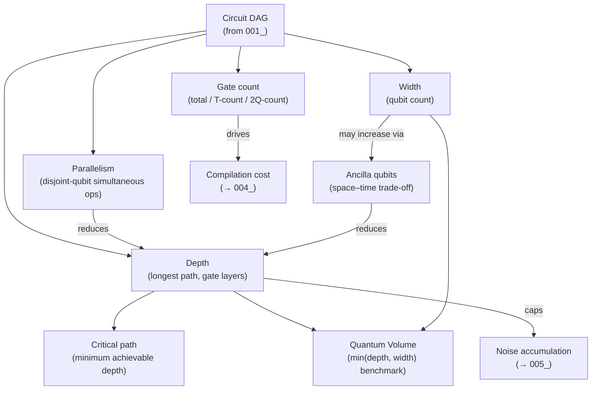

# QCSAA 900–909 · Section 00 · Subsection 902 · Subsubject 002 — Circuit Depth, Width, and Parallelism

## 1. Purpose

Defines the **structural metrics** of quantum circuits — the quantitative measures that characterise a circuit's resource requirements and determine its feasibility on real and idealised hardware. Establishes the controlled vocabulary for circuit depth, circuit width, gate count (total, T-count, and two-qubit gate count), critical-path analysis, and gate-level parallelism, in conformance with IEEE Std 7130-2023[^ieee7130]. These metrics underpin compilation cost models (`004_`), noise-resilience assessments (`005_`), and quantum-complexity resource bounds (QCSAA `905_`).

## 2. Scope

- Covers the *Circuit Depth, Width, and Parallelism* subsubject (`002`) of subsection `902` *Circuits* within section `00` *Fundamentos de Computación Cuántica*.
- Inherits Q-Division authority and ORB support from the parent row in [`../../README.md` §3](../../README.md#3-architecture-table)[^archtable].
- Concepts in scope:
  - **Circuit depth** — the number of sequential gate layers when all parallelisable gates have been grouped into simultaneous layers; the primary proxy for runtime on error-prone hardware and for coherence-time budget.
  - **Circuit width** — the number of qubits involved in the circuit; directly maps to the physical qubit requirement and limits what hardware can execute without mid-circuit ancilla reuse.
  - **Gate count** — total number of gate operations; distinguishes *T-count* (non-Clifford fault-tolerant cost) from *two-qubit gate count* (dominant error source on near-term hardware).
  - **Critical path** — the longest dependency chain in the DAG representation (`001_`); sets the minimum achievable depth after parallelism optimisation.
  - **Gate parallelism** — simultaneous execution of gates on disjoint qubit subsets within a single time step; limited by hardware connectivity, calibration windows, and crosstalk constraints.
  - **Ancilla and scratch qubits** — temporary qubits used to reduce depth at the cost of width; space–time trade-off in circuit optimisation.
  - **Quantum volume** — an IBM-defined hardware benchmark that combines depth and width into a single figure of merit; referenced as a cross-device comparator.
- Out of scope: circuit definition and gate set (`001_`), measurement and feedforward (`003_`), transpilation (`004_`), and noise-specific patterns (`005_`).

## 3. Diagram — Circuit Metric Relationships

Circuit metrics are interdependent: reducing depth typically requires additional width (ancilla), and parallelism is bounded by the critical path.

## 4. Footprint

| Metric | Value |
|---|---|
| Architecture | `QCSAA` — Quantum Computing & Sentient Agency Architecture |
| Master range | `900–999` |
| Code range | `900-909` |
| Section | `00` — Fundamentos de Computación Cuántica |
| Subsection | `902` — Circuits |
| Subsubject | `002` — Circuit Depth, Width, and Parallelism |
| Primary Q-Division | Q-HORIZON[^qdiv] |
| Support Q-Divisions | Q-HPC, Q-DATAGOV |
| ORB support | ORB-PMO, ORB-LEG |
| Governance class | `restricted`[^gov] |
| Folder path | `Q+ATLANTIDE/900-999_QCSAA/900-909_Fundamentos-de-Computacion-Cuantica/902_Circuits/` |
| Document | `002_Circuit-Depth-Width-and-Parallelism.md` (this file) |
| Parent subsection | [`README.md`](./README.md) · [`000_Overview.md`](./000_Overview.md) |
| Parent architecture | [`../../README.md`](../../README.md) |
| Parent baseline | [`organization/Q+ATLANTIDE.md`](../../../../organization/Q+ATLANTIDE.md) |

## 5. References & Citations

[^baseline]: **Q+ATLANTIDE controlled baseline (v1.0.0)** — [`organization/Q+ATLANTIDE.md`](../../../../organization/Q+ATLANTIDE.md). Defines the controlled `000-999` architecture-band taxonomy and the ATLAS-1000 register subpart.

[^archtable]: **QCSAA §3 Architecture Table** — [`../../README.md` §3](../../README.md#3-architecture-table). Authoritative source for the `900-909` row (Section `00` — Fundamentos de Computación Cuántica, Primary Q-Division Q-HORIZON).

[^qdiv]: **Q-Division authority** — Q-Divisions provide technical authority over an architecture row (Q+ATLANTIDE Note N-002). See [`organization/Q+ATLANTIDE.md` §4](../../../../organization/Q+ATLANTIDE.md#4-notes).

[^gov]: **Governance class** — `restricted` denotes documents requiring additional governance, evidence packages and access controls (rule N-006). See [`organization/Q+ATLANTIDE.md` §5.3](../../../../organization/Q+ATLANTIDE.md#53-restricted-band-templates-n-006).

[^ieee7130]: **IEEE Std 7130-2023 — IEEE Standard for Quantum Computing Definitions** — Defines circuit depth, width, gate count, and related structural-metric terminology adopted in this document.

[^iso4879]: **ISO/IEC 4879:2023 — Quantum computing — Concepts and terminology** — International standard for quantum-computing concepts, supplementing IEEE Std 7130 for depth and resource definitions.

[^openqasm3]: **OpenQASM 3.0 — Open Quantum Assembly Language** — DAG and circuit representation used as the common substrate for depth and width analysis in compilation toolchains.

### Applicable standards

The following standards apply to this subsubject in addition to the cross-cutting Q+ATLANTIDE governance:

- IEEE Std 7130-2023 — IEEE Standard for Quantum Computing Definitions[^ieee7130]
- ISO/IEC 4879:2023 — Quantum computing — Concepts and terminology[^iso4879]
- OpenQASM 3.0 — Open Quantum Assembly Language[^openqasm3]
