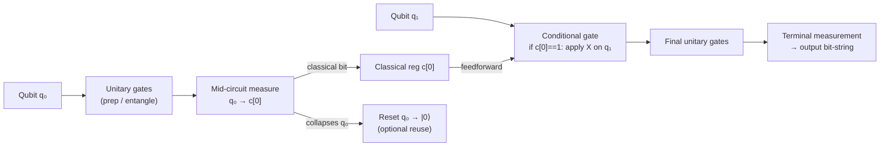

# QCSAA 900–909 · Section 00 · Subsection 902 · Subsubject 003 — Measurement, Mid-Circuit, and Classical Control

## 1. Purpose

Defines the **measurement and classical-control** components of the quantum circuit model — the interface between the quantum and classical domains within a running circuit. Establishes the controlled vocabulary for projective measurement, positive-operator valued measures (POVMs), mid-circuit measurement, classical registers, reset operations, and feedforward (classically-conditioned gate application), in conformance with IEEE Std 7130-2023[^ieee7130] and the OpenQASM 3.0 specification[^openqasm3]. These constructs are required for quantum error correction, adaptive circuits, measurement-based quantum computation (`907_`), and teleportation protocols.

## 2. Scope

- Covers the *Measurement, Mid-Circuit, and Classical Control* subsubject (`003`) of subsection `902` *Circuits* within section `00` *Fundamentos de Computación Cuántica*.
- Inherits Q-Division authority and ORB support from the parent row in [`../../README.md` §3](../../README.md#3-architecture-table)[^archtable].
- Concepts in scope:
  - **Projective (von Neumann) measurement** — measurement in a chosen orthonormal basis (typically the computational basis `{|0⟩,|1⟩}`); produces a classical bit outcome and collapses the measured qubit to the corresponding eigenstate.
  - **POVM (Positive-Operator Valued Measure)** — generalised measurement operators that describe noisy or partial measurement; relevant to readout error characterisation and quantum tomography.
  - **Mid-circuit measurement** — measurement of one or more qubits at an intermediate point in the circuit while remaining qubits continue to evolve; enables syndrome extraction in quantum error correction and adaptive state preparation without waiting for full circuit completion.
  - **Classical register** — one or more classical bits that store measurement outcomes; indexed independently of the qubit register and used as control data.
  - **Reset operation** — unconditional or conditioned reinitialization of a measured qubit to `|0⟩`, enabling qubit reuse (ancilla recycling) to reduce circuit width (`002_`).
  - **Feedforward and conditional gates** — application of a quantum gate conditioned on the value of one or more classical-register bits; the fundamental primitive for classically-controlled adaptive circuits, quantum teleportation correction steps, and active error-correction decoding.
  - **Classical communication latency** — the round-trip delay between mid-circuit measurement and conditioned gate application; a key hardware constraint that bounds the practicality of feedforward on near-term devices.
- Out of scope: circuit definition and gate set (`001_`), structural depth/width metrics (`002_`), compilation (`004_`), and noise-resilient patterns (`005_`).

## 3. Diagram — Measurement and Classical-Control Flow

Mid-circuit measurement breaks the purely unitary evolution and introduces a classical branch: the measurement outcome is written to a classical register and consumed by a conditional gate downstream.

## 4. Footprint

| Metric | Value |
|---|---|
| Architecture | `QCSAA` — Quantum Computing & Sentient Agency Architecture |
| Master range | `900–999` |
| Code range | `900-909` |
| Section | `00` — Fundamentos de Computación Cuántica |
| Subsection | `902` — Circuits |
| Subsubject | `003` — Measurement, Mid-Circuit, and Classical Control |
| Primary Q-Division | Q-HORIZON[^qdiv] |
| Support Q-Divisions | Q-HPC, Q-DATAGOV |
| ORB support | ORB-PMO, ORB-LEG |
| Governance class | `restricted`[^gov] |
| Folder path | `Q+ATLANTIDE/900-999_QCSAA/900-909_Fundamentos-de-Computacion-Cuantica/902_Circuits/` |
| Document | `003_Measurement-Mid-Circuit-and-Classical-Control.md` (this file) |
| Parent subsection | [`README.md`](./README.md) · [`000_Overview.md`](./000_Overview.md) |
| Parent architecture | [`../../README.md`](../../README.md) |
| Parent baseline | [`organization/Q+ATLANTIDE.md`](../../../../organization/Q+ATLANTIDE.md) |

## 5. References & Citations

[^baseline]: **Q+ATLANTIDE controlled baseline (v1.0.0)** — [`organization/Q+ATLANTIDE.md`](../../../../organization/Q+ATLANTIDE.md). Defines the controlled `000-999` architecture-band taxonomy and the ATLAS-1000 register subpart.

[^archtable]: **QCSAA §3 Architecture Table** — [`../../README.md` §3](../../README.md#3-architecture-table). Authoritative source for the `900-909` row (Section `00` — Fundamentos de Computación Cuántica, Primary Q-Division Q-HORIZON).

[^qdiv]: **Q-Division authority** — Q-Divisions provide technical authority over an architecture row (Q+ATLANTIDE Note N-002). See [`organization/Q+ATLANTIDE.md` §4](../../../../organization/Q+ATLANTIDE.md#4-notes).

[^gov]: **Governance class** — `restricted` denotes documents requiring additional governance, evidence packages and access controls (rule N-006). See [`organization/Q+ATLANTIDE.md` §5.3](../../../../organization/Q+ATLANTIDE.md#53-restricted-band-templates-n-006).

[^ieee7130]: **IEEE Std 7130-2023 — IEEE Standard for Quantum Computing Definitions** — Defines measurement, classical register, and feedforward terminology adopted in this document.

[^iso4879]: **ISO/IEC 4879:2023 — Quantum computing — Concepts and terminology** — International standard for measurement and classical-control concepts, supplementing IEEE Std 7130.

[^openqasm3]: **OpenQASM 3.0 — Open Quantum Assembly Language** — Reference specification for mid-circuit measurement syntax, classical register declarations, reset operations, and conditional-gate (`if`) statements.

### Applicable standards

The following standards apply to this subsubject in addition to the cross-cutting Q+ATLANTIDE governance:

- IEEE Std 7130-2023 — IEEE Standard for Quantum Computing Definitions[^ieee7130]
- ISO/IEC 4879:2023 — Quantum computing — Concepts and terminology[^iso4879]
- OpenQASM 3.0 — Open Quantum Assembly Language[^openqasm3]
