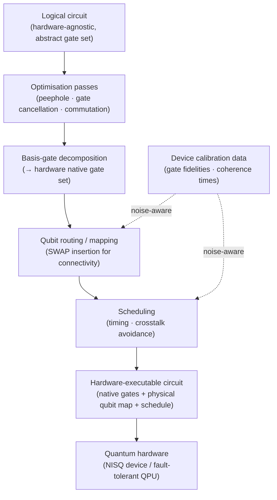

# QCSAA 900–909 · Section 00 · Subsection 902 · Subsubject 004 — Circuit Optimization, Compilation, and Transpilation

## 1. Purpose

Defines the **circuit compilation and transpilation pipeline** — the multi-stage transformation process that converts a hardware-agnostic logical circuit into an executable, hardware-native program that respects the target device's gate set, qubit connectivity, and timing constraints. Establishes the controlled vocabulary for circuit optimisation passes, basis-gate decomposition, qubit routing, scheduling, and transpilation, drawing on OpenQASM 3.0[^openqasm3] and IEEE Std 7130-2023[^ieee7130]. This pipeline is the operational link between the abstract circuit model (`001_`) and physical quantum execution on NISQ-era and future fault-tolerant devices (`005_`).

## 2. Scope

- Covers the *Circuit Optimization, Compilation, and Transpilation* subsubject (`004`) of subsection `902` *Circuits* within section `00` *Fundamentos de Computación Cuántica*.
- Inherits Q-Division authority and ORB support from the parent row in [`../../README.md` §3](../../README.md#3-architecture-table)[^archtable].
- Concepts in scope:
  - **Circuit optimisation** — transformation passes applied to the circuit DAG to reduce gate count, depth (`002_`), or T-count without changing the circuit's ideal unitary; includes algebraic simplification, peephole optimisation, gate cancellation, and commutation-based reordering.
  - **Basis-gate decomposition** — rewriting gates expressed in a universal or abstract gate set into the hardware's native basis gates (e.g., {RZ, SX, CNOT} for superconducting devices; {Rz, CNOT} for trapped-ion targets); may use Solovay–Kitaev or KAK decomposition for exact or approximate conversion.
  - **Qubit routing (mapping)** — assignment of logical qubits to physical qubits on a device with limited connectivity; insertion of SWAP gates (or equivalents) to satisfy two-qubit gate topology constraints while minimising added depth and error.
  - **Circuit scheduling** — assignment of gate operations to discrete time steps on the hardware, respecting gate duration, delay constraints, and cross-talk avoidance windows; produces the pulse-level or instruction-level schedule consumed by the hardware control system.
  - **Transpilation pipeline** — the end-to-end sequence of optimisation, decomposition, routing, and scheduling passes; typically parameterised by an optimisation level that trades compile time for circuit quality.
  - **Compilation for fault-tolerant architectures** — logical-to-physical code encoding, magic-state distillation for non-Clifford gates, and lattice-surgery routing; contrasted with near-term NISQ compilation.
  - **Noise-aware compilation** — compilation passes that incorporate calibrated device-error data (gate fidelities, qubit coherence times) to preferentially route critical gates through high-fidelity qubits and minimise depth on noisy paths.
- Out of scope: basic circuit structure (`001_`), raw depth/width metrics (`002_`), measurement and feedforward (`003_`), and NISQ error-mitigation run-time techniques (`005_`).

## 3. Diagram — Transpilation Pipeline

A logical circuit passes through a sequence of compilation stages before reaching hardware execution.

## 4. Footprint

| Metric | Value |
|---|---|
| Architecture | `QCSAA` — Quantum Computing & Sentient Agency Architecture |
| Master range | `900–999` |
| Code range | `900-909` |
| Section | `00` — Fundamentos de Computación Cuántica |
| Subsection | `902` — Circuits |
| Subsubject | `004` — Circuit Optimization, Compilation, and Transpilation |
| Primary Q-Division | Q-HORIZON[^qdiv] |
| Support Q-Divisions | Q-HPC, Q-DATAGOV |
| ORB support | ORB-PMO, ORB-LEG |
| Governance class | `restricted`[^gov] |
| Folder path | `Q+ATLANTIDE/900-999_QCSAA/900-909_Fundamentos-de-Computacion-Cuantica/902_Circuits/` |
| Document | `004_Circuit-Optimization-Compilation-and-Transpilation.md` (this file) |
| Parent subsection | [`README.md`](./README.md) · [`000_Overview.md`](./000_Overview.md) |
| Parent architecture | [`../../README.md`](../../README.md) |
| Parent baseline | [`organization/Q+ATLANTIDE.md`](../../../../organization/Q+ATLANTIDE.md) |

## 5. References & Citations

[^baseline]: **Q+ATLANTIDE controlled baseline (v1.0.0)** — [`organization/Q+ATLANTIDE.md`](../../../../organization/Q+ATLANTIDE.md). Defines the controlled `000-999` architecture-band taxonomy and the ATLAS-1000 register subpart.

[^archtable]: **QCSAA §3 Architecture Table** — [`../../README.md` §3](../../README.md#3-architecture-table). Authoritative source for the `900-909` row (Section `00` — Fundamentos de Computación Cuántica, Primary Q-Division Q-HORIZON).

[^qdiv]: **Q-Division authority** — Q-Divisions provide technical authority over an architecture row (Q+ATLANTIDE Note N-002). See [`organization/Q+ATLANTIDE.md` §4](../../../../organization/Q+ATLANTIDE.md#4-notes).

[^gov]: **Governance class** — `restricted` denotes documents requiring additional governance, evidence packages and access controls (rule N-006). See [`organization/Q+ATLANTIDE.md` §5.3](../../../../organization/Q+ATLANTIDE.md#53-restricted-band-templates-n-006).

[^ieee7130]: **IEEE Std 7130-2023 — IEEE Standard for Quantum Computing Definitions** — Reference vocabulary for compilation, basis-gate decomposition, and transpilation concepts used in this document.

[^iso4879]: **ISO/IEC 4879:2023 — Quantum computing — Concepts and terminology** — International standard for quantum-computing process and compilation definitions.

[^openqasm3]: **OpenQASM 3.0 — Open Quantum Assembly Language** — Reference intermediate representation for expressing transpiled circuits, basis-gate instructions, qubit mappings, and scheduling directives.

### Applicable standards

The following standards apply to this subsubject in addition to the cross-cutting Q+ATLANTIDE governance:

- IEEE Std 7130-2023 — IEEE Standard for Quantum Computing Definitions[^ieee7130]
- ISO/IEC 4879:2023 — Quantum computing — Concepts and terminology[^iso4879]
- OpenQASM 3.0 — Open Quantum Assembly Language[^openqasm3]
