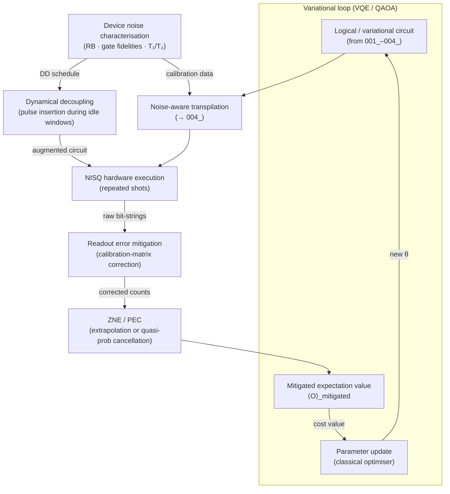

# QCSAA 900–909 · Section 00 · Subsection 902 · Subsubject 005 — Noise-Resilient Circuit Patterns and NISQ Practice

## 1. Purpose

Defines the **noise-resilient circuit design patterns** and **NISQ-era (Noisy Intermediate-Scale Quantum) best practices** that allow useful quantum computations to be executed on near-term hardware despite the absence of full fault tolerance. Establishes the controlled vocabulary for device noise models, dynamical decoupling, error-mitigation techniques (ZNE, PEC, PVQM, readout mitigation), variational circuit ansätze, and circuit benchmarking protocols, in conformance with IEEE Std 7130-2023[^ieee7130] and ISO/IEC 4879:2023[^iso4879]. These patterns are the practical interface between the ideal circuit model (`001_`–`004_`) and real-world quantum hardware operations across the QCSAA band.

## 2. Scope

- Covers the *Noise-Resilient Circuit Patterns and NISQ Practice* subsubject (`005`) of subsection `902` *Circuits* within section `00` *Fundamentos de Computación Cuántica*.
- Inherits Q-Division authority and ORB support from the parent row in [`../../README.md` §3](../../README.md#3-architecture-table)[^archtable].
- Concepts in scope:
  - **NISQ device characteristics** — qubit counts of O(50–1000), gate fidelities of 99–99.9 % for single-qubit and 95–99.5 % for two-qubit gates, coherence times of O(10–1000 µs), and limited or absent quantum error correction; setting the practical performance envelope for circuit execution.
  - **Noise models** — depolarising noise, dephasing (T₂) noise, amplitude damping (T₁ relaxation), coherent errors, and readout (SPAM) errors; used in classical simulation and noise-aware compilation (`004_`).
  - **Dynamical decoupling (DD)** — insertion of refocusing pulse sequences (XY-4, CPMG, Hahn echo) into idle qubit windows to suppress dephasing during circuit execution, exploiting the device's calibrated timing model from the scheduler (`004_`).
  - **Zero-Noise Extrapolation (ZNE)** — error-mitigation technique that intentionally amplifies circuit noise (by gate folding or pulse stretching) and extrapolates observable expectation values back to the zero-noise limit; model-free and compatible with variational circuits.
  - **Probabilistic Error Cancellation (PEC)** — quasi-probability decomposition of the ideal circuit as a linear combination of noisy implementable operations, providing an unbiased estimator at the cost of sampling overhead exponential in circuit error.
  - **Readout error mitigation** — calibration-matrix inversion or matrix-free techniques (M3, TREX) to correct bit-string distribution biases introduced by imperfect measurement (`003_`).
  - **Variational quantum circuit ansätze** — parameterised circuit families used in VQE, QAOA, and quantum machine learning (QCSAA `910-919_`); design considerations include expressibility, trainability (barren-plateau avoidance), hardware efficiency, and noise resilience.
  - **Circuit benchmarking protocols** — randomised benchmarking (RB), interleaved RB, and circuit layer fidelity estimation (CLOPS, Q-score) used to characterise device quality and validate noise-resilient circuit performance.
- Out of scope: full quantum error correction codes (reserved for future `906_`/`908_` subsubjects); fault-tolerant compilation (`004_`); circuit definition and gate set (`001_`); and depth/width metrics (`002_`).

## 3. Diagram — NISQ Noise-Resilience Workflow

NISQ circuits follow a run-time workflow that wraps ideal circuit execution with noise characterisation, mitigation, and result post-processing.

## 4. Footprint

| Metric | Value |
|---|---|
| Architecture | `QCSAA` — Quantum Computing & Sentient Agency Architecture |
| Master range | `900–999` |
| Code range | `900-909` |
| Section | `00` — Fundamentos de Computación Cuántica |
| Subsection | `902` — Circuits |
| Subsubject | `005` — Noise-Resilient Circuit Patterns and NISQ Practice |
| Primary Q-Division | Q-HORIZON[^qdiv] |
| Support Q-Divisions | Q-HPC, Q-DATAGOV |
| ORB support | ORB-PMO, ORB-LEG |
| Governance class | `restricted`[^gov] |
| Folder path | `Q+ATLANTIDE/900-999_QCSAA/900-909_Fundamentos-de-Computacion-Cuantica/902_Circuits/` |
| Document | `005_Noise-Resilient-Circuit-Patterns-and-NISQ-Practice.md` (this file) |
| Parent subsection | [`README.md`](./README.md) · [`000_Overview.md`](./000_Overview.md) |
| Parent architecture | [`../../README.md`](../../README.md) |
| Parent baseline | [`organization/Q+ATLANTIDE.md`](../../../../organization/Q+ATLANTIDE.md) |

## 5. References & Citations

[^baseline]: **Q+ATLANTIDE controlled baseline (v1.0.0)** — [`organization/Q+ATLANTIDE.md`](../../../../organization/Q+ATLANTIDE.md). Defines the controlled `000-999` architecture-band taxonomy and the ATLAS-1000 register subpart.

[^archtable]: **QCSAA §3 Architecture Table** — [`../../README.md` §3](../../README.md#3-architecture-table). Authoritative source for the `900-909` row (Section `00` — Fundamentos de Computación Cuántica, Primary Q-Division Q-HORIZON).

[^qdiv]: **Q-Division authority** — Q-Divisions provide technical authority over an architecture row (Q+ATLANTIDE Note N-002). See [`organization/Q+ATLANTIDE.md` §4](../../../../organization/Q+ATLANTIDE.md#4-notes).

[^gov]: **Governance class** — `restricted` denotes documents requiring additional governance, evidence packages and access controls (rule N-006). See [`organization/Q+ATLANTIDE.md` §5.3](../../../../organization/Q+ATLANTIDE.md#53-restricted-band-templates-n-006).

[^ieee7130]: **IEEE Std 7130-2023 — IEEE Standard for Quantum Computing Definitions** — Reference vocabulary for NISQ, noise model, error mitigation, and variational-circuit terminology.

[^iso4879]: **ISO/IEC 4879:2023 — Quantum computing — Concepts and terminology** — International standard for quantum-computing process and error-characterisation definitions.

[^openqasm3]: **OpenQASM 3.0 — Open Quantum Assembly Language** — Provides the circuit representation and timing/delay constructs used in dynamical-decoupling schedule insertion.

### Applicable standards

The following standards apply to this subsubject in addition to the cross-cutting Q+ATLANTIDE governance:

- IEEE Std 7130-2023 — IEEE Standard for Quantum Computing Definitions[^ieee7130]
- ISO/IEC 4879:2023 — Quantum computing — Concepts and terminology[^iso4879]
- OpenQASM 3.0 — Open Quantum Assembly Language[^openqasm3]
