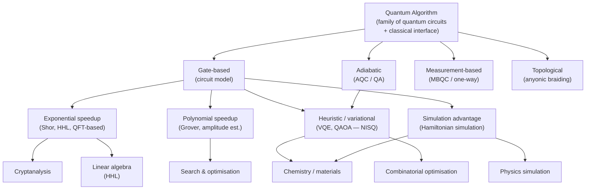

# QCSAA 900-909 · Section 00 · Subsection 903 · Subsubject 001 — Algorithm Definition and Taxonomy

## 1. Purpose

Establishes the **formal definition of a quantum algorithm** and the canonical **taxonomy** used throughout subsection `903` and across the broader QCSAA band. Provides a classification framework by computational model (gate-based, adiabatic, measurement-based, topological), by problem domain, and by asymptotic speedup class. All algorithm families documented in subsubjects `002`–`008` are positioned within this taxonomy[^baseline].

## 2. Scope

- Covers the *Algorithm Definition and Taxonomy* subsubject (`001`) of subsection `903` *Quantum Algorithms* within section `00` *Fundamentos de Computación Cuántica*.
- Inherits Q-Division authority and ORB support from the parent row in [`../README.md`](./README.md)[^archtable].
- Concepts in scope:
  - **Formal definition** — a quantum algorithm as a family of quantum circuits (or equivalent models) parameterised by input size, with a classical pre- and post-processing interface.
  - **Computational models** — gate-based (circuit model), adiabatic quantum computation (AQC), measurement-based quantum computation (MBQC), and topological quantum computation.
  - **Speedup taxonomy** — exponential speedup (e.g., Shor's), polynomial speedup (e.g., Grover's), heuristic advantage (variational, NISQ-era), and simulation advantage (Hamiltonian simulation).
  - **Problem-domain classification** — cryptanalysis, optimisation, simulation, linear-algebra, sampling, and machine-learning subroutines.
  - **Oracle and query-complexity model** — definition of oracle access, query complexity, and its relationship to circuit depth and width.
  - **NISQ vs. fault-tolerant regimes** — classification of algorithms by their hardware requirements and readiness level.
- Out of scope: detailed circuit constructions for individual algorithm families (covered in `002`–`006`), resource estimation methodology (`007`), and aerospace integration (`008`).

## 3. Diagram — Quantum Algorithm Classification Hierarchy

The classification tree shows how the primary computational model, the speedup class, and the problem domain jointly locate any quantum algorithm within the taxonomy.

## 4. Footprint

| Metric | Value |
|---|---|
| Architecture | `QCSAA` — Quantum Computing & Sentient Agency Architecture |
| Master range | `900–999` |
| Code range | `900-909` |
| Section | `00` — Fundamentos de Computación Cuántica |
| Subsection | `903` — Quantum Algorithms |
| Subsubject | `001` — Algorithm Definition and Taxonomy |
| Primary Q-Division | Q-HORIZON[^qdiv] |
| Support Q-Divisions | Q-HPC, Q-DATAGOV |
| ORB support | ORB-PMO, ORB-LEG |
| Governance class | `restricted`[^gov] |
| Evidence package | `EP-QCSAA-903-001` |
| Access control profile | `ACP-QCSAA-RESTRICTED` |
| Folder path | `Q+ATLANTIDE/900-999_QCSAA/900-909_Fundamentos-de-Computacion-Cuantica/903_Quantum-Algorithms/` |
| Document | `001_Algorithm-Definition-and-Taxonomy.md` (this file) |
| Parent subsection | [`README.md`](./README.md) · [`000_Overview.md`](./000_Overview.md) |
| Parent architecture | [`../../README.md`](../../README.md) |
| Parent baseline | [`organization/Q+ATLANTIDE.md`](../../../../organization/Q+ATLANTIDE.md) |

## 5. References & Citations

[^baseline]: **Q+ATLANTIDE controlled baseline (v1.0.0)** — [`organization/Q+ATLANTIDE.md`](../../../../organization/Q+ATLANTIDE.md). Defines the controlled `000-999` architecture-band taxonomy and the ATLAS-1000 register subpart.

[^archtable]: **QCSAA §3 Subsection Index** — [`../README.md` §3](../README.md#3-subsection-index). Authoritative source for the `900-909` subsection listing and Q-Division authority.

[^qdiv]: **Q-Division authority** — Q-Divisions provide technical authority over an architecture row (Q+ATLANTIDE Note N-002). See [`organization/Q+ATLANTIDE.md` §4](../../../../organization/Q+ATLANTIDE.md#4-notes).

[^gov]: **Governance class** — `restricted` denotes documents requiring additional governance, evidence packages and access controls (rule N-006). See [`organization/Q+ATLANTIDE.md` §5.3](../../../../organization/Q+ATLANTIDE.md#53-restricted-band-templates-n-006).

[^iso4879]: **ISO/IEC 4879:2023 — Quantum computing — Terminology and vocabulary** — Normative source for definitions of quantum algorithm, circuit model, and related terms.

[^nistpqc]: **NIST IR 8413** — Informs the classification of cryptanalytic algorithms and speedup characterisation.

[^childs2010]: **Childs, A. M. (2010). "Quantum algorithms." Lecture notes.** — Foundational reference for the query-complexity model and speedup taxonomy used in this subsubject.

### Applicable standards

The following standards apply to this subsubject in addition to the cross-cutting Q+ATLANTIDE governance:

- ISO/IEC 4879:2023 — Quantum computing — Terminology and vocabulary[^iso4879]
- NIST IR 8413 — Post-Quantum Cryptography Standardization[^nistpqc]
