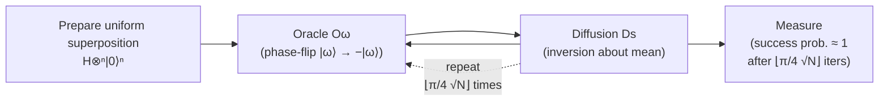

# QCSAA 900-909 · Section 00 · Subsection 903 · Subsubject 002 — Amplitude Amplification and Search

## 1. Purpose

Documents the **amplitude amplification** framework and its primary instantiation as **Grover's search algorithm**, providing the canonical treatment of the quadratic quantum speedup for unstructured search within the Q+ATLANTIDE baseline[^baseline]. Defines the oracle model, the Grover iteration, and the generalised amplitude-amplification theorem that underpins multiple QCSAA algorithm families.

## 2. Scope

- Covers the *Amplitude Amplification and Search* subsubject (`002`) of subsection `903` within section `00` *Fundamentos de Computación Cuántica*.
- Inherits Q-Division authority and ORB support from the parent row in [`../README.md`](./README.md)[^archtable].
- Concepts in scope:
  - **Oracle model** — phase-oracle and bit-flip oracle definitions; the relationship between oracle queries and circuit depth.
  - **Grover's algorithm** — initial uniform superposition, oracle call, diffusion operator (inversion about the mean), and iteration count O(√N) for a search space of size N.
  - **Generalised amplitude amplification** — the Brassard–Høyer–Mosca–Tapp (BHMT) framework; arbitrary initial-state preparation and arbitrary marking oracles.
  - **Amplitude estimation** — QAE as a phase-estimation application of amplitude amplification; relationship to Monte Carlo speedup.
  - **Fixed-point amplitude amplification** — robust variants that converge without exact knowledge of the marked-state amplitude.
  - **Applications** — database search, collision finding, element-distinctness, quantum walk search, and aerospace optimisation subroutines (cross-reference `008`).
  - **Cryptanalytic implications** — Grover's quadratic speedup against symmetric ciphers and its impact on security-parameter selection (cross-reference NIST IR 8413[^nistir8413]).
- Out of scope: Shor's algorithm and QFT-based speedups (`003`), variational search approaches (`004`), full resource-budget analysis (`007`).

## 3. Diagram — Grover Iteration Circuit

One Grover iteration: oracle phase-flip on the target state ∣ω⟩, followed by the diffusion operator that inverts all amplitudes about their mean.

## 4. Footprint

| Metric | Value |
|---|---|
| Architecture | `QCSAA` — Quantum Computing & Sentient Agency Architecture |
| Master range | `900–999` |
| Code range | `900-909` |
| Section | `00` — Fundamentos de Computación Cuántica |
| Subsection | `903` — Quantum Algorithms |
| Subsubject | `002` — Amplitude Amplification and Search |
| Primary Q-Division | Q-HORIZON[^qdiv] |
| Support Q-Divisions | Q-HPC, Q-DATAGOV |
| ORB support | ORB-PMO, ORB-LEG |
| Governance class | `restricted`[^gov] |
| Evidence package | `EP-QCSAA-903-001` |
| Access control profile | `ACP-QCSAA-RESTRICTED` |
| Folder path | `Q+ATLANTIDE/900-999_QCSAA/900-909_Fundamentos-de-Computacion-Cuantica/903_Quantum-Algorithms/` |
| Document | `002_Amplitude-Amplification-and-Search.md` (this file) |
| Parent subsection | [`README.md`](./README.md) · [`000_Overview.md`](./000_Overview.md) |
| Parent architecture | [`../../README.md`](../../README.md) |
| Parent baseline | [`organization/Q+ATLANTIDE.md`](../../../../organization/Q+ATLANTIDE.md) |

## 5. References & Citations

[^baseline]: **Q+ATLANTIDE controlled baseline (v1.0.0)** — [`organization/Q+ATLANTIDE.md`](../../../../organization/Q+ATLANTIDE.md). Defines the controlled `000-999` architecture-band taxonomy and the ATLAS-1000 register subpart.

[^archtable]: **QCSAA §3 Subsection Index** — [`../README.md` §3](../README.md#3-subsection-index). Authoritative source for the `900-909` subsection listing and Q-Division authority.

[^qdiv]: **Q-Division authority** — Q-Divisions provide technical authority over an architecture row (Q+ATLANTIDE Note N-002). See [`organization/Q+ATLANTIDE.md` §4](../../../../organization/Q+ATLANTIDE.md#4-notes).

[^gov]: **Governance class** — `restricted` denotes documents requiring additional governance, evidence packages and access controls (rule N-006). See [`organization/Q+ATLANTIDE.md` §5.3](../../../../organization/Q+ATLANTIDE.md#53-restricted-band-templates-n-006).

[^iso4879]: **ISO/IEC 4879:2023 — Quantum computing — Terminology and vocabulary** — Normative vocabulary for oracle, amplitude, and superposition terms.

[^nistir8413]: **NIST IR 8413** — Documents the impact of Grover's algorithm on symmetric-key security margins and informs the quadratic-speedup classification.

[^grover1996]: **Grover, L. K. (1996). "A fast quantum mechanical algorithm for database search." STOC 1996.** — Original presentation of the Grover search algorithm.

[^bhmt2002]: **Brassard, G., Høyer, P., Mosca, M., Tapp, A. (2002). "Quantum amplitude amplification and estimation." AMS Contemporary Mathematics.** — Foundational reference for the generalised amplitude-amplification theorem.

### Applicable standards

The following standards apply to this subsubject in addition to the cross-cutting Q+ATLANTIDE governance:

- ISO/IEC 4879:2023 — Quantum computing — Terminology and vocabulary[^iso4879]
- NIST IR 8413 — Post-Quantum Cryptography Standardization[^nistir8413]
