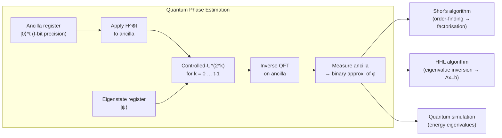

# QCSAA 900-909 · Section 00 · Subsection 903 · Subsubject 003 — Phase Estimation and Fourier Methods

## 1. Purpose

Documents the **Quantum Fourier Transform (QFT)** and **Quantum Phase Estimation (QPE)** as the algorithmic core of the exponential-speedup family, and their principal derivative algorithms — Shor's integer factorisation algorithm and the Harrow–Hassidim–Lloyd (HHL) linear-systems algorithm — within the Q+ATLANTIDE baseline[^baseline]. These methods form the technical foundation for the most impactful quantum algorithmic advances with respect to classical intractability.

## 2. Scope

- Covers the *Phase Estimation and Fourier Methods* subsubject (`003`) of subsection `903` within section `00` *Fundamentos de Computación Cuántica*.
- Inherits Q-Division authority and ORB support from the parent row in [`../README.md`](./README.md)[^archtable].
- Concepts in scope:
  - **Quantum Fourier Transform (QFT)** — definition as the discrete Fourier transform on quantum amplitudes; O(n²) gate circuit; controlled-phase gate decomposition; inverse QFT.
  - **Quantum Phase Estimation (QPE)** — unitary eigenvalue estimation circuit; t-qubit precision register; controlled-U applications; inverse QFT readout; error analysis as a function of ancilla count.
  - **Shor's factorisation algorithm** — order-finding subroutine via QPE; modular-exponentiation oracle; period-extraction and classical post-processing; exponential speedup over the best known classical algorithm.
  - **HHL linear-systems algorithm** — QPE for matrix eigenvalue encoding; controlled-rotation for inversion; uncomputation; speedup conditions and caveats (sparsity, condition number, readout).
  - **Iterative QPE (IQPE)** — single-ancilla variant for reduced register depth; applications in resource-constrained (NISQ-adjacent) settings.
  - **Cryptanalytic implications** — Shor's polynomial-time factorisation of RSA/ECC moduli and its relationship to NIST PQC transition timelines[^nistir8413].
- Out of scope: variational phase-estimation alternatives (`004`), full fault-tolerant resource budgets (`007`), and cryptographic system-migration procedures (`930-939`).

## 3. Diagram — QPE and QFT Pipeline

The QPE circuit applies controlled powers of unitary U to an eigenstate ∣ψ⟩, then reads the phase via the inverse QFT. Shor's and HHL both embed this pattern.

## 4. Footprint

| Metric | Value |
|---|---|
| Architecture | `QCSAA` — Quantum Computing & Sentient Agency Architecture |
| Master range | `900–999` |
| Code range | `900-909` |
| Section | `00` — Fundamentos de Computación Cuántica |
| Subsection | `903` — Quantum Algorithms |
| Subsubject | `003` — Phase Estimation and Fourier Methods |
| Primary Q-Division | Q-HORIZON[^qdiv] |
| Support Q-Divisions | Q-HPC, Q-DATAGOV |
| ORB support | ORB-PMO, ORB-LEG |
| Governance class | `restricted`[^gov] |
| Evidence package | `EP-QCSAA-903-001` |
| Access control profile | `ACP-QCSAA-RESTRICTED` |
| Folder path | `Q+ATLANTIDE/900-999_QCSAA/900-909_Fundamentos-de-Computacion-Cuantica/903_Quantum-Algorithms/` |
| Document | `003_Phase-Estimation-and-Fourier-Methods.md` (this file) |
| Parent subsection | [`README.md`](./README.md) · [`000_Overview.md`](./000_Overview.md) |
| Parent architecture | [`../../README.md`](../../README.md) |
| Parent baseline | [`organization/Q+ATLANTIDE.md`](../../../../organization/Q+ATLANTIDE.md) |

## 5. References & Citations

[^baseline]: **Q+ATLANTIDE controlled baseline (v1.0.0)** — [`organization/Q+ATLANTIDE.md`](../../../../organization/Q+ATLANTIDE.md). Defines the controlled `000-999` architecture-band taxonomy and the ATLAS-1000 register subpart.

[^archtable]: **QCSAA §3 Subsection Index** — [`../README.md` §3](../README.md#3-subsection-index). Authoritative source for the `900-909` subsection listing and Q-Division authority.

[^qdiv]: **Q-Division authority** — Q-Divisions provide technical authority over an architecture row (Q+ATLANTIDE Note N-002). See [`organization/Q+ATLANTIDE.md` §4](../../../../organization/Q+ATLANTIDE.md#4-notes).

[^gov]: **Governance class** — `restricted` denotes documents requiring additional governance, evidence packages and access controls (rule N-006). See [`organization/Q+ATLANTIDE.md` §5.3](../../../../organization/Q+ATLANTIDE.md#53-restricted-band-templates-n-006).

[^iso4879]: **ISO/IEC 4879:2023 — Quantum computing — Terminology and vocabulary** — Normative vocabulary for QFT, QPE, and eigenvalue terms.

[^nistir8413]: **NIST IR 8413** — Documents the impact of Shor's algorithm on public-key cryptographic assumptions; informs cryptanalytic risk classification.

[^shor1994]: **Shor, P. W. (1994). "Algorithms for quantum computation: Discrete logarithms and factoring." FOCS 1994.** — Original presentation of Shor's factorisation algorithm and the QFT-based period-finding subroutine.

[^hhl2009]: **Harrow, A., Hassidim, A., Lloyd, S. (2009). "Quantum algorithm for linear systems of equations." Physical Review Letters 103.** — Foundational reference for the HHL algorithm and its exponential-speedup conditions.

### Applicable standards

The following standards apply to this subsubject in addition to the cross-cutting Q+ATLANTIDE governance:

- ISO/IEC 4879:2023 — Quantum computing — Terminology and vocabulary[^iso4879]
- NIST IR 8413 — Post-Quantum Cryptography Standardization[^nistir8413]
