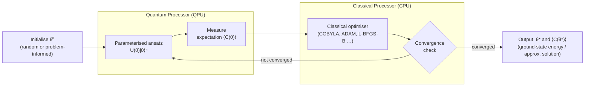

# QCSAA 900-909 · Section 00 · Subsection 903 · Subsubject 004 — Variational Quantum Algorithms

## 1. Purpose

Documents the **variational quantum algorithm (VQA)** paradigm — the family of hybrid classical–quantum methods that are the primary algorithmic approach for near-term (NISQ) quantum devices — within the Q+ATLANTIDE baseline[^baseline]. Covers the Variational Quantum Eigensolver (VQE) for electronic-structure problems and the Quantum Approximate Optimization Algorithm (QAOA) for combinatorial optimisation, along with the general variational loop that connects them.

## 2. Scope

- Covers the *Variational Quantum Algorithms* subsubject (`004`) of subsection `903` within section `00` *Fundamentos de Computación Cuántica*.
- Inherits Q-Division authority and ORB support from the parent row in [`../README.md`](./README.md)[^archtable].
- Concepts in scope:
  - **Variational loop** — parameterised quantum circuit (ansatz), quantum expectation-value measurement, classical optimiser feedback; the general VQA framework.
  - **Ansatz design** — hardware-efficient ansätze, problem-inspired ansätze (UCCSD for chemistry), expressibility and entanglement metrics.
  - **VQE** — cost function as energy expectation ⟨ψ(θ)|H|ψ(θ)⟩; Pauli-decomposition of Hamiltonians; gradient estimation (parameter-shift rule, finite difference, SPSA).
  - **QAOA** — alternating problem unitary U_C(γ) and mixer unitary U_B(β); p-layer depth; relationship to quantum annealing in the p → ∞ limit; MaxCut canonical example.
  - **Other VQA variants** — VQLS (variational linear systems), QCNN (quantum convolutional neural networks as VQA), quantum natural gradient, quantum kernel methods.
  - **Barren-plateau problem** — exponential vanishing of cost-function gradients; mitigation strategies (local cost functions, layerwise training, structured ansätze).
  - **NISQ applicability** — noise tolerance, circuit-depth constraints, and shot-budget requirements for practical deployment.
- Out of scope: full QAOA optimisation patterns and problem encodings (`006`), resource-estimation for fault-tolerant VQA extensions (`007`), and aerospace applications (`008`).

## 3. Diagram — Variational Hybrid Quantum–Classical Loop

The VQA loop iterates between quantum expectation-value evaluation and classical parameter update until the cost function converges.

## 4. Footprint

| Metric | Value |
|---|---|
| Architecture | `QCSAA` — Quantum Computing & Sentient Agency Architecture |
| Master range | `900–999` |
| Code range | `900-909` |
| Section | `00` — Fundamentos de Computación Cuántica |
| Subsection | `903` — Quantum Algorithms |
| Subsubject | `004` — Variational Quantum Algorithms |
| Primary Q-Division | Q-HORIZON[^qdiv] |
| Support Q-Divisions | Q-HPC, Q-DATAGOV |
| ORB support | ORB-PMO, ORB-LEG |
| Governance class | `restricted`[^gov] |
| Evidence package | `EP-QCSAA-903-001` |
| Access control profile | `ACP-QCSAA-RESTRICTED` |
| Folder path | `Q+ATLANTIDE/900-999_QCSAA/900-909_Fundamentos-de-Computacion-Cuantica/903_Quantum-Algorithms/` |
| Document | `004_Variational-Quantum-Algorithms.md` (this file) |
| Parent subsection | [`README.md`](./README.md) · [`000_Overview.md`](./000_Overview.md) |
| Parent architecture | [`../../README.md`](../../README.md) |
| Parent baseline | [`organization/Q+ATLANTIDE.md`](../../../../organization/Q+ATLANTIDE.md) |

## 5. References & Citations

[^baseline]: **Q+ATLANTIDE controlled baseline (v1.0.0)** — [`organization/Q+ATLANTIDE.md`](../../../../organization/Q+ATLANTIDE.md). Defines the controlled `000-999` architecture-band taxonomy and the ATLAS-1000 register subpart.

[^archtable]: **QCSAA §3 Subsection Index** — [`../README.md` §3](../README.md#3-subsection-index). Authoritative source for the `900-909` subsection listing and Q-Division authority.

[^qdiv]: **Q-Division authority** — Q-Divisions provide technical authority over an architecture row (Q+ATLANTIDE Note N-002). See [`organization/Q+ATLANTIDE.md` §4](../../../../organization/Q+ATLANTIDE.md#4-notes).

[^gov]: **Governance class** — `restricted` denotes documents requiring additional governance, evidence packages and access controls (rule N-006). See [`organization/Q+ATLANTIDE.md` §5.3](../../../../organization/Q+ATLANTIDE.md#53-restricted-band-templates-n-006).

[^iso4879]: **ISO/IEC 4879:2023 — Quantum computing — Terminology and vocabulary** — Normative vocabulary for parameterised circuit, ansatz, and related terms.

[^peruzzo2014]: **Peruzzo, A. et al. (2014). "A variational eigenvalue solver on a photonic chip." Nature Communications 5.** — Original demonstration of the Variational Quantum Eigensolver (VQE).

[^farhi2014]: **Farhi, E., Goldstone, J., Gutmann, S. (2014). "A Quantum Approximate Optimization Algorithm." arXiv:1411.4028.** — Foundational reference for QAOA.

[^mcclean2018]: **McClean, J. R., Boixo, S., Smelyanskiy, V. N., Babbush, R., Neven, H. (2018). "Barren plateaus in quantum neural network training landscapes." Nature Communications 9.** — Primary reference for the barren-plateau problem and its implications for VQA scalability.

### Applicable standards

The following standards apply to this subsubject in addition to the cross-cutting Q+ATLANTIDE governance:

- ISO/IEC 4879:2023 — Quantum computing — Terminology and vocabulary[^iso4879]
