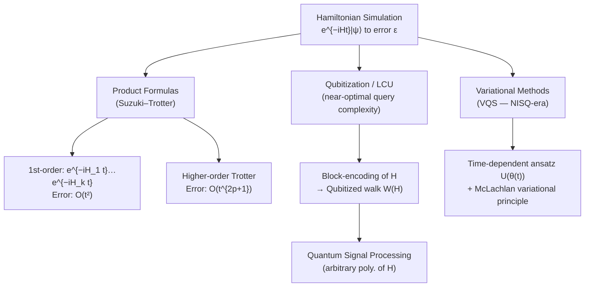

# QCSAA 900-909 · Section 00 · Subsection 903 · Subsubject 005 — Quantum Simulation Algorithms

## 1. Purpose

Documents **quantum simulation algorithms** — methods that use quantum computers to simulate the dynamics or ground states of quantum mechanical systems — within the Q+ATLANTIDE baseline[^baseline]. Covers product-formula (Suzuki–Trotter) methods, qubitization and linear-combination-of-unitaries (LCU) approaches, and variational Hamiltonian simulation, which collectively enable exponential-speedup simulation of materials, chemistry, and physical systems intractable for classical computation.

## 2. Scope

- Covers the *Quantum Simulation Algorithms* subsubject (`005`) of subsection `903` within section `00` *Fundamentos de Computación Cuántica*.
- Inherits Q-Division authority and ORB support from the parent row in [`../README.md`](./README.md)[^archtable].
- Concepts in scope:
  - **Hamiltonian simulation problem** — formal statement: given a Hamiltonian H and time t, implement e^{−iHt} to within error ε.
  - **Product formulas (Suzuki–Trotter)** — first- and higher-order Trotter decompositions; step-size and error analysis; circuit-depth scaling with system size and simulation time.
  - **Qubitization** — block-encoding of Hamiltonians; qubitized quantum walks; quantum signal processing (QSP) for arbitrary eigenvalue transformations; near-optimal query complexity.
  - **Linear Combination of Unitaries (LCU)** — state-preparation and SELECT oracles; oblivious amplitude amplification; resource comparison with Trotter methods.
  - **Variational Hamiltonian simulation** — time-dependent VQA approaches for near-term devices; variational quantum simulation (VQS) of open-system dynamics.
  - **Ground-state and excited-state preparation** — QPE-based energy estimation (cross-reference `003`); VQE-based ground-state approximation (cross-reference `004`).
  - **Target systems** — electronic-structure Hamiltonians (quantum chemistry), lattice gauge theories, condensed-matter models, and aerospace-relevant materials (cross-reference `008`).
- Out of scope: QAOA-specific optimisation encodings (`006`), full fault-tolerant resource budgets (`007`), and aerospace system integration (`008`).

## 3. Diagram — Hamiltonian Simulation Algorithm Hierarchy

Algorithms are classified by their approach to approximating e^{−iHt}: product formulas, qubitization-based, or variational.

## 4. Footprint

| Metric | Value |
|---|---|
| Architecture | `QCSAA` — Quantum Computing & Sentient Agency Architecture |
| Master range | `900–999` |
| Code range | `900-909` |
| Section | `00` — Fundamentos de Computación Cuántica |
| Subsection | `903` — Quantum Algorithms |
| Subsubject | `005` — Quantum Simulation Algorithms |
| Primary Q-Division | Q-HORIZON[^qdiv] |
| Support Q-Divisions | Q-HPC, Q-DATAGOV |
| ORB support | ORB-PMO, ORB-LEG |
| Governance class | `restricted`[^gov] |
| Evidence package | `EP-QCSAA-903-001` |
| Access control profile | `ACP-QCSAA-RESTRICTED` |
| Folder path | `Q+ATLANTIDE/900-999_QCSAA/900-909_Fundamentos-de-Computacion-Cuantica/903_Quantum-Algorithms/` |
| Document | `005_Quantum-Simulation-Algorithms.md` (this file) |
| Parent subsection | [`README.md`](./README.md) · [`000_Overview.md`](./000_Overview.md) |
| Parent architecture | [`../../README.md`](../../README.md) |
| Parent baseline | [`organization/Q+ATLANTIDE.md`](../../../../organization/Q+ATLANTIDE.md) |

## 5. References & Citations

[^baseline]: **Q+ATLANTIDE controlled baseline (v1.0.0)** — [`organization/Q+ATLANTIDE.md`](../../../../organization/Q+ATLANTIDE.md). Defines the controlled `000-999` architecture-band taxonomy and the ATLAS-1000 register subpart.

[^archtable]: **QCSAA §3 Subsection Index** — [`../README.md` §3](../README.md#3-subsection-index). Authoritative source for the `900-909` subsection listing and Q-Division authority.

[^qdiv]: **Q-Division authority** — Q-Divisions provide technical authority over an architecture row (Q+ATLANTIDE Note N-002). See [`organization/Q+ATLANTIDE.md` §4](../../../../organization/Q+ATLANTIDE.md#4-notes).

[^gov]: **Governance class** — `restricted` denotes documents requiring additional governance, evidence packages and access controls (rule N-006). See [`organization/Q+ATLANTIDE.md` §5.3](../../../../organization/Q+ATLANTIDE.md#53-restricted-band-templates-n-006).

[^iso4879]: **ISO/IEC 4879:2023 — Quantum computing — Terminology and vocabulary** — Normative vocabulary for Hamiltonian simulation and related terms.

[^lloyd1996]: **Lloyd, S. (1996). "Universal quantum simulators." Science 273.** — Foundational reference establishing the complexity basis for Hamiltonian simulation.

[^babbush2018]: **Babbush, R. et al. (2018). "Encoding electronic spectra in quantum circuits with linear T complexity." Physical Review X 8.** — Key reference for qubitization and LCU methods with near-optimal resource complexity.

[^childs2021]: **Childs, A. M. et al. (2021). "Theory of Trotter Error with Commutator Scaling." Physical Review X 11.** — Definitive reference for Trotter error analysis and step-count bounds.

### Applicable standards

The following standards apply to this subsubject in addition to the cross-cutting Q+ATLANTIDE governance:

- ISO/IEC 4879:2023 — Quantum computing — Terminology and vocabulary[^iso4879]
