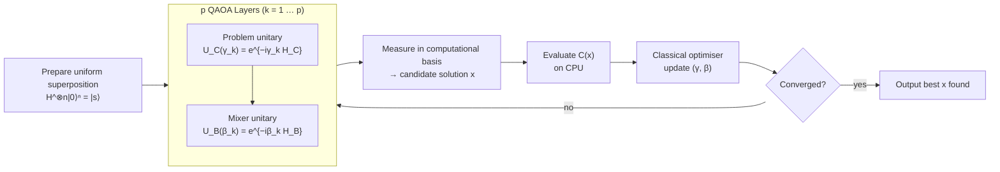

# QCSAA 900-909 · Section 00 · Subsection 903 · Subsubject 006 — Optimization and QAOA Patterns

## 1. Purpose

Documents **quantum optimisation methods** with emphasis on **QAOA circuit patterns** and their application to combinatorial and continuous optimisation problems within the Q+ATLANTIDE baseline[^baseline]. Provides canonical problem encodings (Ising/QUBO), QAOA layer-depth patterns, quantum-annealing interface conventions, and the relationship between QAOA and classical semidefinite-programming approximation ratios for industry-relevant problem classes.

## 2. Scope

- Covers the *Optimization and QAOA Patterns* subsubject (`006`) of subsection `903` within section `00` *Fundamentos de Computación Cuántica*.
- Inherits Q-Division authority and ORB support from the parent row in [`../README.md`](./README.md)[^archtable].
- Concepts in scope:
  - **Problem encodings** — Quadratic Unconstrained Binary Optimization (QUBO) formulation; Ising model mapping; penalty-term encoding for constrained problems; one-hot and binary encodings for integer variables.
  - **QAOA circuit patterns** — problem unitary U_C(γ) from cost Hamiltonian H_C; mixer unitary U_B(β) from transverse-field mixer H_B; p-layer depth; angle parameter optimisation; warm-starting strategies.
  - **QAOA approximation ratios** — known performance guarantees for MaxCut (p=1: ≥ 0.6924 × classical Goemans–Williamson); performance vs. p; local and global optimisation of angles.
  - **Quantum annealing patterns** — D-Wave-style annealing schedule; relationship to adiabatic quantum computation; QUBO interface conventions for annealing hardware.
  - **Continuous optimisation** — quantum gradient descent; quantum natural gradient; application to VQA parameter landscapes (cross-reference `004`).
  - **Aerospace-relevant problem classes** — vehicle routing, scheduling, mission planning, and resource allocation encoded as QUBO/Ising problems (problem class definitions; detailed use-cases in `008`).
  - **Hybrid classical–quantum workflow** — decomposition into subproblems for partial quantum acceleration; warm-start initialisation from classical heuristics.
- Out of scope: VQE and variational loop mechanics (`004`), resource-estimation for optimisation algorithms (`007`), full aerospace integration and assurance (`008`).

## 3. Diagram — QAOA p-Layer Circuit Pattern

Each QAOA layer alternates a problem unitary parameterised by γ_k and a mixer unitary parameterised by β_k. After p layers, the state is measured and angles are updated classically.

## 4. Footprint

| Metric | Value |
|---|---|
| Architecture | `QCSAA` — Quantum Computing & Sentient Agency Architecture |
| Master range | `900–999` |
| Code range | `900-909` |
| Section | `00` — Fundamentos de Computación Cuántica |
| Subsection | `903` — Quantum Algorithms |
| Subsubject | `006` — Optimization and QAOA Patterns |
| Primary Q-Division | Q-HORIZON[^qdiv] |
| Support Q-Divisions | Q-HPC, Q-DATAGOV |
| ORB support | ORB-PMO, ORB-LEG |
| Governance class | `restricted`[^gov] |
| Evidence package | `EP-QCSAA-903-001` |
| Access control profile | `ACP-QCSAA-RESTRICTED` |
| Folder path | `Q+ATLANTIDE/900-999_QCSAA/900-909_Fundamentos-de-Computacion-Cuantica/903_Quantum-Algorithms/` |
| Document | `006_Optimization-and-QAOA-Patterns.md` (this file) |
| Parent subsection | [`README.md`](./README.md) · [`000_Overview.md`](./000_Overview.md) |
| Parent architecture | [`../../README.md`](../../README.md) |
| Parent baseline | [`organization/Q+ATLANTIDE.md`](../../../../organization/Q+ATLANTIDE.md) |

## 5. References & Citations

[^baseline]: **Q+ATLANTIDE controlled baseline (v1.0.0)** — [`organization/Q+ATLANTIDE.md`](../../../../organization/Q+ATLANTIDE.md). Defines the controlled `000-999` architecture-band taxonomy and the ATLAS-1000 register subpart.

[^archtable]: **QCSAA §3 Subsection Index** — [`../README.md` §3](../README.md#3-subsection-index). Authoritative source for the `900-909` subsection listing and Q-Division authority.

[^qdiv]: **Q-Division authority** — Q-Divisions provide technical authority over an architecture row (Q+ATLANTIDE Note N-002). See [`organization/Q+ATLANTIDE.md` §4](../../../../organization/Q+ATLANTIDE.md#4-notes).

[^gov]: **Governance class** — `restricted` denotes documents requiring additional governance, evidence packages and access controls (rule N-006). See [`organization/Q+ATLANTIDE.md` §5.3](../../../../organization/Q+ATLANTIDE.md#53-restricted-band-templates-n-006).

[^iso4879]: **ISO/IEC 4879:2023 — Quantum computing — Terminology and vocabulary** — Normative vocabulary for optimization and annealing terms.

[^farhi2014]: **Farhi, E., Goldstone, J., Gutmann, S. (2014). "A Quantum Approximate Optimization Algorithm." arXiv:1411.4028.** — Foundational reference for QAOA, circuit structure, and approximation ratios.

[^glover2018]: **Glover, F., Kochenberger, G., Du, Y. (2018). "Quantum bridge analytics I: A tutorial on formulating and using QUBO models." 4OR-Q J Oper Res.** — Canonical reference for QUBO formulation and Ising encoding of combinatorial problems.

[^hadfield2019]: **Hadfield, S. et al. (2019). "From the Quantum Approximate Optimization Algorithm to a Quantum Alternating Operator Ansatz." Algorithms 12(2).** — Extends the QAOA framework to constrained problems via alternative mixer constructions.

### Applicable standards

The following standards apply to this subsubject in addition to the cross-cutting Q+ATLANTIDE governance:

- ISO/IEC 4879:2023 — Quantum computing — Terminology and vocabulary[^iso4879]
