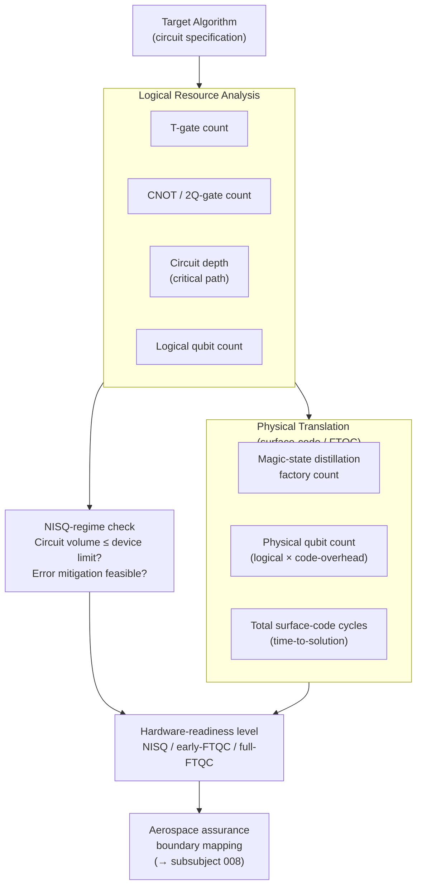

# QCSAA 900-909 · Section 00 · Subsection 903 · Subsubject 007 — Error, Noise, and Resource Estimation

## 1. Purpose

Documents the **error, noise, and resource-estimation** framework used to characterise and budget quantum algorithm implementations within the Q+ATLANTIDE baseline[^baseline]. Provides canonical metrics (T-gate count, CNOT count, logical-qubit count, circuit depth), noise-model definitions (depolarising, amplitude-damping, coherent error), and the methodology for comparing NISQ-era and fault-tolerant resource regimes for the algorithm families defined in subsubjects `002`–`006`.

## 2. Scope

- Covers the *Error, Noise, and Resource Estimation* subsubject (`007`) of subsection `903` within section `00` *Fundamentos de Computación Cuántica*.
- Inherits Q-Division authority and ORB support from the parent row in [`../README.md`](./README.md)[^archtable].
- Concepts in scope:
  - **Logical resource metrics** — T-gate count (non-Clifford gate cost), CNOT/two-qubit gate count, circuit depth (critical path), logical-qubit count, and rotation-gate synthesis overhead.
  - **Physical resource overhead** — logical-to-physical qubit ratio under surface-code error correction; magic-state distillation factory count; classical co-processor requirements.
  - **Noise models** — depolarising noise (single-qubit and two-qubit gate error rates); amplitude-damping (T1/T2 relaxation); phase-damping; coherent systematic errors; cross-talk.
  - **NISQ regime characterisation** — circuit-volume metrics (width × depth); volumetric benchmarking; error-mitigation techniques (zero-noise extrapolation, probabilistic error cancellation, symmetry verification).
  - **Fault-tolerant regime** — surface-code threshold (~1 % per gate); distance-d code overhead; magic-state distillation protocols; scalable resource-estimation models.
  - **Algorithm-specific resource tables** — T-count and qubit requirements for Grover (`002`), QPE (`003`), VQE (`004`), Hamiltonian simulation (`005`), and QAOA (`006`) at representative problem sizes.
  - **Hardware-readiness classification** — mapping algorithms to NISQ, early-FTQC, and full-FTQC maturity levels based on resource requirements.
- Out of scope: quantum error-correction code design (covered in `902_Circuits/`), aerospace certification methodology (`008`).

## 3. Diagram — Resource-Estimation Pipeline

Logical resource analysis precedes physical translation; the result feeds hardware-readiness classification and, for aerospace use, the assurance boundary mapping in subsubject `008`.

## 4. Footprint

| Metric | Value |
|---|---|
| Architecture | `QCSAA` — Quantum Computing & Sentient Agency Architecture |
| Master range | `900–999` |
| Code range | `900-909` |
| Section | `00` — Fundamentos de Computación Cuántica |
| Subsection | `903` — Quantum Algorithms |
| Subsubject | `007` — Error, Noise, and Resource Estimation |
| Primary Q-Division | Q-HORIZON[^qdiv] |
| Support Q-Divisions | Q-HPC, Q-DATAGOV |
| ORB support | ORB-PMO, ORB-LEG |
| Governance class | `restricted`[^gov] |
| Evidence package | `EP-QCSAA-903-001` |
| Access control profile | `ACP-QCSAA-RESTRICTED` |
| Folder path | `Q+ATLANTIDE/900-999_QCSAA/900-909_Fundamentos-de-Computacion-Cuantica/903_Quantum-Algorithms/` |
| Document | `007_Error-Noise-and-Resource-Estimation.md` (this file) |
| Parent subsection | [`README.md`](./README.md) · [`000_Overview.md`](./000_Overview.md) |
| Parent architecture | [`../../README.md`](../../README.md) |
| Parent baseline | [`organization/Q+ATLANTIDE.md`](../../../../organization/Q+ATLANTIDE.md) |

## 5. References & Citations

[^baseline]: **Q+ATLANTIDE controlled baseline (v1.0.0)** — [`organization/Q+ATLANTIDE.md`](../../../../organization/Q+ATLANTIDE.md). Defines the controlled `000-999` architecture-band taxonomy and the ATLAS-1000 register subpart.

[^archtable]: **QCSAA §3 Subsection Index** — [`../README.md` §3](../README.md#3-subsection-index). Authoritative source for the `900-909` subsection listing and Q-Division authority.

[^qdiv]: **Q-Division authority** — Q-Divisions provide technical authority over an architecture row (Q+ATLANTIDE Note N-002). See [`organization/Q+ATLANTIDE.md` §4](../../../../organization/Q+ATLANTIDE.md#4-notes).

[^gov]: **Governance class** — `restricted` denotes documents requiring additional governance, evidence packages and access controls (rule N-006). See [`organization/Q+ATLANTIDE.md` §5.3](../../../../organization/Q+ATLANTIDE.md#53-restricted-band-templates-n-006).

[^iso4879]: **ISO/IEC 4879:2023 — Quantum computing — Terminology and vocabulary** — Normative vocabulary for error models, gate fidelity, and resource-estimation terms.

[^fowler2012]: **Fowler, A. G., Martinis, J. M. et al. (2012). "Surface codes: Towards practical large-scale quantum computation." Physical Review A 86.** — Definitive reference for surface-code overhead and fault-tolerant resource estimation.

[^temme2017]: **Temme, K., Bravyi, S., Gambetta, J. M. (2017). "Error mitigation for short-depth quantum circuits." Physical Review Letters 119.** — Foundational reference for zero-noise extrapolation and probabilistic error cancellation.

[^bishop2017]: **Bishop, L. S. et al. (2017). "Quantum volume." arXiv:1707.03429.** — Defines quantum volume as the canonical NISQ-regime benchmarking metric.

### Applicable standards

The following standards apply to this subsubject in addition to the cross-cutting Q+ATLANTIDE governance:

- ISO/IEC 4879:2023 — Quantum computing — Terminology and vocabulary[^iso4879]
