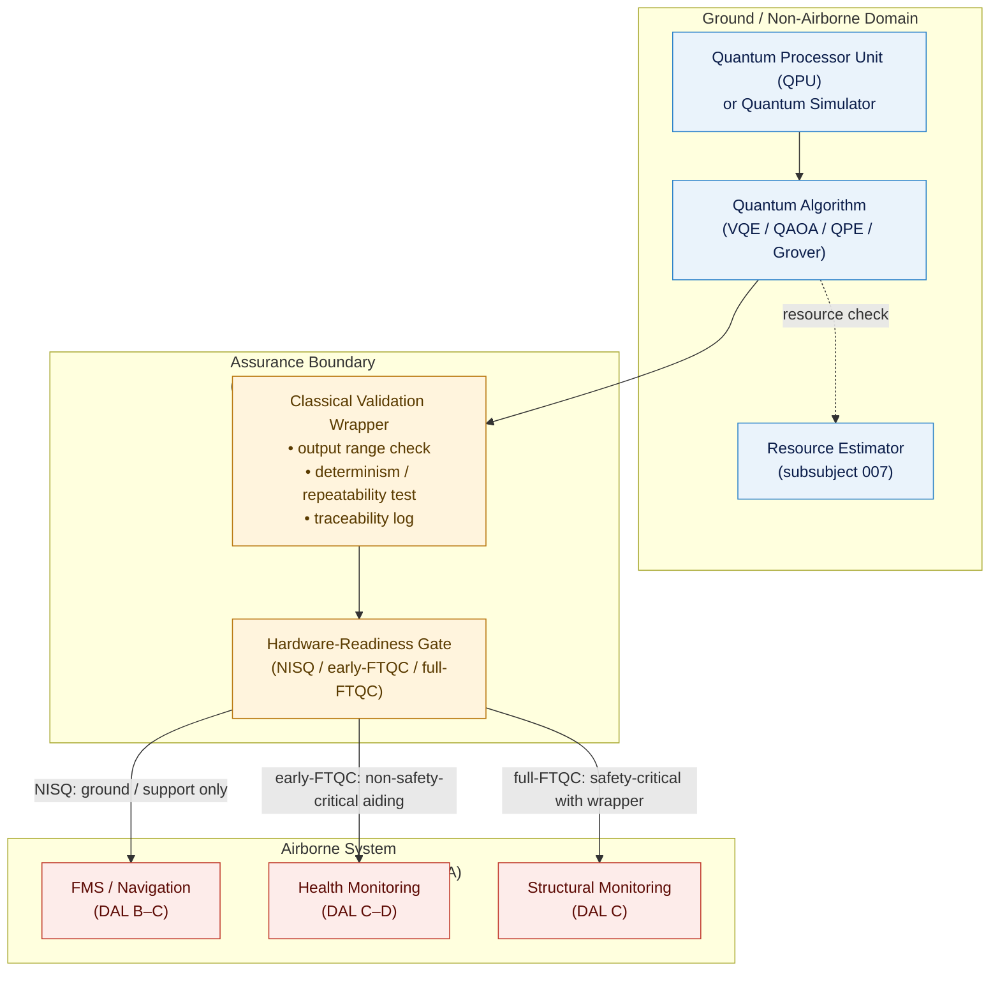

# QCSAA 900-909 · Section 00 · Subsection 903 · Subsubject 008 — Aerospace Use Cases and Assurance Boundaries

## 1. Purpose

Documents the **aerospace use cases** for the quantum algorithm families defined in subsubjects `001`–`007` and establishes the **assurance boundaries** that govern their integration into safety-critical and mission-critical airborne and space systems within the Q+ATLANTIDE baseline[^baseline]. Maps each use-case category to its applicable certification framework (DO-178C[^do178c], DO-254[^do254], ARP4761[^arp4761]) and defines the interface boundary between quantum-algorithm outputs and the classical airborne system that acts on those outputs.

## 2. Scope

- Covers the *Aerospace Use Cases and Assurance Boundaries* subsubject (`008`) of subsection `903` within section `00` *Fundamentos de Computación Cuántica*.
- Inherits Q-Division authority and ORB support from the parent row in [`../README.md`](./README.md)[^archtable].
- Concepts in scope:
  - **Trajectory and flight-path optimisation** — VQE/QAOA-based 4D trajectory planning, fuel-optimal routing for UAVs and commercial aircraft; problem encoded as QUBO/Ising; interface to Flight Management System (FMS).
  - **Structural analysis and materials simulation** — VQE-based electronic-structure simulation for novel aerospace composites (carbon-fibre, titanium alloys, CMC); output consumed by structural integrity tools (not directly airborne).
  - **Quantum-enhanced navigation** — amplitude-estimation subroutines for INS error-covariance propagation; QPE-based eigenvalue methods for Kalman-filter updates; assurance class: DAL-C or lower for non-safety-critical aiding functions.
  - **Mission and resource scheduling** — QAOA-based aircraft gate assignment, crew scheduling, maintenance-slot optimisation; ground-system integration only; no direct airborne DAL requirement.
  - **Predictive maintenance** — Grover-search-based anomaly detection in sensor data streams; amplitude-estimation for reliability-model updates; ground-support system; DAL not applicable.
  - **Assurance boundary definition** — the boundary at which quantum-algorithm outputs enter a safety-critical context; requirements for classical validation wrappers, determinism guarantees, output range checks, and traceability to DO-178C objectives.
  - **DAL mapping** — Assignment of Development Assurance Levels (DAL A–E per ARP4754A[^arp4754a]) to quantum-algorithm use cases based on failure condition severity.
  - **Hardware-readiness gating** — gate criteria linking algorithm hardware-readiness level (from `007`) to permitted use-case deployment scope (ground-only, non-safety-critical aiding, safety-critical with classical wrapper).
- Out of scope: quantum communication and quantum-key distribution in avionics (`920-929`), quantum sensing and metrology (`940-949`), and detailed software design for airborne implementations (covered by programme-specific DO-178C plans).

## 3. Diagram — Use-Case Assurance Boundary Architecture

Quantum algorithms execute on ground-based or segregated QPU infrastructure. Results cross the assurance boundary only through a validated classical interface layer before entering the airborne system.

## 4. Footprint

| Metric | Value |
|---|---|
| Architecture | `QCSAA` — Quantum Computing & Sentient Agency Architecture |
| Master range | `900–999` |
| Code range | `900-909` |
| Section | `00` — Fundamentos de Computación Cuántica |
| Subsection | `903` — Quantum Algorithms |
| Subsubject | `008` — Aerospace Use Cases and Assurance Boundaries |
| Primary Q-Division | Q-HORIZON[^qdiv] |
| Support Q-Divisions | Q-HPC, Q-DATAGOV |
| ORB support | ORB-PMO, ORB-LEG |
| Governance class | `restricted`[^gov] |
| Evidence package | `EP-QCSAA-903-001` |
| Access control profile | `ACP-QCSAA-RESTRICTED` |
| Folder path | `Q+ATLANTIDE/900-999_QCSAA/900-909_Fundamentos-de-Computacion-Cuantica/903_Quantum-Algorithms/` |
| Document | `008_Aerospace-Use-Cases-and-Assurance-Boundaries.md` (this file) |
| Parent subsection | [`README.md`](./README.md) · [`000_Overview.md`](./000_Overview.md) |
| Parent architecture | [`../../README.md`](../../README.md) |
| Parent baseline | [`organization/Q+ATLANTIDE.md`](../../../../organization/Q+ATLANTIDE.md) |

## 5. References & Citations

[^baseline]: **Q+ATLANTIDE controlled baseline (v1.0.0)** — [`organization/Q+ATLANTIDE.md`](../../../../organization/Q+ATLANTIDE.md). Defines the controlled `000-999` architecture-band taxonomy and the ATLAS-1000 register subpart.

[^archtable]: **QCSAA §3 Subsection Index** — [`../README.md` §3](../README.md#3-subsection-index). Authoritative source for the `900-909` subsection listing and Q-Division authority.

[^qdiv]: **Q-Division authority** — Q-Divisions provide technical authority over an architecture row (Q+ATLANTIDE Note N-002). See [`organization/Q+ATLANTIDE.md` §4](../../../../organization/Q+ATLANTIDE.md#4-notes).

[^gov]: **Governance class** — `restricted` denotes documents requiring additional governance, evidence packages and access controls (rule N-006). See [`organization/Q+ATLANTIDE.md` §5.3](../../../../organization/Q+ATLANTIDE.md#53-restricted-band-templates-n-006).

[^iso4879]: **ISO/IEC 4879:2023 — Quantum computing — Terminology and vocabulary** — Normative vocabulary for quantum algorithm and interface terms.

[^do178c]: **RTCA DO-178C — Software Considerations in Airborne Systems and Equipment Certification** — Primary certification standard governing software assurance objectives for airborne systems; defines DAL A–E and the certification liaison process.

[^do254]: **RTCA DO-254 — Design Assurance Guidance for Airborne Electronic Hardware** — Complements DO-178C for complex programmable hardware; applicable if quantum co-processor interfaces are implemented in airborne electronics.

[^arp4761]: **SAE ARP4761 — Guidelines and Methods for Conducting Safety Assessment Process on Civil Airborne Systems** — Safety-assessment methodology (FHA, PSSA, SSA) used to assign failure-condition severity and derive DAL requirements for quantum-algorithm integration.

[^arp4754a]: **SAE ARP4754A — Guidelines for Development of Civil Aircraft and Systems** — System-level development assurance process; source of DAL A–E assignment criteria cited in the use-case table.

[^easa2023]: **EASA AI Roadmap 2.0 (2023)** — EASA framework for assurance of AI/ML-based systems in aviation; applicable to quantum-classical hybrid algorithms classified as ML-adjacent.

### Applicable standards

The following standards apply to this subsubject in addition to the cross-cutting Q+ATLANTIDE governance:

- ISO/IEC 4879:2023 — Quantum computing — Terminology and vocabulary[^iso4879]
- RTCA DO-178C — Software Considerations in Airborne Systems and Equipment Certification[^do178c]
- RTCA DO-254 — Design Assurance Guidance for Airborne Electronic Hardware[^do254]
- SAE ARP4761 — Guidelines and Methods for Conducting Safety Assessment Process on Civil Airborne Systems[^arp4761]
- SAE ARP4754A — Guidelines for Development of Civil Aircraft and Systems[^arp4754a]
- EASA AI Roadmap 2.0 (2023)[^easa2023]
