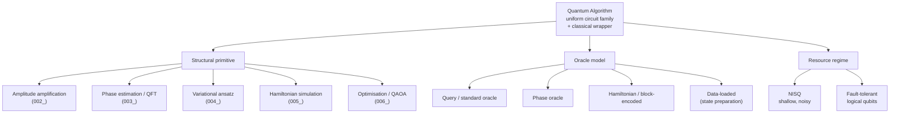

# QCSAA 900-909 · Section 00 · Subsection 903 · Subsubject 001 — Algorithm Definition and Taxonomy

## 1. Purpose

Defines a **quantum algorithm** as a uniformly-generated family of quantum circuits acting on a fixed register model, together with a classical pre-/post-processing wrapper, and establishes the **taxonomy** used by the rest of the subsection to classify algorithms (`002`–`008`) by their structural primitive, oracle model, and resource profile. Aligns the register with the IEEE P7130 vocabulary[^ieeep7130] and the controlled Q+ATLANTIDE baseline[^baseline].

## 2. Scope

- Covers the *Algorithm Definition and Taxonomy* subsubject (`001`) of subsection `903` *Quantum Algorithms* within section `00` *Fundamentos de Computación Cuántica*.
- Inherits Q-Division authority and ORB support from the parent row in [`../../README.md` §3](../../README.md#3-architecture-table)[^archtable].
- Concepts in scope:
  - **Algorithm as a circuit family** $\{C_n\}_{n \in \mathbb{N}}$ that is *uniformly generated* by a classical Turing machine, acting on the qubit and circuit models defined in [`../900_Qubits/`](../900_Qubits/) and [`../030_circuits/`](../030_circuits/).
  - **Oracle / black-box model** — query complexity, the distinction between *standard* and *phase* oracles, and the role of oracles as the formal interface to a problem instance.
  - **Input / output convention** — classical bitstring inputs encoded into computational-basis states, sampled outputs after measurement, and the success-probability contract that turns a single shot into an algorithm via repetition or amplitude amplification (`002_`).
  - **Taxonomy axes** used downstream:
    - *Structural primitive*: amplitude amplification (`002_`), phase estimation / QFT (`003_`), variational ansatz (`004_`), Hamiltonian simulation (`005_`), QAOA-style optimisation (`006_`).
    - *Oracle model*: query / Hamiltonian / data-loaded (state-preparation).
    - *Resource regime*: NISQ (low depth, no error correction) vs. fault-tolerant (logical qubits per [`../900_Qubits/005_Logical-Qubits-Encoding-and-Error-Correction.md`](../900_Qubits/005_Logical-Qubits-Encoding-and-Error-Correction.md)).
  - **Speedup classes** — provable, heuristic, and conjectured separations relative to classical baselines, with the complexity context deferred to [`../050_foundations/`](../050_foundations/).
- Out of scope: specific algorithm instances (covered in `002_`–`006_`), error and resource estimation methodology (covered in `007_`), and aerospace deployment constraints (covered in `008_`).

## 3. Diagram — Quantum Algorithm Taxonomy

The taxonomy below is the controlled vocabulary used by `002_`–`008_` to classify each algorithm; every downstream subsubject populates one branch of this tree and back-references it rather than redefining the classification.

## 4. Footprint

| Metric | Value |
|---|---|
| Architecture | `QCSAA` — Quantum Computing & Sentient Agency Architecture |
| Master range | `900–999` |
| Code range | `900-909` |
| Section | `00` — Fundamentos de Computación Cuántica |
| Subject | `00` — General Information |
| Subsection | `903` — Quantum Algorithms |
| Subsubject | `001` — Algorithm Definition and Taxonomy |
| Primary Q-Division | Q-HORIZON[^qdiv] |
| Support Q-Divisions | Q-HPC, Q-DATAGOV |
| ORB support | ORB-PMO, ORB-LEG |
| Governance class | `restricted`[^gov] |
| Folder path | `Q+ATLANTIDE/900-999_QCSAA/900-909_Fundamentos-de-Computacion-Cuantica/903_quantum-algorithms/` |
| Document | `001_Algorithm-Definition-and-Taxonomy.md` (this file) |
| Parent subsection | [`README.md`](./README.md) · [`000_Overview.md`](./000_Overview.md) |
| Parent architecture | [`../../README.md`](../../README.md) |
| Parent baseline | [`organization/Q+ATLANTIDE.md`](../../../../organization/Q+ATLANTIDE.md) |

## 5. References & Citations

[^baseline]: **Q+ATLANTIDE controlled baseline (v1.0.0)** — [`organization/Q+ATLANTIDE.md`](../../../../organization/Q+ATLANTIDE.md). Defines the controlled `000-999` architecture-band taxonomy and the ATLAS-1000 register subpart.

[^archtable]: **QCSAA §3 Architecture Table** — [`../../README.md` §3](../../README.md#3-architecture-table). Authoritative source for the `900-909` row (Section `00` — Fundamentos de Computación Cuántica, Primary Q-Division Q-HORIZON).

[^qdiv]: **Q-Division authority** — Q-Divisions provide technical authority over an architecture row (Q+ATLANTIDE Note N-002). See [`organization/Q+ATLANTIDE.md` §4](../../../../organization/Q+ATLANTIDE.md#4-notes).

[^gov]: **Governance class** — Bands are classified as `baseline` or `restricted` per Q+ATLANTIDE §4 governance rules.

[^ieeep7130]: **IEEE P7130 — Standard for Quantum Computing Definitions** — Vocabulary baseline for the quantum computing scope of QCSAA `900-999`.

[^s1000d]: **S1000D Issue 6.0 — International specification for technical publications** — Common Source DataBase (CSDB) and Data Module Code (DMC) specification used for all Q+ATLANTIDE artefacts.

[^as9100d]: **AS9100D — Quality Management Systems — Aviation, Space and Defense Organizations** — Quality-management baseline for all Q+ATLANTIDE deliverables.

### Applicable industry standards

The following standards apply to this subsubject in addition to the cross-cutting Q+ATLANTIDE governance:

- IEEE P7130 — Standard for Quantum Computing Definitions[^ieeep7130]
- S1000D Issue 6.0 — International specification for technical publications[^s1000d]
- AS9100D — Quality Management Systems — Aviation, Space and Defense Organizations[^as9100d]
