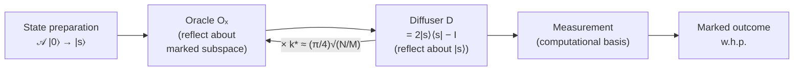

# QCSAA 900-909 · Section 00 · Subsection 903 · Subsubject 002 — Amplitude Amplification and Search

## 1. Purpose

Defines the **amplitude amplification** primitive — the structural generalisation of Grover's search algorithm — as the canonical mechanism by which quantum algorithms convert a small marked-state amplitude into a high success probability with a quadratic query speedup. Establishes the formal building blocks (oracle reflection, diffuser, Grover iterate) used by every search-style algorithm catalogued in this subsection per the taxonomy in [`001_Algorithm-Definition-and-Taxonomy.md`](./001_Algorithm-Definition-and-Taxonomy.md). Aligned with IEEE P7130[^ieeep7130] and the controlled Q+ATLANTIDE baseline[^baseline].

## 2. Scope

- Covers the *Amplitude Amplification and Search* subsubject (`002`) of subsection `903`.
- Inherits Q-Division authority and ORB support from the parent row in [`../../README.md` §3](../../README.md#3-architecture-table)[^archtable].
- Concepts in scope:
  - **Phase / standard oracle equivalence** — $O_f|x\rangle = (-1)^{f(x)}|x\rangle$ vs. $|x\rangle|y\rangle \mapsto |x\rangle|y \oplus f(x)\rangle$, and the standard reduction between them.
  - **Grover diffuser** $D = 2|s\rangle\langle s| - I$ over a starting state $|s\rangle$ (typically uniform superposition produced by Hadamard layer).
  - **Grover iterate** $G = D \cdot O_f$, its action as a rotation by angle $2\theta$ in the two-dimensional subspace spanned by marked / unmarked components, and the optimal iteration count $k^* \approx \frac{\pi}{4}\sqrt{N/M}$ for $M$ marked items in $N$ candidates.
  - **Amplitude amplification (Brassard–Høyer–Mosca–Tapp)** — generalisation to arbitrary state-preparation $\mathcal{A}$ in place of Hadamard, with iterate $Q = -\mathcal{A} S_0 \mathcal{A}^\dagger S_f$.
  - **Amplitude / quantum-counting estimation** — pairing the iterate with phase estimation (`003_`) to estimate $M/N$.
  - **Quadratic speedup** as a query-complexity statement ($O(\sqrt{N})$ vs. $O(N)$), and its tightness lower bound; explicit non-applicability to problems where the quadratic gain is overwhelmed by the oracle cost.
- Out of scope: phase estimation itself (`003_`), variational search heuristics (`004_`), QAOA-style optimisation (`006_`), and noise-induced amplitude leakage analysis (`007_`).

## 3. Diagram — Grover Iterate and Amplification Loop

The diagram shows the canonical amplification loop: state preparation, repeated application of the Grover iterate $k^*$ times, and final measurement. Every search-style algorithm in QCSAA shall map onto this loop and back-reference its components.

## 4. Footprint

| Metric | Value |
|---|---|
| Architecture | `QCSAA` — Quantum Computing & Sentient Agency Architecture |
| Master range | `900–999` |
| Code range | `900-909` |
| Section | `00` — Fundamentos de Computación Cuántica |
| Subject | `00` — General Information |
| Subsection | `903` — Quantum Algorithms |
| Subsubject | `002` — Amplitude Amplification and Search |
| Primary Q-Division | Q-HORIZON[^qdiv] |
| Support Q-Divisions | Q-HPC, Q-DATAGOV |
| ORB support | ORB-PMO, ORB-LEG |
| Governance class | `restricted`[^gov] |
| Folder path | `Q+ATLANTIDE/900-999_QCSAA/900-909_Fundamentos-de-Computacion-Cuantica/903_quantum-algorithms/` |
| Document | `002_Amplitude-Amplification-and-Search.md` (this file) |
| Parent subsection | [`README.md`](./README.md) · [`000_Overview.md`](./000_Overview.md) |
| Parent architecture | [`../../README.md`](../../README.md) |
| Parent baseline | [`organization/Q+ATLANTIDE.md`](../../../../organization/Q+ATLANTIDE.md) |

## 5. References & Citations

[^baseline]: **Q+ATLANTIDE controlled baseline (v1.0.0)** — [`organization/Q+ATLANTIDE.md`](../../../../organization/Q+ATLANTIDE.md). Defines the controlled `000-999` architecture-band taxonomy and the ATLAS-1000 register subpart.

[^archtable]: **QCSAA §3 Architecture Table** — [`../../README.md` §3](../../README.md#3-architecture-table). Authoritative source for the `900-909` row (Section `00` — Fundamentos de Computación Cuántica, Primary Q-Division Q-HORIZON).

[^qdiv]: **Q-Division authority** — Q-Divisions provide technical authority over an architecture row (Q+ATLANTIDE Note N-002). See [`organization/Q+ATLANTIDE.md` §4](../../../../organization/Q+ATLANTIDE.md#4-notes).

[^gov]: **Governance class** — Bands are classified as `baseline` or `restricted` per Q+ATLANTIDE §4 governance rules.

[^ieeep7130]: **IEEE P7130 — Standard for Quantum Computing Definitions** — Vocabulary baseline for the quantum computing scope of QCSAA `900-999`.

[^s1000d]: **S1000D Issue 6.0 — International specification for technical publications** — Common Source DataBase (CSDB) and Data Module Code (DMC) specification used for all Q+ATLANTIDE artefacts.

[^as9100d]: **AS9100D — Quality Management Systems — Aviation, Space and Defense Organizations** — Quality-management baseline for all Q+ATLANTIDE deliverables.

### Applicable industry standards

The following standards apply to this subsubject in addition to the cross-cutting Q+ATLANTIDE governance:

- IEEE P7130 — Standard for Quantum Computing Definitions[^ieeep7130]
- S1000D Issue 6.0 — International specification for technical publications[^s1000d]
- AS9100D — Quality Management Systems — Aviation, Space and Defense Organizations[^as9100d]
