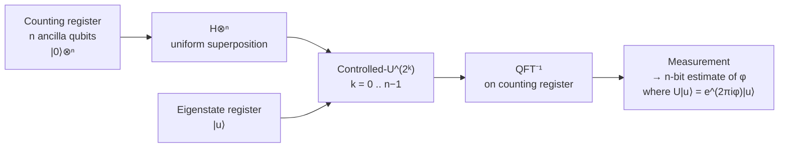

# QCSAA 900-909 · Section 00 · Subsection 903 · Subsubject 003 — Phase Estimation and Fourier Methods

## 1. Purpose

Defines the **Quantum Fourier Transform (QFT)** and the **Quantum Phase Estimation (QPE)** primitive, together with the family of algorithms (order-finding, Shor's factoring, HHL-style linear systems, period-finding for hidden-subgroup problems) that derive their speedup from the Fourier structure of $\mathbb{Z}_{2^n}$. Establishes the canonical resource counts and precision/success-probability tradeoffs used by `005_`–`007_`. Aligned with IEEE P7130[^ieeep7130], the post-quantum threat references[^nistir8413][^etsiqsc001], and the controlled Q+ATLANTIDE baseline[^baseline].

## 2. Scope

- Covers the *Phase Estimation and Fourier Methods* subsubject (`003`) of subsection `903`.
- Inherits Q-Division authority and ORB support from the parent row in [`../../README.md` §3](../../README.md#3-architecture-table)[^archtable].
- Concepts in scope:
  - **Quantum Fourier Transform** $\mathrm{QFT}_N |x\rangle = \frac{1}{\sqrt{N}} \sum_{k=0}^{N-1} e^{2\pi i x k / N} |k\rangle$, its $O(n^2)$ gate decomposition into Hadamard and controlled-phase gates, and its inverse $\mathrm{QFT}^\dagger$.
  - **Quantum Phase Estimation** — given a unitary $U$ with eigenvector $|u\rangle$ and eigenphase $\varphi$, estimate $\varphi$ to $n$ bits with success probability $\geq 1 - \varepsilon$ using $O(n + \log(1/\varepsilon))$ controlled-$U^{2^k}$ applications and one $\mathrm{QFT}^\dagger$.
  - **Iterative / Kitaev-style phase estimation** as a NISQ-friendly variant that trades ancilla width for circuit repetitions.
  - **Order-finding and Shor's factoring** — reduction of integer factoring to period-finding of $f(x) = a^x \bmod N$, with the period extracted by QPE on the modular-multiplication unitary; explicit cross-band link to CYB `880-889` Post-Quantum Cryptography (the Shor pathway is the canonical motivation for PQC under NIST IR 8413[^nistir8413] and ETSI GR QSC 001[^etsiqsc001]).
  - **Hidden Subgroup Problem (HSP) framing** — abelian HSP over $\mathbb{Z}_n$ solved by QPE; non-abelian extensions noted but deferred to research literature.
  - **Quantum linear-systems (HHL family)** — block-encoded $A^{-1}$ via QPE on $e^{iAt}$, with the precision/condition-number tradeoffs that determine its end-to-end speedup; cross-references Hamiltonian simulation (`005_`).
- Out of scope: amplitude amplification (`002_`), variational eigensolvers (`004_`), explicit Trotter / qDRIFT decompositions (`005_`), QAOA (`006_`), and resource estimates for fault-tolerant QPE (covered in `007_`).

## 3. Diagram — Quantum Phase Estimation Architecture

The diagram is the canonical QPE circuit pattern that every Fourier-method algorithm in this subsubject reduces to. Order-finding, HHL and abelian-HSP solvers are different `(U, |u⟩)` instantiations of this same template.

## 4. Footprint

| Metric | Value |
|---|---|
| Architecture | `QCSAA` — Quantum Computing & Sentient Agency Architecture |
| Master range | `900–999` |
| Code range | `900-909` |
| Section | `00` — Fundamentos de Computación Cuántica |
| Subject | `00` — General Information |
| Subsection | `903` — Quantum Algorithms |
| Subsubject | `003` — Phase Estimation and Fourier Methods |
| Primary Q-Division | Q-HORIZON[^qdiv] |
| Support Q-Divisions | Q-HPC, Q-DATAGOV |
| ORB support | ORB-PMO, ORB-LEG |
| Governance class | `restricted`[^gov] |
| Folder path | `Q+ATLANTIDE/900-999_QCSAA/900-909_Fundamentos-de-Computacion-Cuantica/903_quantum-algorithms/` |
| Document | `003_Phase-Estimation-and-Fourier-Methods.md` (this file) |
| Parent subsection | [`README.md`](./README.md) · [`000_Overview.md`](./000_Overview.md) |
| Parent architecture | [`../../README.md`](../../README.md) |
| Parent baseline | [`organization/Q+ATLANTIDE.md`](../../../../organization/Q+ATLANTIDE.md) |

## 5. References & Citations

[^baseline]: **Q+ATLANTIDE controlled baseline (v1.0.0)** — [`organization/Q+ATLANTIDE.md`](../../../../organization/Q+ATLANTIDE.md). Defines the controlled `000-999` architecture-band taxonomy and the ATLAS-1000 register subpart.

[^archtable]: **QCSAA §3 Architecture Table** — [`../../README.md` §3](../../README.md#3-architecture-table). Authoritative source for the `900-909` row (Section `00` — Fundamentos de Computación Cuántica, Primary Q-Division Q-HORIZON).

[^qdiv]: **Q-Division authority** — Q-Divisions provide technical authority over an architecture row (Q+ATLANTIDE Note N-002). See [`organization/Q+ATLANTIDE.md` §4](../../../../organization/Q+ATLANTIDE.md#4-notes).

[^gov]: **Governance class** — Bands are classified as `baseline` or `restricted` per Q+ATLANTIDE §4 governance rules.

[^ieeep7130]: **IEEE P7130 — Standard for Quantum Computing Definitions** — Vocabulary baseline for the quantum computing scope of QCSAA `900-999`.

[^nistir8413]: **NIST IR 8413 — Status Report on the Third Round of the NIST Post-Quantum Cryptography Standardization Process** — Post-quantum cryptography reference for the Shor-family threat model.

[^etsiqsc001]: **ETSI GR QSC 001 — Quantum-Safe Cryptography (QSC); Quantum-safe algorithmic framework** — ETSI quantum-safe cryptography framework applied across QCSAA.

[^s1000d]: **S1000D Issue 6.0 — International specification for technical publications** — Common Source DataBase (CSDB) and Data Module Code (DMC) specification used for all Q+ATLANTIDE artefacts.

[^as9100d]: **AS9100D — Quality Management Systems — Aviation, Space and Defense Organizations** — Quality-management baseline for all Q+ATLANTIDE deliverables.

### Applicable industry standards

The following standards apply to this subsubject in addition to the cross-cutting Q+ATLANTIDE governance:

- IEEE P7130 — Standard for Quantum Computing Definitions[^ieeep7130]
- NIST IR 8413 — Status Report on the Third Round of the NIST Post-Quantum Cryptography Standardization Process[^nistir8413]
- ETSI GR QSC 001 — Quantum-Safe Cryptography (QSC); Quantum-safe algorithmic framework[^etsiqsc001]
- S1000D Issue 6.0 — International specification for technical publications[^s1000d]
- AS9100D — Quality Management Systems — Aviation, Space and Defense Organizations[^as9100d]
