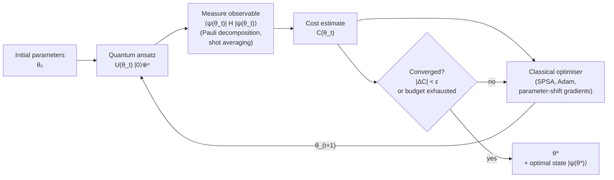

# QCSAA 900-909 · Section 00 · Subsection 903 · Subsubject 004 — Variational Quantum Algorithms

## 1. Purpose

Defines the **Variational Quantum Algorithm (VQA)** pattern — a hybrid quantum/classical loop in which a parameterised quantum circuit (the *ansatz*) prepares a trial state, a classical optimiser updates its parameters to minimise an expectation-value cost function, and the loop iterates until convergence. Catalogues the canonical VQA instances (VQE, VQLS, variational quantum classifiers, generative VQAs) that are the dominant NISQ-era algorithm class per the resource-regime axis of [`001_Algorithm-Definition-and-Taxonomy.md`](./001_Algorithm-Definition-and-Taxonomy.md). Aligned with IEEE P7130[^ieeep7130] and the controlled Q+ATLANTIDE baseline[^baseline].

## 2. Scope

- Covers the *Variational Quantum Algorithms* subsubject (`004`) of subsection `903`.
- Inherits Q-Division authority and ORB support from the parent row in [`../../README.md` §3](../../README.md#3-architecture-table)[^archtable].
- Concepts in scope:
  - **Parameterised ansatz** $|\psi(\boldsymbol{\theta})\rangle = U(\boldsymbol{\theta})|0\rangle^{\otimes n}$ with $U(\boldsymbol{\theta})$ a sequence of single- and two-qubit gates from the universal gate set defined in [`../020_gates/904_Universal-Gate-Sets-and-Decomposition.md`](../020_gates/904_Universal-Gate-Sets-and-Decomposition.md). Hardware-efficient, problem-inspired (UCC, Hamiltonian-variational) and symmetry-preserving families.
  - **Cost function** $C(\boldsymbol{\theta}) = \langle \psi(\boldsymbol{\theta}) | H | \psi(\boldsymbol{\theta}) \rangle$ for an observable $H$ expressed as a weighted sum of Pauli strings; estimation by sampling and shot allocation.
  - **Hybrid loop** — quantum execution of $U(\boldsymbol{\theta}_t)$, classical estimation of $C$ and (where required) gradients via the parameter-shift rule, classical update $\boldsymbol{\theta}_{t+1}$, repeat. Termination criteria (convergence tolerance, shot budget, wall clock).
  - **Canonical VQA instances**:
    - *VQE* — variational quantum eigensolver for the ground-state energy of an electronic / spin Hamiltonian.
    - *VQLS* — variational quantum linear solver as the NISQ counterpart of HHL (`003_`).
    - *Variational quantum classifier (VQC) and quantum kernel methods* — feeders into QCSAA `910-919` Quantum Machine Learning.
    - *Generative VQAs* — quantum circuit Born machines, QGANs.
  - **Trainability hazards** — barren plateaus, noise-induced barren plateaus, ansatz expressibility/trainability tradeoffs; design rules to mitigate them (shallow ansatz, local cost functions, symmetry restriction).
- Out of scope: QAOA-specific structure (covered in `006_`), Hamiltonian-simulation alternatives to VQE (covered in `005_`), and full noise/error analysis (covered in `007_`).

## 3. Diagram — Variational Hybrid Loop

The hybrid loop below is the controlling pattern for every VQA instance in QCSAA. Cross-band consumers (QML in `910-919`, robotics in `960-969`) instantiate it with their own Hamiltonian / cost / ansatz triple but do not modify the loop topology.

## 4. Footprint

| Metric | Value |
|---|---|
| Architecture | `QCSAA` — Quantum Computing & Sentient Agency Architecture |
| Master range | `900–999` |
| Code range | `900-909` |
| Section | `00` — Fundamentos de Computación Cuántica |
| Subject | `00` — General Information |
| Subsection | `903` — Quantum Algorithms |
| Subsubject | `004` — Variational Quantum Algorithms |
| Primary Q-Division | Q-HORIZON[^qdiv] |
| Support Q-Divisions | Q-HPC, Q-DATAGOV |
| ORB support | ORB-PMO, ORB-LEG |
| Governance class | `restricted`[^gov] |
| Folder path | `Q+ATLANTIDE/900-999_QCSAA/900-909_Fundamentos-de-Computacion-Cuantica/903_quantum-algorithms/` |
| Document | `004_Variational-Quantum-Algorithms.md` (this file) |
| Parent subsection | [`README.md`](./README.md) · [`000_Overview.md`](./000_Overview.md) |
| Parent architecture | [`../../README.md`](../../README.md) |
| Parent baseline | [`organization/Q+ATLANTIDE.md`](../../../../organization/Q+ATLANTIDE.md) |

## 5. References & Citations

[^baseline]: **Q+ATLANTIDE controlled baseline (v1.0.0)** — [`organization/Q+ATLANTIDE.md`](../../../../organization/Q+ATLANTIDE.md). Defines the controlled `000-999` architecture-band taxonomy and the ATLAS-1000 register subpart.

[^archtable]: **QCSAA §3 Architecture Table** — [`../../README.md` §3](../../README.md#3-architecture-table). Authoritative source for the `900-909` row (Section `00` — Fundamentos de Computación Cuántica, Primary Q-Division Q-HORIZON).

[^qdiv]: **Q-Division authority** — Q-Divisions provide technical authority over an architecture row (Q+ATLANTIDE Note N-002). See [`organization/Q+ATLANTIDE.md` §4](../../../../organization/Q+ATLANTIDE.md#4-notes).

[^gov]: **Governance class** — Bands are classified as `baseline` or `restricted` per Q+ATLANTIDE §4 governance rules.

[^ieeep7130]: **IEEE P7130 — Standard for Quantum Computing Definitions** — Vocabulary baseline for the quantum computing scope of QCSAA `900-999`.

[^s1000d]: **S1000D Issue 6.0 — International specification for technical publications** — Common Source DataBase (CSDB) and Data Module Code (DMC) specification used for all Q+ATLANTIDE artefacts.

[^as9100d]: **AS9100D — Quality Management Systems — Aviation, Space and Defense Organizations** — Quality-management baseline for all Q+ATLANTIDE deliverables.

### Applicable industry standards

The following standards apply to this subsubject in addition to the cross-cutting Q+ATLANTIDE governance:

- IEEE P7130 — Standard for Quantum Computing Definitions[^ieeep7130]
- S1000D Issue 6.0 — International specification for technical publications[^s1000d]
- AS9100D — Quality Management Systems — Aviation, Space and Defense Organizations[^as9100d]
