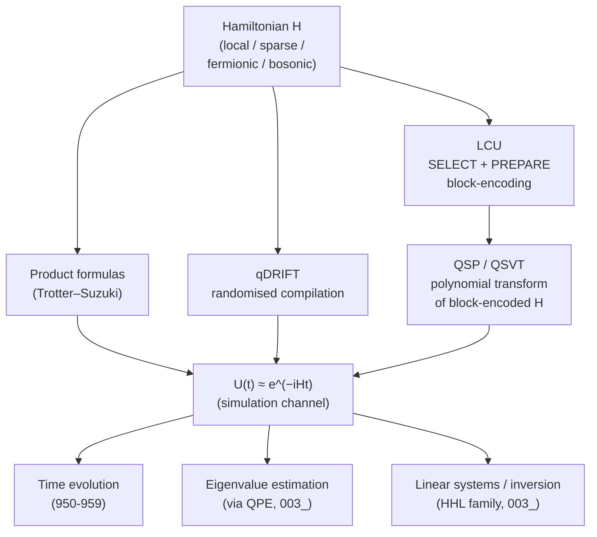

# QCSAA 900-909 · Section 00 · Subsection 903 · Subsubject 005 — Quantum Simulation Algorithms

## 1. Purpose

Defines the **Hamiltonian-simulation** primitive — the construction of a circuit that approximates the unitary $U(t) = e^{-iHt}$ for a target Hamiltonian $H$ — and catalogues the algorithmic families (Trotter–Suzuki product formulas, qDRIFT, Linear Combination of Unitaries, Quantum Signal Processing / Quantum Singular Value Transformation) that realise it. Hamiltonian simulation is the *original* quantum-advantage motivator (Feynman–Lloyd) and the upstream engine of every QCSAA `950-959` Quantum Simulation use case. Aligned with IEEE P7130[^ieeep7130] and the controlled Q+ATLANTIDE baseline[^baseline].

## 2. Scope

- Covers the *Quantum Simulation Algorithms* subsubject (`005`) of subsection `903`.
- Inherits Q-Division authority and ORB support from the parent row in [`../../README.md` §3](../../README.md#3-architecture-table)[^archtable].
- Concepts in scope:
  - **Hamiltonian classes** — local / $k$-local, sparse, geometrically-local, sum-of-Pauli, fermionic (with Jordan–Wigner / Bravyi–Kitaev encodings) and bosonic-truncated.
  - **Product-formula (Trotter–Suzuki) simulation** — first- and higher-order splittings $e^{-i(A+B)t} \approx (e^{-iAt/r} e^{-iBt/r})^r$, error scaling in $t$ and $r$, commutator-aware bounds, and gate-count formulas.
  - **qDRIFT** — randomised compilation of $H = \sum_j h_j H_j$ into a stochastic product of unitaries, removing the $L$-dependence of Trotter at the cost of $1/\varepsilon$ scaling.
  - **Linear Combination of Unitaries (LCU)** — block-encoding of $H$ via a SELECT/PREPARE pair, used as the building block for QSP/QSVT.
  - **Quantum Signal Processing (QSP) and Quantum Singular Value Transformation (QSVT)** — uniform polynomial transformations of block-encoded operators; near-optimal Hamiltonian simulation, matrix inversion, and amplitude amplification all reducible to QSVT.
  - **Eigenvalue and observable estimation** — combining simulation with phase estimation (`003_`) for ground-state energy estimation, with VQE (`004_`) as the NISQ alternative.
  - **Resource scaling** — gate-count, ancilla, and T-count expressions used by the resource-estimation methodology in `007_`.
- Out of scope: variational eigensolvers (`004_`), QAOA (`006_`), end-to-end aerospace use cases (`008_`), and the physical implementation of the simulating hardware (covered in [`../900_Qubits/002_Physical-Qubit-Implementations.md`](../900_Qubits/002_Physical-Qubit-Implementations.md)).

## 3. Diagram — Hamiltonian-Simulation Algorithm Family

The taxonomy below is the authoritative classification used by `007_` for resource estimation and by QCSAA `950-959` for downstream simulation use cases. Each leaf maps to a distinct compiler pass and a distinct error-budget structure.

## 4. Footprint

| Metric | Value |
|---|---|
| Architecture | `QCSAA` — Quantum Computing & Sentient Agency Architecture |
| Master range | `900–999` |
| Code range | `900-909` |
| Section | `00` — Fundamentos de Computación Cuántica |
| Subject | `00` — General Information |
| Subsection | `903` — Quantum Algorithms |
| Subsubject | `005` — Quantum Simulation Algorithms |
| Primary Q-Division | Q-HORIZON[^qdiv] |
| Support Q-Divisions | Q-HPC, Q-DATAGOV |
| ORB support | ORB-PMO, ORB-LEG |
| Governance class | `restricted`[^gov] |
| Folder path | `Q+ATLANTIDE/900-999_QCSAA/900-909_Fundamentos-de-Computacion-Cuantica/903_quantum-algorithms/` |
| Document | `005_Quantum-Simulation-Algorithms.md` (this file) |
| Parent subsection | [`README.md`](./README.md) · [`000_Overview.md`](./000_Overview.md) |
| Parent architecture | [`../../README.md`](../../README.md) |
| Parent baseline | [`organization/Q+ATLANTIDE.md`](../../../../organization/Q+ATLANTIDE.md) |

## 5. References & Citations

[^baseline]: **Q+ATLANTIDE controlled baseline (v1.0.0)** — [`organization/Q+ATLANTIDE.md`](../../../../organization/Q+ATLANTIDE.md). Defines the controlled `000-999` architecture-band taxonomy and the ATLAS-1000 register subpart.

[^archtable]: **QCSAA §3 Architecture Table** — [`../../README.md` §3](../../README.md#3-architecture-table). Authoritative source for the `900-909` row (Section `00` — Fundamentos de Computación Cuántica, Primary Q-Division Q-HORIZON).

[^qdiv]: **Q-Division authority** — Q-Divisions provide technical authority over an architecture row (Q+ATLANTIDE Note N-002). See [`organization/Q+ATLANTIDE.md` §4](../../../../organization/Q+ATLANTIDE.md#4-notes).

[^gov]: **Governance class** — Bands are classified as `baseline` or `restricted` per Q+ATLANTIDE §4 governance rules.

[^ieeep7130]: **IEEE P7130 — Standard for Quantum Computing Definitions** — Vocabulary baseline for the quantum computing scope of QCSAA `900-999`.

[^s1000d]: **S1000D Issue 6.0 — International specification for technical publications** — Common Source DataBase (CSDB) and Data Module Code (DMC) specification used for all Q+ATLANTIDE artefacts.

[^as9100d]: **AS9100D — Quality Management Systems — Aviation, Space and Defense Organizations** — Quality-management baseline for all Q+ATLANTIDE deliverables.

### Applicable industry standards

The following standards apply to this subsubject in addition to the cross-cutting Q+ATLANTIDE governance:

- IEEE P7130 — Standard for Quantum Computing Definitions[^ieeep7130]
- S1000D Issue 6.0 — International specification for technical publications[^s1000d]
- AS9100D — Quality Management Systems — Aviation, Space and Defense Organizations[^as9100d]
