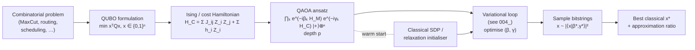

# QCSAA 900-909 · Section 00 · Subsection 903 · Subsubject 006 — Optimization and QAOA Patterns

## 1. Purpose

Defines the **Quantum Approximate Optimization Algorithm (QAOA)** and the surrounding family of optimisation-oriented quantum patterns (quantum annealing, adiabatic preparation, warm-start QAOA, recursive QAOA, Grover-based optimisation), and establishes the canonical encoding pipeline from a combinatorial problem (QUBO / Ising / MaxCut) to a problem-Hamiltonian and a $p$-layer QAOA ansatz. QAOA is the optimisation specialisation of the variational pattern in [`004_Variational-Quantum-Algorithms.md`](./004_Variational-Quantum-Algorithms.md), with an alternating-operator structure motivated by adiabatic evolution. Aligned with IEEE P7130[^ieeep7130] and the controlled Q+ATLANTIDE baseline[^baseline].

## 2. Scope

- Covers the *Optimization and QAOA Patterns* subsubject (`006`) of subsection `903`.
- Inherits Q-Division authority and ORB support from the parent row in [`../../README.md` §3](../../README.md#3-architecture-table)[^archtable].
- Concepts in scope:
  - **Combinatorial optimisation encoding** — mapping of a problem (MaxCut, MaxSAT, Knapsack, scheduling, routing) to a *QUBO* $\min_{x \in \{0,1\}^n} x^\top Q x$, then to an *Ising Hamiltonian* $H_C = \sum_{i<j} J_{ij} Z_i Z_j + \sum_i h_i Z_i$ via $x_i \mapsto (1 - Z_i)/2$.
  - **QAOA ansatz** $|\boldsymbol{\beta},\boldsymbol{\gamma}\rangle = \prod_{k=1}^{p} e^{-i \beta_k H_M} e^{-i \gamma_k H_C} |+\rangle^{\otimes n}$ with mixer $H_M = \sum_i X_i$ and depth parameter $p$; classical optimisation of $(\boldsymbol{\beta}, \boldsymbol{\gamma})$ via the variational loop of `004_`.
  - **Quantum adiabatic theorem** as the $p \to \infty$ continuous-time limit of QAOA; **quantum annealing** as the analog hardware implementation of the same idea.
  - **QAOA variants** — *warm-start* (initialisation from a classical SDP/relaxation solution), *recursive QAOA* (variable elimination), *constraint-preserving mixers* (XY-mixer for one-hot encodings), and *Grover-based optimisation* for objective-function search via amplitude amplification (`002_`).
  - **Performance characterisation** — approximation ratio, concentration of optimal parameters, transferability of $(\boldsymbol{\beta}^*, \boldsymbol{\gamma}^*)$ across instances, and known classical-equivalent regimes that bound the speedup.
  - **Aerospace-relevant problem families** — vehicle routing, mission scheduling, antenna pointing, fleet rebalancing — surfaced in `008_` and consumed by QCSAA `960-969` Quantum Robotics and `970-979` Sentient Quantum Agency.
- Out of scope: the bare variational pattern (`004_`), Hamiltonian-simulation primitives (`005_`), error / noise / resource estimation (`007_`), and the assurance boundary for aerospace optimisation (`008_`).

## 3. Diagram — QAOA Pipeline

The pipeline below is the controlled encoding-and-execution path used by every QAOA-class algorithm in QCSAA. Cross-band consumers (robotics, agency) shall enter at the *problem* node and back-reference the canonical reduction rather than redefining the encoding.

## 4. Footprint

| Metric | Value |
|---|---|
| Architecture | `QCSAA` — Quantum Computing & Sentient Agency Architecture |
| Master range | `900–999` |
| Code range | `900-909` |
| Section | `00` — Fundamentos de Computación Cuántica |
| Subject | `00` — General Information |
| Subsection | `903` — Quantum Algorithms |
| Subsubject | `006` — Optimization and QAOA Patterns |
| Primary Q-Division | Q-HORIZON[^qdiv] |
| Support Q-Divisions | Q-HPC, Q-DATAGOV |
| ORB support | ORB-PMO, ORB-LEG |
| Governance class | `restricted`[^gov] |
| Folder path | `Q+ATLANTIDE/900-999_QCSAA/900-909_Fundamentos-de-Computacion-Cuantica/903_quantum-algorithms/` |
| Document | `006_Optimization-and-QAOA-Patterns.md` (this file) |
| Parent subsection | [`README.md`](./README.md) · [`000_Overview.md`](./000_Overview.md) |
| Parent architecture | [`../../README.md`](../../README.md) |
| Parent baseline | [`organization/Q+ATLANTIDE.md`](../../../../organization/Q+ATLANTIDE.md) |

## 5. References & Citations

[^baseline]: **Q+ATLANTIDE controlled baseline (v1.0.0)** — [`organization/Q+ATLANTIDE.md`](../../../../organization/Q+ATLANTIDE.md). Defines the controlled `000-999` architecture-band taxonomy and the ATLAS-1000 register subpart.

[^archtable]: **QCSAA §3 Architecture Table** — [`../../README.md` §3](../../README.md#3-architecture-table). Authoritative source for the `900-909` row (Section `00` — Fundamentos de Computación Cuántica, Primary Q-Division Q-HORIZON).

[^qdiv]: **Q-Division authority** — Q-Divisions provide technical authority over an architecture row (Q+ATLANTIDE Note N-002). See [`organization/Q+ATLANTIDE.md` §4](../../../../organization/Q+ATLANTIDE.md#4-notes).

[^gov]: **Governance class** — Bands are classified as `baseline` or `restricted` per Q+ATLANTIDE §4 governance rules.

[^ieeep7130]: **IEEE P7130 — Standard for Quantum Computing Definitions** — Vocabulary baseline for the quantum computing scope of QCSAA `900-999`.

[^s1000d]: **S1000D Issue 6.0 — International specification for technical publications** — Common Source DataBase (CSDB) and Data Module Code (DMC) specification used for all Q+ATLANTIDE artefacts.

[^as9100d]: **AS9100D — Quality Management Systems — Aviation, Space and Defense Organizations** — Quality-management baseline for all Q+ATLANTIDE deliverables.

### Applicable industry standards

The following standards apply to this subsubject in addition to the cross-cutting Q+ATLANTIDE governance:

- IEEE P7130 — Standard for Quantum Computing Definitions[^ieeep7130]
- S1000D Issue 6.0 — International specification for technical publications[^s1000d]
- AS9100D — Quality Management Systems — Aviation, Space and Defense Organizations[^as9100d]
