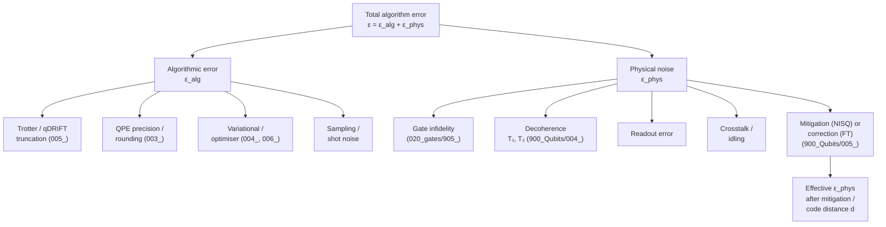

# QCSAA 900-909 · Section 00 · Subsection 903 · Subsubject 007 — Error, Noise and Resource Estimation

## 1. Purpose

Defines the **algorithm-level error budget** and **resource-estimation methodology** that converts an idealised quantum algorithm (`002_`–`006_`) into a quantitative claim about logical-qubit count, gate count, T-count, runtime, and end-to-end success probability under a chosen noise model. Establishes the controlled vocabulary for *algorithmic error* (Trotter / sampling / variational) versus *physical noise* (decoherence, gate infidelity, measurement error) and the bridges to error mitigation (NISQ) and error correction (fault-tolerant) referenced by `008_`. Aligned with IEEE P7130[^ieeep7130] and the controlled Q+ATLANTIDE baseline[^baseline].

## 2. Scope

- Covers the *Error, Noise and Resource Estimation* subsubject (`007`) of subsection `903`.
- Inherits Q-Division authority and ORB support from the parent row in [`../../README.md` §3](../../README.md#3-architecture-table)[^archtable].
- Concepts in scope:
  - **Algorithmic error sources** (intrinsic to the algorithm, independent of hardware):
    - *Trotter / qDRIFT truncation error* (`005_`).
    - *Phase-estimation precision* and post-measurement rounding (`003_`).
    - *Variational ansatz expressibility / optimiser convergence* error (`004_`, `006_`).
    - *Sampling / shot-noise* on expectation values, Hoeffding-style budgets.
  - **Physical noise sources** (extrinsic) — gate, idling, decoherence ($T_1, T_2$), readout and crosstalk errors, all defined upstream in [`../900_Qubits/004_Decoherence-Noise-and-Fidelity.md`](../900_Qubits/004_Decoherence-Noise-and-Fidelity.md) and [`../020_gates/905_Gate-Implementation-Calibration-and-Error-Characterization.md`](../020_gates/905_Gate-Implementation-Calibration-and-Error-Characterization.md).
  - **Error budget composition** — total error $\varepsilon = \varepsilon_{\text{alg}} + \varepsilon_{\text{phys}}$ (with circuit-depth / gate-count weighting), budget split across the algorithm stages, and the per-stage tolerances that flow into compiler choices (cf. [`../030_circuits/904_Circuit-Optimization-Compilation-and-Transpilation.md`](../030_circuits/904_Circuit-Optimization-Compilation-and-Transpilation.md)).
  - **Resource-estimation outputs** — physical qubit count, logical qubit count (under a chosen code, see [`../900_Qubits/005_Logical-Qubits-Encoding-and-Error-Correction.md`](../900_Qubits/005_Logical-Qubits-Encoding-and-Error-Correction.md)), $T$-count and $T$-depth, total wall-clock runtime, and end-to-end success probability.
  - **Mitigation vs. correction**:
    - *NISQ mitigation* — zero-noise extrapolation, probabilistic error cancellation, dynamical decoupling, measurement-error mitigation, symmetry verification.
    - *Fault-tolerant correction* — surface-code / colour-code distance selection, magic-state distillation overhead, lattice-surgery routing.
  - **Reporting template** — the structured fields ( algorithm class, problem size, error budget, qubit/gate/T counts, runtime, code, distance) that any QCSAA algorithm submission shall provide; consumed by `008_` for assurance gates.
- Out of scope: hardware-platform-specific calibration (covered in `020_gates/905_` and `900_Qubits/004_`), and program/portfolio-level cost models.

## 3. Diagram — Algorithm Error Budget Composition

The diagram defines the controlled decomposition used by every QCSAA algorithm record. Each leaf is a separately-budgeted quantity; the algorithm's reported success probability is derived from their composition rather than being asserted independently.

## 4. Footprint

| Metric | Value |
|---|---|
| Architecture | `QCSAA` — Quantum Computing & Sentient Agency Architecture |
| Master range | `900–999` |
| Code range | `900-909` |
| Section | `00` — Fundamentos de Computación Cuántica |
| Subject | `00` — General Information |
| Subsection | `903` — Quantum Algorithms |
| Subsubject | `007` — Error, Noise and Resource Estimation |
| Primary Q-Division | Q-HORIZON[^qdiv] |
| Support Q-Divisions | Q-HPC, Q-DATAGOV |
| ORB support | ORB-PMO, ORB-LEG |
| Governance class | `restricted`[^gov] |
| Folder path | `Q+ATLANTIDE/900-999_QCSAA/900-909_Fundamentos-de-Computacion-Cuantica/903_quantum-algorithms/` |
| Document | `007_Error-Noise-and-Resource-Estimation.md` (this file) |
| Parent subsection | [`README.md`](./README.md) · [`000_Overview.md`](./000_Overview.md) |
| Parent architecture | [`../../README.md`](../../README.md) |
| Parent baseline | [`organization/Q+ATLANTIDE.md`](../../../../organization/Q+ATLANTIDE.md) |

## 5. References & Citations

[^baseline]: **Q+ATLANTIDE controlled baseline (v1.0.0)** — [`organization/Q+ATLANTIDE.md`](../../../../organization/Q+ATLANTIDE.md). Defines the controlled `000-999` architecture-band taxonomy and the ATLAS-1000 register subpart.

[^archtable]: **QCSAA §3 Architecture Table** — [`../../README.md` §3](../../README.md#3-architecture-table). Authoritative source for the `900-909` row (Section `00` — Fundamentos de Computación Cuántica, Primary Q-Division Q-HORIZON).

[^qdiv]: **Q-Division authority** — Q-Divisions provide technical authority over an architecture row (Q+ATLANTIDE Note N-002). See [`organization/Q+ATLANTIDE.md` §4](../../../../organization/Q+ATLANTIDE.md#4-notes).

[^gov]: **Governance class** — Bands are classified as `baseline` or `restricted` per Q+ATLANTIDE §4 governance rules.

[^ieeep7130]: **IEEE P7130 — Standard for Quantum Computing Definitions** — Vocabulary baseline for the quantum computing scope of QCSAA `900-999`.

[^s1000d]: **S1000D Issue 6.0 — International specification for technical publications** — Common Source DataBase (CSDB) and Data Module Code (DMC) specification used for all Q+ATLANTIDE artefacts.

[^as9100d]: **AS9100D — Quality Management Systems — Aviation, Space and Defense Organizations** — Quality-management baseline for all Q+ATLANTIDE deliverables.

### Applicable industry standards

The following standards apply to this subsubject in addition to the cross-cutting Q+ATLANTIDE governance:

- IEEE P7130 — Standard for Quantum Computing Definitions[^ieeep7130]
- S1000D Issue 6.0 — International specification for technical publications[^s1000d]
- AS9100D — Quality Management Systems — Aviation, Space and Defense Organizations[^as9100d]
