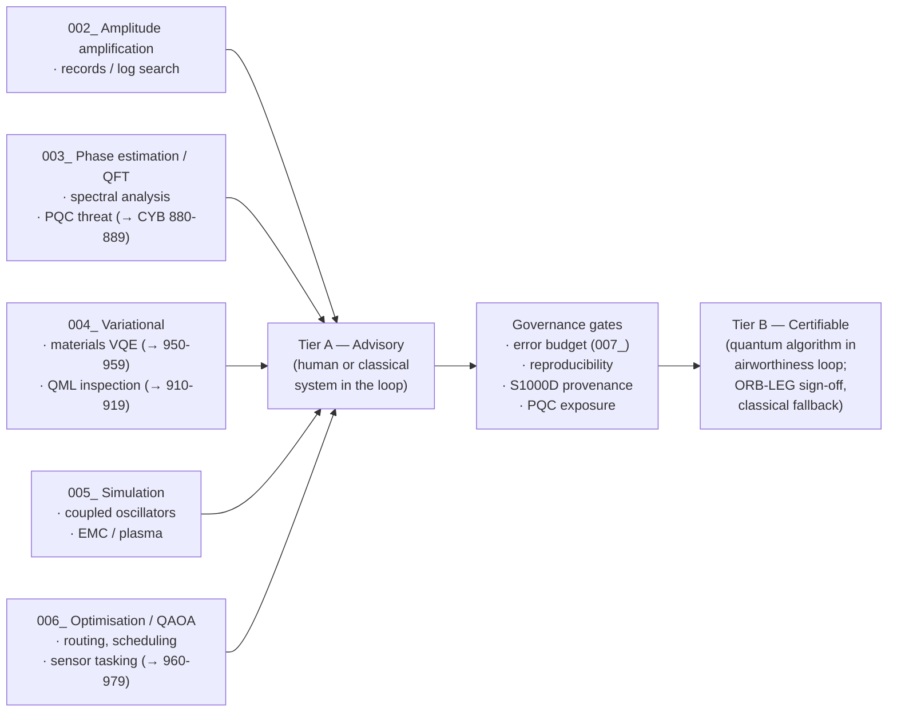

# QCSAA 900-909 · Section 00 · Subsection 903 · Subsubject 008 — Aerospace Use Cases and Assurance Boundaries

## 1. Purpose

Defines the **aerospace use-case catalogue** for QCSAA quantum algorithms and the **assurance boundary** that separates *advisory* uses (where a quantum algorithm informs a decision but does not actuate the airframe) from *certifiable* uses (where a quantum algorithm is in the loop of a function subject to AS9100D[^as9100d] and ATLAS-1000 airworthiness constraints). Establishes the canonical mapping from each algorithm class (`002_`–`006_`) to a representative aerospace problem, and the governance gates each must clear under the controlled Q+ATLANTIDE baseline[^baseline] before crossing the assurance boundary.

## 2. Scope

- Covers the *Aerospace Use Cases and Assurance Boundaries* subsubject (`008`) of subsection `903`.
- Inherits Q-Division authority and ORB support from the parent row in [`../../README.md` §3](../../README.md#3-architecture-table)[^archtable].
- Concepts in scope:
  - **Use-case catalogue** mapping algorithm class → aerospace problem:
    - *Amplitude amplification (`002_`)* → database / log search across maintenance and flight-data records.
    - *Phase estimation / Fourier methods (`003_`)* → spectral analysis of vibration / acoustic data, signal-of-interest detection, and the *threat* leg of the post-quantum cryptography migration consumed by CYB `880-889`.
    - *Variational quantum algorithms (`004_`)* → materials-discovery VQE for composite layups and battery chemistries (cross-band into `950-959` Quantum Simulation), and quantum machine-learning classifiers for non-destructive inspection (cross-band into `910-919`).
    - *Hamiltonian simulation (`005_`)* → CFD-adjacent coupled-oscillator simulation, plasma / propulsion modelling, electromagnetic compatibility analysis.
    - *Optimisation / QAOA (`006_`)* → fleet routing, mission scheduling, sensor-tasking, antenna-pointing, ground-handling resource allocation (cross-band into `960-969` Quantum Robotics and `970-979` Sentient Quantum Agency).
  - **Assurance boundary** — explicit two-tier classification:
    - *Tier A — Advisory.* Quantum-algorithm output is consumed by a human or by a classical, certifiable system as a *suggestion only*; no airworthiness implication. Acceptable for current QCSAA deployments.
    - *Tier B — Certifiable.* Quantum-algorithm output enters a control loop with airworthiness or safety implications. Requires the resource-estimation / error-budget record from `007_`, an end-to-end verifiable classical fallback, and explicit ORB-LEG sign-off.
  - **Governance gates** that any algorithm must pass to claim Tier A or Tier B status — error-budget completeness (`007_`), reproducibility (deterministic seeds, recorded shots, archived OpenQASM), provenance (S1000D[^s1000d] data-module reference), and post-quantum cryptography exposure assessment (NIST IR 8413[^nistir8413], ETSI GR QSC 001[^etsiqsc001]).
  - **Cross-band consumption rules** — downstream QCSAA bands (`910-979`) and CYB `880-889` shall back-reference this subsubject when claiming an aerospace use case for a quantum algorithm; they shall not re-establish the assurance boundary.
- Out of scope: program-level prioritisation of use cases, hardware-vendor selection, and the aircraft-system-level certification artefacts themselves (handled in the ATLAS `000-099` partition).

## 3. Diagram — Use Cases and the Assurance Boundary

The boundary below is the controlled gate between *advisory* and *certifiable* deployments of QCSAA algorithms. Every aerospace use case introduced anywhere in QCSAA shall be plotted on this diagram, with explicit reference to the algorithm class and the gate it has cleared.

## 4. Footprint

| Metric | Value |
|---|---|
| Architecture | `QCSAA` — Quantum Computing & Sentient Agency Architecture |
| Master range | `900–999` |
| Code range | `900-909` |
| Section | `00` — Fundamentos de Computación Cuántica |
| Subject | `00` — General Information |
| Subsection | `903` — Quantum Algorithms |
| Subsubject | `008` — Aerospace Use Cases and Assurance Boundaries |
| Primary Q-Division | Q-HORIZON[^qdiv] |
| Support Q-Divisions | Q-HPC, Q-DATAGOV |
| ORB support | ORB-PMO, ORB-LEG |
| Governance class | `restricted`[^gov] |
| Folder path | `Q+ATLANTIDE/900-999_QCSAA/900-909_Fundamentos-de-Computacion-Cuantica/903_quantum-algorithms/` |
| Document | `008_Aerospace-Use-Cases-and-Assurance-Boundaries.md` (this file) |
| Parent subsection | [`README.md`](./README.md) · [`000_Overview.md`](./000_Overview.md) |
| Parent architecture | [`../../README.md`](../../README.md) |
| Parent baseline | [`organization/Q+ATLANTIDE.md`](../../../../organization/Q+ATLANTIDE.md) |

## 5. References & Citations

[^baseline]: **Q+ATLANTIDE controlled baseline (v1.0.0)** — [`organization/Q+ATLANTIDE.md`](../../../../organization/Q+ATLANTIDE.md). Defines the controlled `000-999` architecture-band taxonomy and the ATLAS-1000 register subpart.

[^archtable]: **QCSAA §3 Architecture Table** — [`../../README.md` §3](../../README.md#3-architecture-table). Authoritative source for the `900-909` row (Section `00` — Fundamentos de Computación Cuántica, Primary Q-Division Q-HORIZON).

[^qdiv]: **Q-Division authority** — Q-Divisions provide technical authority over an architecture row (Q+ATLANTIDE Note N-002). See [`organization/Q+ATLANTIDE.md` §4](../../../../organization/Q+ATLANTIDE.md#4-notes).

[^gov]: **Governance class** — Bands are classified as `baseline` or `restricted` per Q+ATLANTIDE §4 governance rules.

[^ieeep7130]: **IEEE P7130 — Standard for Quantum Computing Definitions** — Vocabulary baseline for the quantum computing scope of QCSAA `900-999`.

[^nistir8413]: **NIST IR 8413 — Status Report on the Third Round of the NIST Post-Quantum Cryptography Standardization Process** — Post-quantum cryptography reference for QCSAA security-bridging items.

[^etsiqsc001]: **ETSI GR QSC 001 — Quantum-Safe Cryptography (QSC); Quantum-safe algorithmic framework** — ETSI quantum-safe cryptography framework applied across QCSAA.

[^s1000d]: **S1000D Issue 6.0 — International specification for technical publications** — Common Source DataBase (CSDB) and Data Module Code (DMC) specification used for all Q+ATLANTIDE artefacts.

[^as9100d]: **AS9100D — Quality Management Systems — Aviation, Space and Defense Organizations** — Quality-management baseline for all Q+ATLANTIDE deliverables.

### Applicable industry standards

The following standards apply to this subsubject in addition to the cross-cutting Q+ATLANTIDE governance:

- IEEE P7130 — Standard for Quantum Computing Definitions[^ieeep7130]
- NIST IR 8413 — Status Report on the Third Round of the NIST Post-Quantum Cryptography Standardization Process[^nistir8413]
- ETSI GR QSC 001 — Quantum-Safe Cryptography (QSC); Quantum-safe algorithmic framework[^etsiqsc001]
- S1000D Issue 6.0 — International specification for technical publications[^s1000d]
- AS9100D — Quality Management Systems — Aviation, Space and Defense Organizations[^as9100d]
