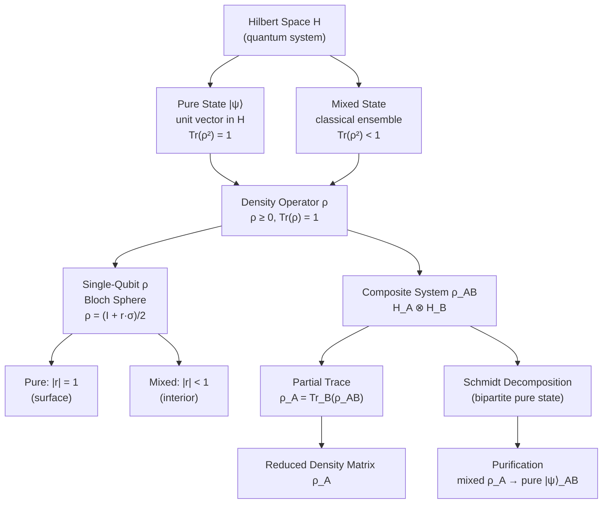

# QCSAA 900-909 · Section 00 · Subsection 904 · Subsubject 001 — Quantum States, Density Operators and Mixed States

## 1. Purpose

Establishes the **representational formalism for quantum states** within the Q+ATLANTIDE QCSAA programme. Defines quantum states as unit vectors in a Hilbert space (pure states) and as positive semidefinite trace-one operators (density operators / mixed states), providing the mathematical foundation for all downstream subsubjects in subsection `904` *Quantum Information Theory*.

This subsubject covers the Dirac bra-ket notation, the density operator (density matrix) formalism, the distinction between pure and mixed states, the Bloch sphere representation for single-qubit states, reduced density matrices via the partial trace, and the positivity and unit-trace conditions that characterise valid quantum states — following the canonical treatments in Nielsen & Chuang[^nc2000], Preskill[^preskill], and Watrous[^watrous].

## 2. Scope

- Covers the *Quantum States, Density Operators and Mixed States* subsubject (`001`) of subsection `904` *Quantum Information Theory* within section `00` *Fundamentos de Computación Cuántica*.
- Inherits Q-Division authority and ORB support from the parent row in [`../../README.md` §3](../../README.md#3-architecture-table)[^archtable].
- Concepts in scope:
  - **Pure states** — unit vectors |ψ⟩ ∈ H; state preparation, superposition, and the qubit as a two-level pure state.
  - **Density operators** — operators ρ satisfying ρ ≥ 0, Tr(ρ) = 1; equivalence between density-operator and ensemble descriptions.
  - **Pure vs mixed states** — characterisation via Tr(ρ²) = 1 (pure) vs Tr(ρ²) < 1 (mixed); convex structure of the state space.
  - **Bloch sphere** — parametrisation of single-qubit density matrices as ρ = (I + r·σ)/2 with |r| ≤ 1; surface (pure) vs interior (mixed).
  - **Partial trace** — tracing out a subsystem of a composite system ρ_AB to obtain the reduced density matrix ρ_A = Tr_B(ρ_AB).
  - **Schmidt decomposition** — bipartite pure-state decomposition and its relation to entanglement rank.
  - **Purification** — embedding any mixed state as the partial trace of a pure state on an enlarged Hilbert space.
- Out of scope: entropy measures derived from density operators (`002`), quantum channels acting on states (`003`), and entanglement quantification (`004`).

## 3. Diagram — Quantum State Hierarchy

The following diagram shows the hierarchy from pure states to mixed states, density operators, and reduced states via partial trace.

## 4. Footprint

| Metric | Value |
|---|---|
| Architecture | `QCSAA` — Quantum Computing & Sentient Agency Architecture (controlled term) |
| Master range | `900–999` |
| Code range | `900-909` |
| Section | `00` — Fundamentos de Computación Cuántica |
| Subsection | `904` — Quantum Information Theory |
| Subsubject | `001` — Quantum States, Density Operators and Mixed States |
| Primary Q-Division | Q-HORIZON[^qdiv] |
| Support Q-Divisions | Q-HPC, Q-DATAGOV |
| ORB support | ORB-PMO, ORB-LEG |
| Governance class | `restricted`[^gov] |
| Folder path | `Q+ATLANTIDE/900-999_QCSAA/900-909_Fundamentos-de-Computacion-Cuantica/904_Quantum-Information-Theory/` |
| Document | `001_Quantum-States-Density-Operators-and-Mixed-States.md` (this file) |
| Parent subsection | [`../README.md`](../README.md) · [`../000_Overview.md`](../000_Overview.md) |
| Parent architecture | [`../../README.md`](../../README.md) |
| Parent baseline | [`organization/Q+ATLANTIDE.md`](../../../../organization/Q+ATLANTIDE.md) |

## 5. References & Citations

[^baseline]: **Q+ATLANTIDE controlled baseline (v1.0.0)** — [`organization/Q+ATLANTIDE.md`](../../../../organization/Q+ATLANTIDE.md). Defines the controlled `000-999` architecture-band taxonomy and the ATLAS-1000 register subpart.

[^archtable]: **§3 — Architecture Table (parent)** — [`../../README.md` §3](../../README.md#3-architecture-table). Authoritative source for the `900-909` row.

[^qdiv]: **Q-Division authority** — [`organization/Q-Divisions/`](../../../../organization/Q-Divisions/). Technical-authority units for the Q+ATLANTIDE baseline.

[^gov]: **Governance class** — `restricted` denotes documents requiring additional governance, evidence packages and access controls (rule N-006[^n006]).

[^n001]: **Note N-001** — Q+ATLANTIDE (with its ATLAS-1000 register subpart) is a taxonomy and traceability ecosystem, not an organization chart. See [`organization/Q+ATLANTIDE.md` §4](../../../../organization/Q+ATLANTIDE.md#4-notes).

[^n002]: **Note N-002** — Architecture bands classify technologies; Q-Divisions provide technical authority; ORB-Functions provide enterprise support. See [`organization/Q+ATLANTIDE.md` §4](../../../../organization/Q+ATLANTIDE.md#4-notes).

[^n006]: **Note N-006 (Restricted bands)** — Quantum-related (`900-999` QCSAA) bands require additional governance, evidence packages and access controls. See [`organization/Q+ATLANTIDE.md` §5.3](../../../../organization/Q+ATLANTIDE.md#53-restricted-band-templates-n-006).

[^nc2000]: **Nielsen, M.A. & Chuang, I.L. — "Quantum Computation and Quantum Information"** (Cambridge University Press, 2000). Canonical reference for quantum states, channels, entropy, entanglement, and information-theoretic bounds.

[^preskill]: **Preskill, J. — "Lecture Notes for Physics 219: Quantum Information and Computation"** (Caltech, 2018). Covers density operators, quantum channels, entanglement measures, and no-go theorems.

[^iso4879]: **ISO/IEC 4879:2023 — Quantum computing — Vocabulary** — Controlled terminology standard for quantum computing concepts used across Q+ATLANTIDE QCSAA artefacts.

[^watrous]: **Watrous, J. — "The Theory of Quantum Information"** (Cambridge University Press, 2018). Formal treatment of quantum states, measurements, channels, and information-theoretic quantities.

### Applicable industry standards

The following standards and foundational texts apply to this subsubject in addition to the cross-cutting Q+ATLANTIDE governance:

- ISO/IEC 4879:2023 — Quantum computing — Vocabulary[^iso4879]
- Nielsen & Chuang — Quantum Computation and Quantum Information (Cambridge, 2000)[^nc2000]
- Watrous — The Theory of Quantum Information (Cambridge, 2018)[^watrous]
- Preskill — Lecture Notes for Physics 219 (Caltech, 2018)[^preskill]
