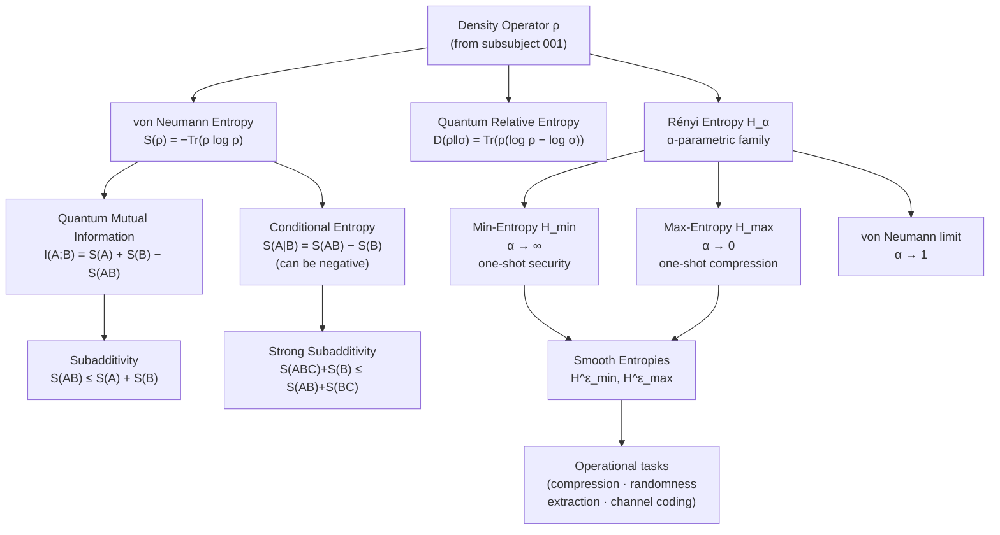

# QCSAA 900-909 · Section 00 · Subsection 904 · Subsubject 002 — Quantum Entropy and Information Measures

## 1. Purpose

Defines and characterises the **quantum entropy and information measures** that quantify uncertainty, correlation, and information content in quantum systems within the Q+ATLANTIDE QCSAA programme. These measures — von Neumann entropy, quantum relative entropy, quantum mutual information, conditional entropy, Rényi entropies, and smooth entropies — underpin the theoretical analysis of quantum channels, coding theorems, and capacity bounds established in subsubjects `003`–`006`.

This subsubject follows the canonical treatments in Nielsen & Chuang[^nc2000], Wilde[^wilde], and Watrous[^watrous], and adopts the controlled terminology of ISO/IEC 4879:2023[^iso4879].

## 2. Scope

- Covers the *Quantum Entropy and Information Measures* subsubject (`002`) of subsection `904` *Quantum Information Theory* within section `00` *Fundamentos de Computación Cuántica*.
- Inherits Q-Division authority and ORB support from the parent row in [`../../README.md` §3](../../README.md#3-architecture-table)[^archtable].
- Concepts in scope:
  - **von Neumann entropy** — S(ρ) = −Tr(ρ log ρ); properties: non-negativity, concavity, invariance under unitaries, additivity for product states.
  - **Quantum relative entropy** — D(ρ‖σ) = Tr(ρ(log ρ − log σ)); Klein's inequality; role as a parent quantity for other measures.
  - **Quantum mutual information** — I(A;B)_ρ = S(ρ_A) + S(ρ_B) − S(ρ_AB); upper bound 2 min{S(ρ_A), S(ρ_B)}.
  - **Conditional quantum entropy** — S(A|B)_ρ = S(ρ_AB) − S(ρ_B); can be negative for entangled states.
  - **Subadditivity and strong subadditivity** — S(ρ_AB) ≤ S(ρ_A) + S(ρ_B); S(ρ_ABC) + S(ρ_B) ≤ S(ρ_AB) + S(ρ_BC).
  - **Rényi entropy** — H_α(ρ) = (1/(1−α)) log Tr(ρ^α); limits: Shannon (α→1), min-entropy (α→∞), max-entropy (α→0).
  - **Min-entropy and max-entropy** — H_min(ρ) = −log λ_max(ρ); H_max(ρ) = 2 log Tr(√ρ); role in one-shot information theory.
  - **Smooth entropies** — H^ε_min and H^ε_max; smoothing over an ε-ball in trace distance; operational meaning in compression and randomness extraction.
- Out of scope: entropy of quantum channels (covered in `003`), capacity expressions that invoke these measures (`006`), and no-go theorems bounding information flow (`007`).

## 3. Diagram — Quantum Entropy Hierarchy

The following diagram shows the relationships among quantum entropy measures and their operational roles.

## 4. Footprint

| Metric | Value |
|---|---|
| Architecture | `QCSAA` — Quantum Computing & Sentient Agency Architecture (controlled term) |
| Master range | `900–999` |
| Code range | `900-909` |
| Section | `00` — Fundamentos de Computación Cuántica |
| Subsection | `904` — Quantum Information Theory |
| Subsubject | `002` — Quantum Entropy and Information Measures |
| Primary Q-Division | Q-HORIZON[^qdiv] |
| Support Q-Divisions | Q-HPC, Q-DATAGOV |
| ORB support | ORB-PMO, ORB-LEG |
| Governance class | `restricted`[^gov] |
| Folder path | `Q+ATLANTIDE/900-999_QCSAA/900-909_Fundamentos-de-Computacion-Cuantica/904_Quantum-Information-Theory/` |
| Document | `002_Quantum-Entropy-and-Information-Measures.md` (this file) |
| Parent subsection | [`../README.md`](../README.md) · [`../000_Overview.md`](../000_Overview.md) |
| Parent architecture | [`../../README.md`](../../README.md) |
| Parent baseline | [`organization/Q+ATLANTIDE.md`](../../../../organization/Q+ATLANTIDE.md) |

## 5. References & Citations

[^baseline]: **Q+ATLANTIDE controlled baseline (v1.0.0)** — [`organization/Q+ATLANTIDE.md`](../../../../organization/Q+ATLANTIDE.md). Defines the controlled `000-999` architecture-band taxonomy and the ATLAS-1000 register subpart.

[^archtable]: **§3 — Architecture Table (parent)** — [`../../README.md` §3](../../README.md#3-architecture-table). Authoritative source for the `900-909` row.

[^qdiv]: **Q-Division authority** — [`organization/Q-Divisions/`](../../../../organization/Q-Divisions/). Technical-authority units for the Q+ATLANTIDE baseline.

[^gov]: **Governance class** — `restricted` denotes documents requiring additional governance, evidence packages and access controls (rule N-006[^n006]).

[^n001]: **Note N-001** — Q+ATLANTIDE (with its ATLAS-1000 register subpart) is a taxonomy and traceability ecosystem, not an organization chart. See [`organization/Q+ATLANTIDE.md` §4](../../../../organization/Q+ATLANTIDE.md#4-notes).

[^n002]: **Note N-002** — Architecture bands classify technologies; Q-Divisions provide technical authority; ORB-Functions provide enterprise support. See [`organization/Q+ATLANTIDE.md` §4](../../../../organization/Q+ATLANTIDE.md#4-notes).

[^n006]: **Note N-006 (Restricted bands)** — Quantum-related (`900-999` QCSAA) bands require additional governance, evidence packages and access controls. See [`organization/Q+ATLANTIDE.md` §5.3](../../../../organization/Q+ATLANTIDE.md#53-restricted-band-templates-n-006).

[^nc2000]: **Nielsen, M.A. & Chuang, I.L. — "Quantum Computation and Quantum Information"** (Cambridge University Press, 2000). Canonical reference for quantum states, channels, entropy, entanglement, and information-theoretic bounds.

[^wilde]: **Wilde, M.M. — "Quantum Information Theory"** (2nd ed., Cambridge University Press, 2017). Comprehensive treatment of quantum entropy, channel capacities, and coding theorems.

[^iso4879]: **ISO/IEC 4879:2023 — Quantum computing — Vocabulary** — Controlled terminology standard for quantum computing concepts used across Q+ATLANTIDE QCSAA artefacts.

[^watrous]: **Watrous, J. — "The Theory of Quantum Information"** (Cambridge University Press, 2018). Formal treatment of quantum states, measurements, channels, and information-theoretic quantities.

### Applicable industry standards

The following standards and foundational texts apply to this subsubject in addition to the cross-cutting Q+ATLANTIDE governance:

- ISO/IEC 4879:2023 — Quantum computing — Vocabulary[^iso4879]
- Nielsen & Chuang — Quantum Computation and Quantum Information (Cambridge, 2000)[^nc2000]
- Wilde — Quantum Information Theory, 2nd ed. (Cambridge, 2017)[^wilde]
- Watrous — The Theory of Quantum Information (Cambridge, 2018)[^watrous]
