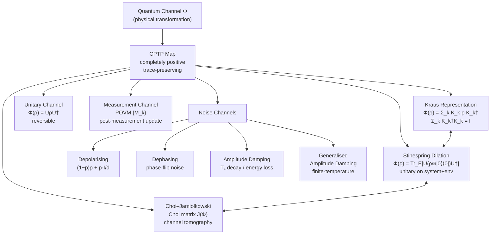

# QCSAA 900-909 · Section 00 · Subsection 904 · Subsubject 003 — Quantum Channels and Operations

## 1. Purpose

Defines the **mathematical framework for quantum channels and operations** — the transformations that act on quantum states within the Q+ATLANTIDE QCSAA programme. Quantum channels (completely positive trace-preserving maps, CPTP maps) are the most general physically realisable transformations and encompass unitary evolution, measurement, noise processes, and communication links.

This subsubject establishes the Kraus operator-sum representation, the Stinespring dilation theorem, the Choi–Jamiołkowski isomorphism, and the standard noise channel models (depolarising, dephasing, amplitude-damping), following Wilde[^wilde], Watrous[^watrous], Nielsen & Chuang[^nc2000], and Preskill[^preskill].

## 2. Scope

- Covers the *Quantum Channels and Operations* subsubject (`003`) of subsection `904` *Quantum Information Theory* within section `00` *Fundamentos de Computación Cuántica*.
- Inherits Q-Division authority and ORB support from the parent row in [`../../README.md` §3](../../README.md#3-architecture-table)[^archtable].
- Concepts in scope:
  - **Completely positive (CP) maps** — linear maps Φ such that (id_n ⊗ Φ) is positive for all n; complete positivity as the physically necessary generalisation of positivity.
  - **Trace-preserving (TP) condition** — Σ_k K_k†K_k = I; ensures preservation of the trace (probability normalisation).
  - **Kraus representation** — Φ(ρ) = Σ_k K_k ρ K_k†; non-unique; minimum Kraus rank and unitary freedom in Kraus operators.
  - **Stinespring dilation** — any CPTP map Φ(ρ) = Tr_E[U(ρ ⊗ |0⟩⟨0|_E)U†] with a unitary U on system + environment; isometric extension.
  - **Choi–Jamiołkowski isomorphism** — one-to-one correspondence between CPTP maps and positive semidefinite Choi matrices; channel tomography via process tomography.
  - **Unitary channels** — Φ(ρ) = UρU†; reversible, trace-preserving, entropy-preserving.
  - **Measurement channels (instruments)** — generalised measurements described by POVM elements; post-measurement state update.
  - **Standard noise channels** — depolarising (Φ(ρ) = (1−p)ρ + p I/d), dephasing (phase-flip), amplitude-damping (T₁ decay), generalised amplitude-damping; their Kraus decompositions and physical interpretations.
  - **Channel tomography** — standard and compressed methods for characterising an unknown quantum channel via process matrices.
- Out of scope: entanglement properties of channel inputs and outputs (`004`), channel coding and capacity (`005`, `006`), and fundamental no-go limits on channel operations (`007`).

## 3. Diagram — Quantum Channel Representations

The following diagram shows the principal representations of a quantum channel and the standard noise channel taxonomy.

## 4. Footprint

| Metric | Value |
|---|---|
| Architecture | `QCSAA` — Quantum Computing & Sentient Agency Architecture (controlled term) |
| Master range | `900–999` |
| Code range | `900-909` |
| Section | `00` — Fundamentos de Computación Cuántica |
| Subsection | `904` — Quantum Information Theory |
| Subsubject | `003` — Quantum Channels and Operations |
| Primary Q-Division | Q-HORIZON[^qdiv] |
| Support Q-Divisions | Q-HPC, Q-DATAGOV |
| ORB support | ORB-PMO, ORB-LEG |
| Governance class | `restricted`[^gov] |
| Folder path | `Q+ATLANTIDE/900-999_QCSAA/900-909_Fundamentos-de-Computacion-Cuantica/904_Quantum-Information-Theory/` |
| Document | `003_Quantum-Channels-and-Operations.md` (this file) |
| Parent subsection | [`../README.md`](../README.md) · [`../000_Overview.md`](../000_Overview.md) |
| Parent architecture | [`../../README.md`](../../README.md) |
| Parent baseline | [`organization/Q+ATLANTIDE.md`](../../../../organization/Q+ATLANTIDE.md) |

## 5. References & Citations

[^baseline]: **Q+ATLANTIDE controlled baseline (v1.0.0)** — [`organization/Q+ATLANTIDE.md`](../../../../organization/Q+ATLANTIDE.md). Defines the controlled `000-999` architecture-band taxonomy and the ATLAS-1000 register subpart.

[^archtable]: **§3 — Architecture Table (parent)** — [`../../README.md` §3](../../README.md#3-architecture-table). Authoritative source for the `900-909` row.

[^qdiv]: **Q-Division authority** — [`organization/Q-Divisions/`](../../../../organization/Q-Divisions/). Technical-authority units for the Q+ATLANTIDE baseline.

[^gov]: **Governance class** — `restricted` denotes documents requiring additional governance, evidence packages and access controls (rule N-006[^n006]).

[^n001]: **Note N-001** — Q+ATLANTIDE (with its ATLAS-1000 register subpart) is a taxonomy and traceability ecosystem, not an organization chart. See [`organization/Q+ATLANTIDE.md` §4](../../../../organization/Q+ATLANTIDE.md#4-notes).

[^n002]: **Note N-002** — Architecture bands classify technologies; Q-Divisions provide technical authority; ORB-Functions provide enterprise support. See [`organization/Q+ATLANTIDE.md` §4](../../../../organization/Q+ATLANTIDE.md#4-notes).

[^n006]: **Note N-006 (Restricted bands)** — Quantum-related (`900-999` QCSAA) bands require additional governance, evidence packages and access controls. See [`organization/Q+ATLANTIDE.md` §5.3](../../../../organization/Q+ATLANTIDE.md#53-restricted-band-templates-n-006).

[^nc2000]: **Nielsen, M.A. & Chuang, I.L. — "Quantum Computation and Quantum Information"** (Cambridge University Press, 2000). Canonical reference for quantum states, channels, entropy, entanglement, and information-theoretic bounds.

[^wilde]: **Wilde, M.M. — "Quantum Information Theory"** (2nd ed., Cambridge University Press, 2017). Comprehensive treatment of quantum entropy, channel capacities, and coding theorems.

[^preskill]: **Preskill, J. — "Lecture Notes for Physics 219: Quantum Information and Computation"** (Caltech, 2018). Covers density operators, quantum channels, entanglement measures, and no-go theorems.

[^iso4879]: **ISO/IEC 4879:2023 — Quantum computing — Vocabulary** — Controlled terminology standard for quantum computing concepts used across Q+ATLANTIDE QCSAA artefacts.

[^watrous]: **Watrous, J. — "The Theory of Quantum Information"** (Cambridge University Press, 2018). Formal treatment of quantum states, measurements, channels, and information-theoretic quantities.

### Applicable industry standards

The following standards and foundational texts apply to this subsubject in addition to the cross-cutting Q+ATLANTIDE governance:

- ISO/IEC 4879:2023 — Quantum computing — Vocabulary[^iso4879]
- Nielsen & Chuang — Quantum Computation and Quantum Information (Cambridge, 2000)[^nc2000]
- Wilde — Quantum Information Theory, 2nd ed. (Cambridge, 2017)[^wilde]
- Watrous — The Theory of Quantum Information (Cambridge, 2018)[^watrous]
- Preskill — Lecture Notes for Physics 219 (Caltech, 2018)[^preskill]
