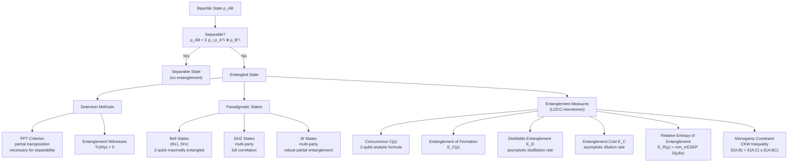

# QCSAA 900-909 · Section 00 · Subsection 904 · Subsubject 004 — Entanglement Theory and Measures

## 1. Purpose

Establishes the **theory of quantum entanglement** — its characterisation, detection, and quantification — within the Q+ATLANTIDE QCSAA programme. Entanglement is the defining resource of quantum information processing, enabling quantum teleportation, superdense coding, quantum key distribution, and measurement-based quantum computation. This subsubject provides the formal framework for distinguishing separable from entangled states, identifying entanglement witnesses, and computing entanglement measures that bound resource costs in quantum protocols.

This subsubject follows Nielsen & Chuang[^nc2000], Wilde[^wilde], and Preskill[^preskill], and adopts the controlled vocabulary of ISO/IEC 4879:2023[^iso4879].

## 2. Scope

- Covers the *Entanglement Theory and Measures* subsubject (`004`) of subsection `904` *Quantum Information Theory* within section `00` *Fundamentos de Computación Cuántica*.
- Inherits Q-Division authority and ORB support from the parent row in [`../../README.md` §3](../../README.md#3-architecture-table)[^archtable].
- Concepts in scope:
  - **Separable states** — bipartite states ρ_AB = Σ_i p_i ρ_A^i ⊗ ρ_B^i; separability as the absence of quantum correlations.
  - **Entangled states** — states not admitting a separable decomposition; computational hardness of separability testing.
  - **Bell states** — the four maximally entangled two-qubit states |Φ±⟩, |Ψ±⟩; Bell-state measurement; superdense coding and teleportation.
  - **GHZ and W states** — paradigmatic multi-partite entangled states with distinct correlation structures and inequivalent LOCC classes.
  - **Entanglement witnesses** — Hermitian operators W such that Tr(Wρ) < 0 certifies entanglement; constructive witnesses via the PPT criterion.
  - **PPT (Peres–Horodecki) criterion** — partial transposition positivity as a necessary condition for separability; sufficient for 2×2 and 2×3 systems.
  - **Entanglement measures** — functions E(ρ) satisfying LOCC monotonicity: concurrence, entanglement of formation (EoF), distillable entanglement E_D, entanglement cost E_C, relative entropy of entanglement.
  - **Monogamy of entanglement** — Coffman–Kundu–Wootters inequality; limits on the shareability of entanglement across multiple parties.
  - **LOCC operations** — local operations and classical communication; equivalence classes and entanglement manipulation protocols.
- Out of scope: entanglement in quantum error-correcting codes (`005`), entanglement as a channel resource for capacity (`006`), and no-go theorems bounding entanglement operations (`007`).

## 3. Diagram — Entanglement Measures Hierarchy

The following diagram shows the structure of bipartite entanglement theory from state classification through detection to quantification.

## 4. Footprint

| Metric | Value |
|---|---|
| Architecture | `QCSAA` — Quantum Computing & Sentient Agency Architecture (controlled term) |
| Master range | `900–999` |
| Code range | `900-909` |
| Section | `00` — Fundamentos de Computación Cuántica |
| Subsection | `904` — Quantum Information Theory |
| Subsubject | `004` — Entanglement Theory and Measures |
| Primary Q-Division | Q-HORIZON[^qdiv] |
| Support Q-Divisions | Q-HPC, Q-DATAGOV |
| ORB support | ORB-PMO, ORB-LEG |
| Governance class | `restricted`[^gov] |
| Folder path | `Q+ATLANTIDE/900-999_QCSAA/900-909_Fundamentos-de-Computacion-Cuantica/904_Quantum-Information-Theory/` |
| Document | `004_Entanglement-Theory-and-Measures.md` (this file) |
| Parent subsection | [`../README.md`](../README.md) · [`../000_Overview.md`](../000_Overview.md) |
| Parent architecture | [`../../README.md`](../../README.md) |
| Parent baseline | [`organization/Q+ATLANTIDE.md`](../../../../organization/Q+ATLANTIDE.md) |

## 5. References & Citations

[^baseline]: **Q+ATLANTIDE controlled baseline (v1.0.0)** — [`organization/Q+ATLANTIDE.md`](../../../../organization/Q+ATLANTIDE.md). Defines the controlled `000-999` architecture-band taxonomy and the ATLAS-1000 register subpart.

[^archtable]: **§3 — Architecture Table (parent)** — [`../../README.md` §3](../../README.md#3-architecture-table). Authoritative source for the `900-909` row.

[^qdiv]: **Q-Division authority** — [`organization/Q-Divisions/`](../../../../organization/Q-Divisions/). Technical-authority units for the Q+ATLANTIDE baseline.

[^gov]: **Governance class** — `restricted` denotes documents requiring additional governance, evidence packages and access controls (rule N-006[^n006]).

[^n001]: **Note N-001** — Q+ATLANTIDE (with its ATLAS-1000 register subpart) is a taxonomy and traceability ecosystem, not an organization chart. See [`organization/Q+ATLANTIDE.md` §4](../../../../organization/Q+ATLANTIDE.md#4-notes).

[^n002]: **Note N-002** — Architecture bands classify technologies; Q-Divisions provide technical authority; ORB-Functions provide enterprise support. See [`organization/Q+ATLANTIDE.md` §4](../../../../organization/Q+ATLANTIDE.md#4-notes).

[^n006]: **Note N-006 (Restricted bands)** — Quantum-related (`900-999` QCSAA) bands require additional governance, evidence packages and access controls. See [`organization/Q+ATLANTIDE.md` §5.3](../../../../organization/Q+ATLANTIDE.md#53-restricted-band-templates-n-006).

[^nc2000]: **Nielsen, M.A. & Chuang, I.L. — "Quantum Computation and Quantum Information"** (Cambridge University Press, 2000). Canonical reference for quantum states, channels, entropy, entanglement, and information-theoretic bounds.

[^wilde]: **Wilde, M.M. — "Quantum Information Theory"** (2nd ed., Cambridge University Press, 2017). Comprehensive treatment of quantum entropy, channel capacities, and coding theorems.

[^preskill]: **Preskill, J. — "Lecture Notes for Physics 219: Quantum Information and Computation"** (Caltech, 2018). Covers density operators, quantum channels, entanglement measures, and no-go theorems.

[^iso4879]: **ISO/IEC 4879:2023 — Quantum computing — Vocabulary** — Controlled terminology standard for quantum computing concepts used across Q+ATLANTIDE QCSAA artefacts.

### Applicable industry standards

The following standards and foundational texts apply to this subsubject in addition to the cross-cutting Q+ATLANTIDE governance:

- ISO/IEC 4879:2023 — Quantum computing — Vocabulary[^iso4879]
- Nielsen & Chuang — Quantum Computation and Quantum Information (Cambridge, 2000)[^nc2000]
- Wilde — Quantum Information Theory, 2nd ed. (Cambridge, 2017)[^wilde]
- Preskill — Lecture Notes for Physics 219 (Caltech, 2018)[^preskill]
