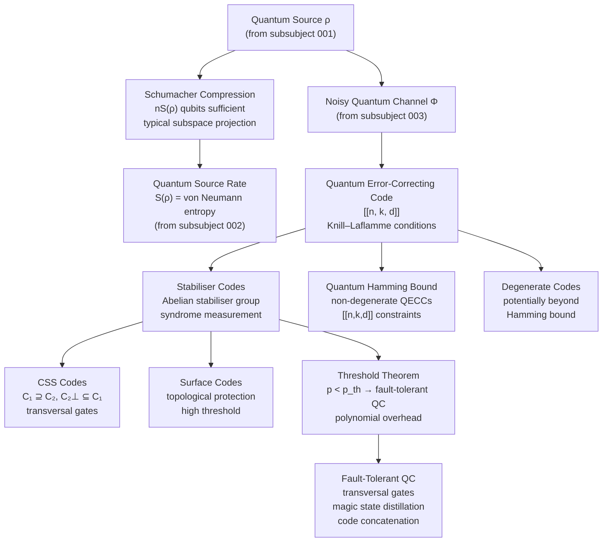

# QCSAA 900-909 · Section 00 · Subsection 904 · Subsubject 005 — Quantum Coding and Compression

## 1. Purpose

Establishes the **theory of quantum source coding, data compression, and quantum error-correcting codes (QECCs)** within the Q+ATLANTIDE QCSAA programme. This subsubject covers Schumacher's quantum data compression theorem (the quantum analogue of Shannon's source coding theorem), the foundations of quantum error correction, stabiliser codes, CSS codes, the quantum Hamming bound, and the threshold theorem for fault-tolerant quantum computation.

Quantum coding theory is the bridge between the information-theoretic foundations established in subsubjects `001`–`004` and the practical implementation of quantum computers and quantum communication systems. This subsubject follows Nielsen & Chuang[^nc2000] and Wilde[^wilde] as canonical references.

## 2. Scope

- Covers the *Quantum Coding and Compression* subsubject (`005`) of subsection `904` *Quantum Information Theory* within section `00` *Fundamentos de Computación Cuántica*.
- Inherits Q-Division authority and ORB support from the parent row in [`../../README.md` §3](../../README.md#3-architecture-table)[^archtable].
- Concepts in scope:
  - **Schumacher compression** — quantum source coding theorem: n qubits from a source ρ can be compressed to nS(ρ) qubits with vanishing error; the von Neumann entropy as the quantum source-coding rate.
  - **Quantum data compression protocols** — typical subspace projectors; quantum typical sequences; compression and decompression unitaries.
  - **Quantum error-correcting codes (QECCs)** — encoding quantum information into a subspace of a larger Hilbert space to protect against a specified error set; quantum error-correction conditions (Knill–Laflamme).
  - **Stabiliser codes** — codes defined by an Abelian stabiliser group S ⊆ Pauli group; syndrome measurement without measuring the encoded information; [[n,k,d]] notation.
  - **CSS codes (Calderbank–Shor–Steane)** — QECCs constructed from two classical linear codes C₁ ⊇ C₂ with C₂⊥ ⊆ C₁; transversal implementation of logical gates.
  - **Quantum Hamming bound** — combinatorial bound on the parameters [[n,k,d]] of non-degenerate QECCs; analogous to classical Hamming bound.
  - **Degenerate codes** — codes where distinct errors can have the same syndrome; potentially exceeding the quantum Hamming bound.
  - **Threshold theorem** — existence of a fault-tolerance threshold p_th such that for physical error rate p < p_th, arbitrarily long quantum computations are possible with polynomial overhead.
  - **Fault-tolerant quantum computation foundations** — transversal gates, magic state distillation, code concatenation, and topological codes (surface codes) as threshold-achieving schemes.
- Out of scope: specific gate-set implementations and hardware error models (QCSAA `901`), channel capacity theorems that use coding rates (`006`), and no-go results that limit coding (`007`).

## 3. Diagram — Quantum Coding Theory Flow

The following diagram shows the flow from quantum source coding through error correction to fault-tolerant computation.

## 4. Footprint

| Metric | Value |
|---|---|
| Architecture | `QCSAA` — Quantum Computing & Sentient Agency Architecture (controlled term) |
| Master range | `900–999` |
| Code range | `900-909` |
| Section | `00` — Fundamentos de Computación Cuántica |
| Subsection | `904` — Quantum Information Theory |
| Subsubject | `005` — Quantum Coding and Compression |
| Primary Q-Division | Q-HORIZON[^qdiv] |
| Support Q-Divisions | Q-HPC, Q-DATAGOV |
| ORB support | ORB-PMO, ORB-LEG |
| Governance class | `restricted`[^gov] |
| Folder path | `Q+ATLANTIDE/900-999_QCSAA/900-909_Fundamentos-de-Computacion-Cuantica/904_Quantum-Information-Theory/` |
| Document | `005_Quantum-Coding-and-Compression.md` (this file) |
| Parent subsection | [`../README.md`](../README.md) · [`../000_Overview.md`](../000_Overview.md) |
| Parent architecture | [`../../README.md`](../../README.md) |
| Parent baseline | [`organization/Q+ATLANTIDE.md`](../../../../organization/Q+ATLANTIDE.md) |

## 5. References & Citations

[^baseline]: **Q+ATLANTIDE controlled baseline (v1.0.0)** — [`organization/Q+ATLANTIDE.md`](../../../../organization/Q+ATLANTIDE.md). Defines the controlled `000-999` architecture-band taxonomy and the ATLAS-1000 register subpart.

[^archtable]: **§3 — Architecture Table (parent)** — [`../../README.md` §3](../../README.md#3-architecture-table). Authoritative source for the `900-909` row.

[^qdiv]: **Q-Division authority** — [`organization/Q-Divisions/`](../../../../organization/Q-Divisions/). Technical-authority units for the Q+ATLANTIDE baseline.

[^gov]: **Governance class** — `restricted` denotes documents requiring additional governance, evidence packages and access controls (rule N-006[^n006]).

[^n001]: **Note N-001** — Q+ATLANTIDE (with its ATLAS-1000 register subpart) is a taxonomy and traceability ecosystem, not an organization chart. See [`organization/Q+ATLANTIDE.md` §4](../../../../organization/Q+ATLANTIDE.md#4-notes).

[^n002]: **Note N-002** — Architecture bands classify technologies; Q-Divisions provide technical authority; ORB-Functions provide enterprise support. See [`organization/Q+ATLANTIDE.md` §4](../../../../organization/Q+ATLANTIDE.md#4-notes).

[^n006]: **Note N-006 (Restricted bands)** — Quantum-related (`900-999` QCSAA) bands require additional governance, evidence packages and access controls. See [`organization/Q+ATLANTIDE.md` §5.3](../../../../organization/Q+ATLANTIDE.md#53-restricted-band-templates-n-006).

[^nc2000]: **Nielsen, M.A. & Chuang, I.L. — "Quantum Computation and Quantum Information"** (Cambridge University Press, 2000). Canonical reference for quantum states, channels, entropy, entanglement, and information-theoretic bounds.

[^wilde]: **Wilde, M.M. — "Quantum Information Theory"** (2nd ed., Cambridge University Press, 2017). Comprehensive treatment of quantum entropy, channel capacities, and coding theorems.

[^iso4879]: **ISO/IEC 4879:2023 — Quantum computing — Vocabulary** — Controlled terminology standard for quantum computing concepts used across Q+ATLANTIDE QCSAA artefacts.

### Applicable industry standards

The following standards and foundational texts apply to this subsubject in addition to the cross-cutting Q+ATLANTIDE governance:

- ISO/IEC 4879:2023 — Quantum computing — Vocabulary[^iso4879]
- Nielsen & Chuang — Quantum Computation and Quantum Information (Cambridge, 2000)[^nc2000]
- Wilde — Quantum Information Theory, 2nd ed. (Cambridge, 2017)[^wilde]
