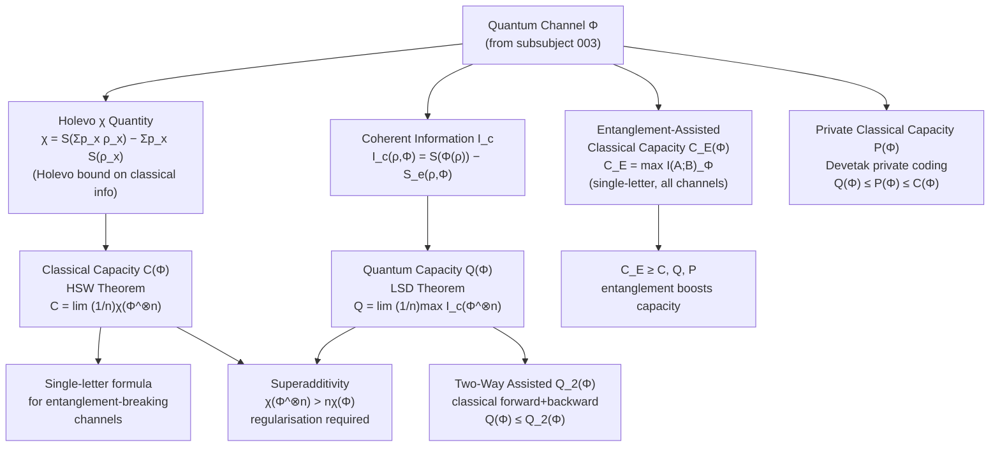

# QCSAA 900-909 · Section 00 · Subsection 904 · Subsubject 006 — Quantum Channel Capacity and Communication Limits

## 1. Purpose

Defines the **fundamental communication capacity limits of quantum channels** within the Q+ATLANTIDE QCSAA programme. Channel capacity theory determines the maximum rates at which classical or quantum information can be reliably transmitted over a quantum channel, with or without auxiliary resources such as entanglement or classical communication.

This subsubject covers the classical capacity via the Holevo–Schumacher–Westmoreland (HSW) theorem and the Holevo χ quantity, the quantum capacity via the Lloyd–Shor–Devetak (LSD) theorem and coherent information, the entanglement-assisted classical capacity (Bennett–Shor–Smolin–Thapliyal), the private classical capacity, superadditivity phenomena, and the regularisation problem that prevents closed-form single-letter capacity formulas in general. This follows Wilde[^wilde] and Watrous[^watrous] as primary references.

## 2. Scope

- Covers the *Quantum Channel Capacity and Communication Limits* subsubject (`006`) of subsection `904` *Quantum Information Theory* within section `00` *Fundamentos de Computación Cuántica*.
- Inherits Q-Division authority and ORB support from the parent row in [`../../README.md` §3](../../README.md#3-architecture-table)[^archtable].
- Concepts in scope:
  - **Holevo χ quantity** — χ({p_x, ρ_x}) = S(Σ_x p_x ρ_x) − Σ_x p_x S(ρ_x); upper bound on classical information extractable from a quantum ensemble.
  - **Classical capacity C(Φ)** — HSW theorem: C(Φ) = lim_{n→∞} (1/n) χ(Φ^⊗n); regularisation over tensor-power channels; single-letter formula for entanglement-breaking channels.
  - **Coherent information** — I_c(ρ,Φ) = S(Φ(ρ)) − S_e(ρ,Φ) where S_e is the entropy exchange; the building block of quantum capacity.
  - **Quantum capacity Q(Φ)** — LSD theorem: Q(Φ) = lim_{n→∞} (1/n) max_ρ I_c(ρ, Φ^⊗n); coherent information regularisation; zero-capacity channels and binding entanglement.
  - **Entanglement-assisted classical capacity C_E(Φ)** — C_E = max_ρ I(A;B)_Φ = max_ρ [S(ρ) + S(Φ(ρ)) − S_e(ρ,Φ)]; single-letter formula holds for all channels; doubling of classical capacity under entanglement assistance.
  - **Private classical capacity P(Φ)** — rate of private bits over a quantum channel; relation to quantum capacity Q(Φ) and the Devetak private coding theorem.
  - **Superadditivity and regularisation** — existence of channels where χ(Φ^⊗n) > nχ(Φ) (e.g., Hastings' example); channels where Q(Φ^⊗n) > nQ(Φ); hardness of computing regularised capacities.
  - **Two-way assisted capacities** — quantum capacity assisted by two-way classical communication Q_2(Φ); connection to distillable entanglement.
- Out of scope: specific quantum communication protocol designs (QCSAA `907`), hardware implementations of quantum links (QCSAA `901`), and no-go results that bound capacity (`007`).

## 3. Diagram — Quantum Channel Capacity Hierarchy

The following diagram shows the capacity hierarchy for a quantum channel Φ and the resource assumptions underlying each capacity.

## 4. Footprint

| Metric | Value |
|---|---|
| Architecture | `QCSAA` — Quantum Computing & Sentient Agency Architecture (controlled term) |
| Master range | `900–999` |
| Code range | `900-909` |
| Section | `00` — Fundamentos de Computación Cuántica |
| Subsection | `904` — Quantum Information Theory |
| Subsubject | `006` — Quantum Channel Capacity and Communication Limits |
| Primary Q-Division | Q-HORIZON[^qdiv] |
| Support Q-Divisions | Q-HPC, Q-DATAGOV |
| ORB support | ORB-PMO, ORB-LEG |
| Governance class | `restricted`[^gov] |
| Folder path | `Q+ATLANTIDE/900-999_QCSAA/900-909_Fundamentos-de-Computacion-Cuantica/904_Quantum-Information-Theory/` |
| Document | `006_Quantum-Channel-Capacity-and-Communication-Limits.md` (this file) |
| Parent subsection | [`../README.md`](../README.md) · [`../000_Overview.md`](../000_Overview.md) |
| Parent architecture | [`../../README.md`](../../README.md) |
| Parent baseline | [`organization/Q+ATLANTIDE.md`](../../../../organization/Q+ATLANTIDE.md) |

## 5. References & Citations

[^baseline]: **Q+ATLANTIDE controlled baseline (v1.0.0)** — [`organization/Q+ATLANTIDE.md`](../../../../organization/Q+ATLANTIDE.md). Defines the controlled `000-999` architecture-band taxonomy and the ATLAS-1000 register subpart.

[^archtable]: **§3 — Architecture Table (parent)** — [`../../README.md` §3](../../README.md#3-architecture-table). Authoritative source for the `900-909` row.

[^qdiv]: **Q-Division authority** — [`organization/Q-Divisions/`](../../../../organization/Q-Divisions/). Technical-authority units for the Q+ATLANTIDE baseline.

[^gov]: **Governance class** — `restricted` denotes documents requiring additional governance, evidence packages and access controls (rule N-006[^n006]).

[^n001]: **Note N-001** — Q+ATLANTIDE (with its ATLAS-1000 register subpart) is a taxonomy and traceability ecosystem, not an organization chart. See [`organization/Q+ATLANTIDE.md` §4](../../../../organization/Q+ATLANTIDE.md#4-notes).

[^n002]: **Note N-002** — Architecture bands classify technologies; Q-Divisions provide technical authority; ORB-Functions provide enterprise support. See [`organization/Q+ATLANTIDE.md` §4](../../../../organization/Q+ATLANTIDE.md#4-notes).

[^n006]: **Note N-006 (Restricted bands)** — Quantum-related (`900-999` QCSAA) bands require additional governance, evidence packages and access controls. See [`organization/Q+ATLANTIDE.md` §5.3](../../../../organization/Q+ATLANTIDE.md#53-restricted-band-templates-n-006).

[^wilde]: **Wilde, M.M. — "Quantum Information Theory"** (2nd ed., Cambridge University Press, 2017). Comprehensive treatment of quantum entropy, channel capacities, and coding theorems.

[^iso4879]: **ISO/IEC 4879:2023 — Quantum computing — Vocabulary** — Controlled terminology standard for quantum computing concepts used across Q+ATLANTIDE QCSAA artefacts.

[^watrous]: **Watrous, J. — "The Theory of Quantum Information"** (Cambridge University Press, 2018). Formal treatment of quantum states, measurements, channels, and information-theoretic quantities.

### Applicable industry standards

The following standards and foundational texts apply to this subsubject in addition to the cross-cutting Q+ATLANTIDE governance:

- ISO/IEC 4879:2023 — Quantum computing — Vocabulary[^iso4879]
- Wilde — Quantum Information Theory, 2nd ed. (Cambridge, 2017)[^wilde]
- Watrous — The Theory of Quantum Information (Cambridge, 2018)[^watrous]
