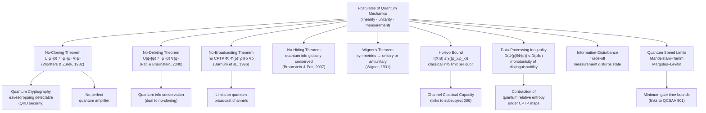

# QCSAA 900-909 · Section 00 · Subsection 904 · Subsubject 007 — No-Go Theorems and Information-Theoretic Boundaries

## 1. Purpose

Establishes the **fundamental no-go theorems and information-theoretic boundaries** of quantum mechanics within the Q+ATLANTIDE QCSAA programme. These results define the hard limits on what is and is not possible with quantum information — they are not implementation constraints but theoretical impossibilities derivable from the postulates of quantum mechanics.

No-go theorems constrain the design space for all quantum protocols, algorithms, and architectures addressed elsewhere in the QCSAA band. This subsubject covers the no-cloning theorem, no-deleting theorem, no-broadcasting theorem, no-hiding theorem, the Holevo bound, the data-processing inequality, quantum speed limits, Wigner's theorem, and the fundamental information-disturbance trade-off. Primary references are Nielsen & Chuang[^nc2000] and Preskill[^preskill].

## 2. Scope

- Covers the *No-Go Theorems and Information-Theoretic Boundaries* subsubject (`007`) of subsection `904` *Quantum Information Theory* within section `00` *Fundamentos de Computación Cuántica*.
- Inherits Q-Division authority and ORB support from the parent row in [`../../README.md` §3](../../README.md#3-architecture-table)[^archtable].
- Concepts in scope:
  - **No-cloning theorem** — there is no unitary operation U such that U|ψ⟩|0⟩ = |ψ⟩|ψ⟩ for all |ψ⟩; forbids perfect copying of unknown quantum states; prevents eavesdropping in QKD without detection.
  - **No-deleting theorem** — there is no unitary U such that U|ψ⟩|ψ⟩ = |ψ⟩|0⟩ for all |ψ⟩; asserts conservation of quantum information (quantum linearity forbids deletion).
  - **No-broadcasting theorem** — no completely positive map can broadcast an arbitrary mixed state ρ into two identical copies ρ ⊗ ρ; generalises no-cloning to mixed states.
  - **No-hiding theorem** — if quantum information is missing from a subsystem (e.g., bleached by a channel), it must reside in the correlations of the environment; quantum information is globally conserved.
  - **Holevo bound** — accessible classical information I(X;B) ≤ χ({p_x, ρ_x}) from a quantum ensemble; fundamental limit on classical information extractable per quantum state (links to subsubject `006`).
  - **Data-processing inequality** — quantum relative entropy D(ρ‖σ) is non-increasing under CPTP maps: D(Φ(ρ)‖Φ(σ)) ≤ D(ρ‖σ); monotonicity of distinguishability under quantum operations.
  - **Quantum speed limits** — Mandelstam–Tamm and Margolus–Levitin bounds on the minimum time for a quantum system to evolve between distinguishable states; lower bounds on gate operation times.
  - **Wigner's theorem** — every symmetry of quantum mechanics is represented by either a unitary or an antiunitary operator; foundational for the symmetry structure of quantum channels and measurements.
  - **Information-disturbance trade-off** — any measurement that extracts information about an unknown quantum state necessarily disturbs it; quantitative formulations via quantum Fisher information and entropic uncertainty relations.
- Out of scope: specific protocol attacks exploiting these limits (QCSAA `907`), error-correction schemes that work within these constraints (`005`), and capacity bounds that follow from the Holevo bound (`006`).

## 3. Diagram — No-Go Theorems and Their Implications

The following diagram shows the principal no-go theorems, their derivation basis, and the downstream implications for quantum information processing.

## 4. Footprint

| Metric | Value |
|---|---|
| Architecture | `QCSAA` — Quantum Computing & Sentient Agency Architecture (controlled term) |
| Master range | `900–999` |
| Code range | `900-909` |
| Section | `00` — Fundamentos de Computación Cuántica |
| Subsection | `904` — Quantum Information Theory |
| Subsubject | `007` — No-Go Theorems and Information-Theoretic Boundaries |
| Primary Q-Division | Q-HORIZON[^qdiv] |
| Support Q-Divisions | Q-HPC, Q-DATAGOV |
| ORB support | ORB-PMO, ORB-LEG |
| Governance class | `restricted`[^gov] |
| Folder path | `Q+ATLANTIDE/900-999_QCSAA/900-909_Fundamentos-de-Computacion-Cuantica/904_Quantum-Information-Theory/` |
| Document | `007_No-Go-Theorems-and-Information-Theoretic-Boundaries.md` (this file) |
| Parent subsection | [`../README.md`](../README.md) · [`../000_Overview.md`](../000_Overview.md) |
| Parent architecture | [`../../README.md`](../../README.md) |
| Parent baseline | [`organization/Q+ATLANTIDE.md`](../../../../organization/Q+ATLANTIDE.md) |

## 5. References & Citations

[^baseline]: **Q+ATLANTIDE controlled baseline (v1.0.0)** — [`organization/Q+ATLANTIDE.md`](../../../../organization/Q+ATLANTIDE.md). Defines the controlled `000-999` architecture-band taxonomy and the ATLAS-1000 register subpart.

[^archtable]: **§3 — Architecture Table (parent)** — [`../../README.md` §3](../../README.md#3-architecture-table). Authoritative source for the `900-909` row.

[^qdiv]: **Q-Division authority** — [`organization/Q-Divisions/`](../../../../organization/Q-Divisions/). Technical-authority units for the Q+ATLANTIDE baseline.

[^gov]: **Governance class** — `restricted` denotes documents requiring additional governance, evidence packages and access controls (rule N-006[^n006]).

[^n001]: **Note N-001** — Q+ATLANTIDE (with its ATLAS-1000 register subpart) is a taxonomy and traceability ecosystem, not an organization chart. See [`organization/Q+ATLANTIDE.md` §4](../../../../organization/Q+ATLANTIDE.md#4-notes).

[^n002]: **Note N-002** — Architecture bands classify technologies; Q-Divisions provide technical authority; ORB-Functions provide enterprise support. See [`organization/Q+ATLANTIDE.md` §4](../../../../organization/Q+ATLANTIDE.md#4-notes).

[^n006]: **Note N-006 (Restricted bands)** — Quantum-related (`900-999` QCSAA) bands require additional governance, evidence packages and access controls. See [`organization/Q+ATLANTIDE.md` §5.3](../../../../organization/Q+ATLANTIDE.md#53-restricted-band-templates-n-006).

[^nc2000]: **Nielsen, M.A. & Chuang, I.L. — "Quantum Computation and Quantum Information"** (Cambridge University Press, 2000). Canonical reference for quantum states, channels, entropy, entanglement, and information-theoretic bounds.

[^preskill]: **Preskill, J. — "Lecture Notes for Physics 219: Quantum Information and Computation"** (Caltech, 2018). Covers density operators, quantum channels, entanglement measures, and no-go theorems.

[^iso4879]: **ISO/IEC 4879:2023 — Quantum computing — Vocabulary** — Controlled terminology standard for quantum computing concepts used across Q+ATLANTIDE QCSAA artefacts.

[^watrous]: **Watrous, J. — "The Theory of Quantum Information"** (Cambridge University Press, 2018). Formal treatment of quantum states, measurements, channels, and information-theoretic quantities.

### Applicable industry standards

The following standards and foundational texts apply to this subsubject in addition to the cross-cutting Q+ATLANTIDE governance:

- ISO/IEC 4879:2023 — Quantum computing — Vocabulary[^iso4879]
- Nielsen & Chuang — Quantum Computation and Quantum Information (Cambridge, 2000)[^nc2000]
- Preskill — Lecture Notes for Physics 219 (Caltech, 2018)[^preskill]
- Watrous — The Theory of Quantum Information (Cambridge, 2018)[^watrous]
