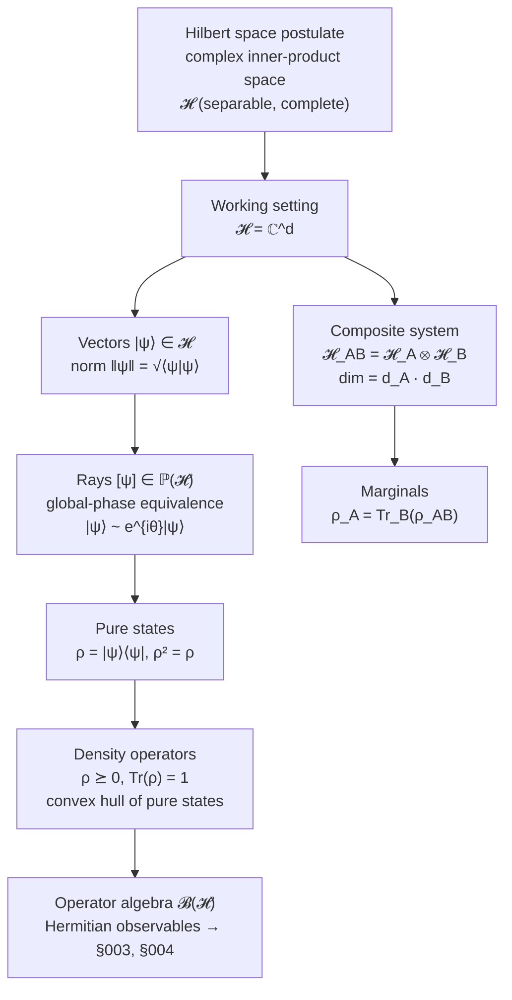

# QCSAA 900-909 · Section 00 · Subsection 904 · Subsubject 001 — Quantum State Space and Hilbert Formalism

## 1. Purpose

Establishes the **state-space postulate** of quantum mechanics for the foundational range, promoting the qubit-level Hilbert formalism introduced in [`../900_Qubits/001_Qubit-Definition-and-Mathematical-Formalism.md`](../900_Qubits/001_Qubit-Definition-and-Mathematical-Formalism.md) to the general statement that every isolated quantum system is associated with a complex separable Hilbert space $\mathcal{H}$, with physical states represented as *rays* in that space (equivalently, density operators on it). This subsubject is the foundational anchor cited by every downstream chapter of QCSAA (`910-979`) when it needs to reason about state, composition, or partial information without re-deriving the qubit-level definitions.

## 2. Scope

- Covers the *Quantum State Space and Hilbert Formalism* subsubject (`001`) of subsection `904` *Foundations* within section `00` *Fundamentos de Computación Cuántica*.
- Inherits Q-Division authority and ORB support from the parent row in [`../../README.md` §3](../../README.md#3-architecture-table)[^archtable].
- Concepts in scope:
  - **Hilbert space postulate** — complex inner-product space, completeness, separability; finite-dimensional case $\mathcal{H} = \mathbb{C}^d$ as the working setting for QCSAA.
  - **Inner product, norm, orthonormal bases** — Dirac bra–ket notation $\langle\phi|\psi\rangle$, basis expansion $|\psi\rangle = \sum_i c_i |i\rangle$, completeness relation $\sum_i |i\rangle\langle i| = \mathbb{I}$.
  - **State as ray, not vector** — global-phase equivalence $|\psi\rangle \sim e^{i\theta}|\psi\rangle$; projective Hilbert space $\mathbb{P}(\mathcal{H})$.
  - **Density operators** — positive semi-definite, trace-1 operators on $\mathcal{H}$; pure-state criterion $\rho^2 = \rho$; the convex set of states.
  - **Composite systems** — tensor product $\mathcal{H}_{AB} = \mathcal{H}_A \otimes \mathcal{H}_B$, dimension multiplicativity, partial trace as the marginal-state operation.
  - **Operators** — bounded linear operators $\mathcal{B}(\mathcal{H})$, Hermitian observables, positive operators, the operator algebra that supports §`003` and §`004`.
- Out of scope: dynamics (`003_`), measurement statistics (`004_`), no-go theorems on this state space (`005_`), and complexity-theoretic exploitation of the dimension $2^n$ (`006_`).

## 3. Diagram — State-Space Layering

## 4. Footprint

| Metric | Value |
|---|---|
| Architecture | `QCSAA` — Quantum Computing & Sentient Agency Architecture |
| Master range | `900–999` |
| Code range | `900-909` |
| Section | `00` — Fundamentos de Computación Cuántica |
| Subject | `00` — General Information |
| Subsection | `904` — Foundations |
| Subsubject | `001` — Quantum State Space and Hilbert Formalism |
| Primary Q-Division | Q-HORIZON[^qdiv] |
| Support Q-Divisions | Q-HPC, Q-DATAGOV |
| ORB support | ORB-PMO, ORB-LEG |
| Governance class | `restricted`[^gov] |
| Folder path | `Q+ATLANTIDE/900-999_QCSAA/900-909_Fundamentos-de-Computacion-Cuantica/904_foundations/` |
| Document | `001_Quantum-State-Space-and-Hilbert-Formalism.md` (this file) |
| Parent subsection | [`README.md`](./README.md) · [`000_Overview.md`](./000_Overview.md) |
| Parent architecture | [`../../README.md`](../../README.md) |
| Parent baseline | [`organization/Q+ATLANTIDE.md`](../../../../organization/Q+ATLANTIDE.md) |

## 5. References & Citations

[^baseline]: **Q+ATLANTIDE controlled baseline (v1.0.0)** — [`organization/Q+ATLANTIDE.md`](../../../../organization/Q+ATLANTIDE.md). Defines the controlled `000-999` architecture-band taxonomy and the ATLAS-1000 register subpart.

[^archtable]: **QCSAA §3 Architecture Table** — [`../../README.md` §3](../../README.md#3-architecture-table). Authoritative source for the `900-909` row (Section `00` — Fundamentos de Computación Cuántica, Primary Q-Division Q-HORIZON).

[^qdiv]: **Q-Division authority** — Q-Divisions provide technical authority over an architecture row (Q+ATLANTIDE Note N-002). See [`organization/Q+ATLANTIDE.md` §4](../../../../organization/Q+ATLANTIDE.md#4-notes).

[^gov]: **Governance class** — Bands are classified as `baseline` or `restricted` per Q+ATLANTIDE §4 governance rules.

[^ieeep7130]: **IEEE P7130 — Standard for Quantum Computing Definitions** — Vocabulary baseline for the quantum computing scope of QCSAA `900-999`.

[^s1000d]: **S1000D Issue 6.0 — International specification for technical publications** — Common Source DataBase (CSDB) and Data Module Code (DMC) specification used for all Q+ATLANTIDE artefacts.

[^as9100d]: **AS9100D — Quality Management Systems — Aviation, Space and Defense Organizations** — Quality-management baseline for all Q+ATLANTIDE deliverables.

### Applicable industry standards

The following standards apply to this subsubject in addition to the cross-cutting Q+ATLANTIDE governance:

- IEEE P7130 — Standard for Quantum Computing Definitions[^ieeep7130]
- S1000D Issue 6.0 — International specification for technical publications[^s1000d]
- AS9100D — Quality Management Systems — Aviation, Space and Defense Organizations[^as9100d]
