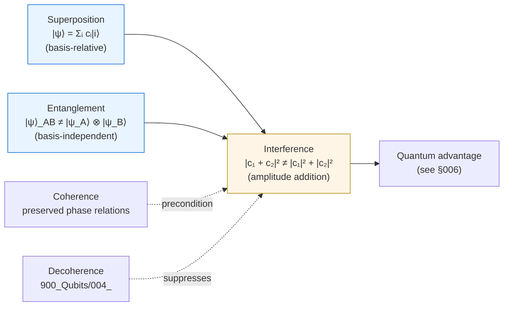

# QCSAA 900-909 · Section 00 · Subsection 904 · Subsubject 002 — Superposition, Entanglement and Interference

## 1. Purpose

Names and disambiguates the **three resource phenomena** of the Hilbert formalism (`001_`) on which every quantum advantage in QCSAA ultimately rests: **superposition** (linearity of state space), **entanglement** (non-separability of composite states), and **interference** (constructive/destructive amplitude combination under unitary evolution and projective measurement). This subsubject is the canonical reference for downstream chapters that need to characterise *why* a quantum protocol differs from its classical counterpart — and is paired with §`005_` (no-go theorems) to enforce the discipline of attributing advantage only to phenomena that actually carry it.

## 2. Scope

- Covers the *Superposition, Entanglement and Interference* subsubject (`002`) of subsection `904` *Foundations* within section `00` *Fundamentos de Computación Cuántica*.
- Inherits Q-Division authority and ORB support from the parent row in [`../../README.md` §3](../../README.md#3-architecture-table)[^archtable].
- Concepts in scope:
  - **Superposition** — linearity of $\mathcal{H}$: any normalised complex combination $|\psi\rangle = \sum_i c_i |i\rangle$ is itself a valid state. Superposition is a **basis-relative** statement (a superposition in one basis is a basis vector in another) and therefore is not, by itself, the source of quantum advantage.
  - **Entanglement** — a state $|\psi\rangle_{AB} \in \mathcal{H}_A \otimes \mathcal{H}_B$ is *separable* if it factors as $|\psi\rangle_A \otimes |\psi\rangle_B$; otherwise it is *entangled*. Operational signatures: violation of Bell-type inequalities, non-classical correlations, monogamy. Entanglement is **basis-independent** and therefore a genuine resource.
  - **Interference** — coherent combination of probability amplitudes ($|c_1 + c_2|^2$, not $|c_1|^2 + |c_2|^2$): the mechanism by which superposition is *converted* into computational advantage by gate sequences and measurement.
  - **Coherence as the precondition** — interference requires phase relationships preserved across the evolution; decoherence (cf. [`../900_Qubits/004_Decoherence-Noise-and-Fidelity.md`](../900_Qubits/004_Decoherence-Noise-and-Fidelity.md)) suppresses interference and degrades the resource.
  - **Why this triad and not "superposition alone"** — overclaim discipline (cf. §`007_`): superposition without entanglement and without interference is reproducible by classical sampling; the joint structure is what is non-classical.
- Out of scope: dynamics that *produce* these phenomena (`003_`), measurement statistics that *read out* them (`004_`), and complexity-theoretic exploitation (`006_`).

## 3. Diagram — Resource Triad and the Advantage Pathway

## 4. Footprint

| Metric | Value |
|---|---|
| Architecture | `QCSAA` — Quantum Computing & Sentient Agency Architecture |
| Master range | `900–999` |
| Code range | `900-909` |
| Section | `00` — Fundamentos de Computación Cuántica |
| Subject | `00` — General Information |
| Subsection | `904` — Foundations |
| Subsubject | `002` — Superposition, Entanglement and Interference |
| Primary Q-Division | Q-HORIZON[^qdiv] |
| Support Q-Divisions | Q-HPC, Q-DATAGOV |
| ORB support | ORB-PMO, ORB-LEG |
| Governance class | `restricted`[^gov] |
| Folder path | `Q+ATLANTIDE/900-999_QCSAA/900-909_Fundamentos-de-Computacion-Cuantica/904_foundations/` |
| Document | `002_Superposition-Entanglement-and-Interference.md` (this file) |
| Parent subsection | [`README.md`](./README.md) · [`000_Overview.md`](./000_Overview.md) |
| Parent architecture | [`../../README.md`](../../README.md) |
| Parent baseline | [`organization/Q+ATLANTIDE.md`](../../../../organization/Q+ATLANTIDE.md) |

## 5. References & Citations

[^baseline]: **Q+ATLANTIDE controlled baseline (v1.0.0)** — [`organization/Q+ATLANTIDE.md`](../../../../organization/Q+ATLANTIDE.md). Defines the controlled `000-999` architecture-band taxonomy and the ATLAS-1000 register subpart.

[^archtable]: **QCSAA §3 Architecture Table** — [`../../README.md` §3](../../README.md#3-architecture-table). Authoritative source for the `900-909` row (Section `00` — Fundamentos de Computación Cuántica, Primary Q-Division Q-HORIZON).

[^qdiv]: **Q-Division authority** — Q-Divisions provide technical authority over an architecture row (Q+ATLANTIDE Note N-002). See [`organization/Q+ATLANTIDE.md` §4](../../../../organization/Q+ATLANTIDE.md#4-notes).

[^gov]: **Governance class** — Bands are classified as `baseline` or `restricted` per Q+ATLANTIDE §4 governance rules.

[^ieeep7130]: **IEEE P7130 — Standard for Quantum Computing Definitions** — Vocabulary baseline for the quantum computing scope of QCSAA `900-999`.

[^s1000d]: **S1000D Issue 6.0 — International specification for technical publications** — Common Source DataBase (CSDB) and Data Module Code (DMC) specification used for all Q+ATLANTIDE artefacts.

[^as9100d]: **AS9100D — Quality Management Systems — Aviation, Space and Defense Organizations** — Quality-management baseline for all Q+ATLANTIDE deliverables.

### Applicable industry standards

The following standards apply to this subsubject in addition to the cross-cutting Q+ATLANTIDE governance:

- IEEE P7130 — Standard for Quantum Computing Definitions[^ieeep7130]
- S1000D Issue 6.0 — International specification for technical publications[^s1000d]
- AS9100D — Quality Management Systems — Aviation, Space and Defense Organizations[^as9100d]
