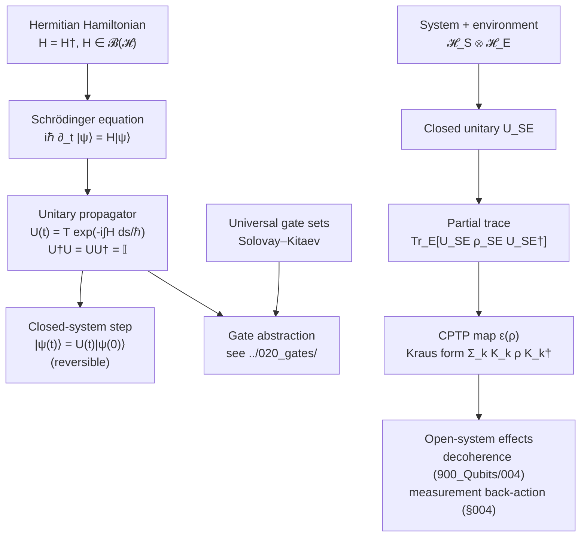

# QCSAA 900-909 · Section 00 · Subsection 904 · Subsubject 003 — Unitary Evolution and Operators

## 1. Purpose

States the **dynamical postulate** of quantum mechanics — that the closed-system evolution of states in $\mathcal{H}$ is given by a one-parameter unitary group generated by a Hermitian Hamiltonian — and connects it to the gate-level abstraction defined in [`../020_gates/`](../020_gates/). This subsubject is the foundational reason why quantum gates are *unitary*, why they are *reversible*, and why open-system dynamics (decoherence, measurement) require the more general CPTP map formalism rather than the unitary postulate alone.

## 2. Scope

- Covers the *Unitary Evolution and Operators* subsubject (`003`) of subsection `904` *Foundations* within section `00` *Fundamentos de Computación Cuántica*.
- Inherits Q-Division authority and ORB support from the parent row in [`../../README.md` §3](../../README.md#3-architecture-table)[^archtable].
- Concepts in scope:
  - **Schrödinger equation** $i\hbar\,\partial_t|\psi(t)\rangle = H|\psi(t)\rangle$ for Hermitian $H$ on $\mathcal{H}$; equivalent von Neumann form $i\hbar\,\partial_t \rho = [H, \rho]$ for density operators.
  - **Unitary propagator** $U(t,t_0) = T\exp\!\left(-\tfrac{i}{\hbar}\int_{t_0}^{t} H(s)\,\mathrm{d}s\right)$; group properties $U^{\dagger}U = U U^{\dagger} = \mathbb{I}$, $U(t_2,t_0) = U(t_2,t_1)\,U(t_1,t_0)$.
  - **Reversibility** — every closed-system step has a unique inverse, in contrast to the irreversible classical Boolean gates (AND, OR). Reversible classical computation (Toffoli, Fredkin) is the embedding bridge.
  - **Operator algebra essentials** — Hermitian observables, normal operators, spectral decomposition $A = \sum_k \lambda_k P_k$, functional calculus $f(A) = \sum_k f(\lambda_k) P_k$, commutators $[A,B]$ and the role of non-commuting observables.
  - **Composition and locality** — tensor-product unitaries $U_A \otimes U_B$ for product evolutions; the Solovay–Kitaev theorem and universal gate sets (cf. [`../020_gates/904_Universal-Gate-Sets-and-Decomposition.md`](../020_gates/904_Universal-Gate-Sets-and-Decomposition.md)) showing that every $U \in \mathrm{U}(2^n)$ admits an efficient finite-gate approximation.
  - **Open-system bridge** — when the system is not isolated, the closed-system unitary on $\mathcal{H}_{SE}$ followed by partial trace yields a **completely positive trace-preserving (CPTP)** map on $\mathcal{H}_S$ (Stinespring/Kraus form). Decoherence, noise channels and measurement back-action all live here, not in the unitary postulate.
- Out of scope: the measurement postulate proper (`004_`), the no-go theorems that follow from unitarity (`005_`), and complexity-class implications (`006_`).

## 3. Diagram — Closed-System Dynamics and the CPTP Bridge

## 4. Footprint

| Metric | Value |
|---|---|
| Architecture | `QCSAA` — Quantum Computing & Sentient Agency Architecture |
| Master range | `900–999` |
| Code range | `900-909` |
| Section | `00` — Fundamentos de Computación Cuántica |
| Subject | `00` — General Information |
| Subsection | `904` — Foundations |
| Subsubject | `003` — Unitary Evolution and Operators |
| Primary Q-Division | Q-HORIZON[^qdiv] |
| Support Q-Divisions | Q-HPC, Q-DATAGOV |
| ORB support | ORB-PMO, ORB-LEG |
| Governance class | `restricted`[^gov] |
| Folder path | `Q+ATLANTIDE/900-999_QCSAA/900-909_Fundamentos-de-Computacion-Cuantica/904_foundations/` |
| Document | `003_Unitary-Evolution-and-Operators.md` (this file) |
| Parent subsection | [`README.md`](./README.md) · [`000_Overview.md`](./000_Overview.md) |
| Parent architecture | [`../../README.md`](../../README.md) |
| Parent baseline | [`organization/Q+ATLANTIDE.md`](../../../../organization/Q+ATLANTIDE.md) |

## 5. References & Citations

[^baseline]: **Q+ATLANTIDE controlled baseline (v1.0.0)** — [`organization/Q+ATLANTIDE.md`](../../../../organization/Q+ATLANTIDE.md). Defines the controlled `000-999` architecture-band taxonomy and the ATLAS-1000 register subpart.

[^archtable]: **QCSAA §3 Architecture Table** — [`../../README.md` §3](../../README.md#3-architecture-table). Authoritative source for the `900-909` row (Section `00` — Fundamentos de Computación Cuántica, Primary Q-Division Q-HORIZON).

[^qdiv]: **Q-Division authority** — Q-Divisions provide technical authority over an architecture row (Q+ATLANTIDE Note N-002). See [`organization/Q+ATLANTIDE.md` §4](../../../../organization/Q+ATLANTIDE.md#4-notes).

[^gov]: **Governance class** — Bands are classified as `baseline` or `restricted` per Q+ATLANTIDE §4 governance rules.

[^ieeep7130]: **IEEE P7130 — Standard for Quantum Computing Definitions** — Vocabulary baseline for the quantum computing scope of QCSAA `900-999`.

[^s1000d]: **S1000D Issue 6.0 — International specification for technical publications** — Common Source DataBase (CSDB) and Data Module Code (DMC) specification used for all Q+ATLANTIDE artefacts.

[^as9100d]: **AS9100D — Quality Management Systems — Aviation, Space and Defense Organizations** — Quality-management baseline for all Q+ATLANTIDE deliverables.

### Applicable industry standards

The following standards apply to this subsubject in addition to the cross-cutting Q+ATLANTIDE governance:

- IEEE P7130 — Standard for Quantum Computing Definitions[^ieeep7130]
- S1000D Issue 6.0 — International specification for technical publications[^s1000d]
- AS9100D — Quality Management Systems — Aviation, Space and Defense Organizations[^as9100d]
