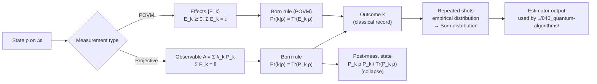

# QCSAA 900-909 · Section 00 · Subsection 904 · Subsubject 004 — Measurement Postulates and Probability

## 1. Purpose

States the **measurement postulates** of quantum mechanics — the Born rule, the projection postulate (and its POVM generalisation), and the resulting classical-record probability distribution — and connects them to the readout discipline used by gates, circuits and algorithms upstream. This subsubject is the foundational reference for every QCSAA chapter that produces a *number* from a quantum experiment, and is the natural pair to §`003_` (which describes the deterministic, reversible part of the dynamics) and §`005_` (which uses the measurement postulates to derive the no-go theorems).

## 2. Scope

- Covers the *Measurement Postulates and Probability* subsubject (`004`) of subsection `904` *Foundations* within section `00` *Fundamentos de Computación Cuántica*.
- Inherits Q-Division authority and ORB support from the parent row in [`../../README.md` §3](../../README.md#3-architecture-table)[^archtable].
- Concepts in scope:
  - **Projective (von Neumann) measurement** — observable $A = \sum_k \lambda_k P_k$ with orthogonal projectors $P_k$, completeness $\sum_k P_k = \mathbb{I}$.
  - **Born rule** — $\Pr(k\,|\,\rho) = \mathrm{Tr}(P_k\,\rho)$ for density operator $\rho$; pure-state form $\Pr(k\,|\,\psi) = \langle\psi|P_k|\psi\rangle = \|P_k|\psi\rangle\|^2$.
  - **Projection (collapse) postulate** — post-measurement state $\rho \mapsto P_k\,\rho\,P_k / \mathrm{Tr}(P_k\,\rho)$ conditioned on outcome $k$.
  - **POVM generalisation** — set $\{E_k\}$ of positive operators with $\sum_k E_k = \mathbb{I}$; $\Pr(k\,|\,\rho) = \mathrm{Tr}(E_k\,\rho)$. Naimark dilation embedding into a projective measurement on a larger space.
  - **Repeated measurement and statistics** — the empirical distribution converges to the Born distribution; finite-shot estimation, sample complexity, and concentration bounds (Hoeffding, Chernoff) for circuit estimators.
  - **Compatible vs incompatible observables** — commuting observables $[A, B] = 0$ admit a joint distribution; non-commuting observables obey uncertainty relations (Robertson–Schrödinger).
  - **Mid-circuit measurement** — the circuit-level realisation of the postulate, with classical control and feedforward (cf. [`../030_circuits/903_Measurement-Mid-Circuit-and-Classical-Control.md`](../030_circuits/903_Measurement-Mid-Circuit-and-Classical-Control.md)).
- Out of scope: the algorithmic exploitation of measurement statistics (`../040_quantum-algorithms/`), and the no-go theorems derived from these postulates (`005_`).

## 3. Diagram — From State to Classical Record

## 4. Footprint

| Metric | Value |
|---|---|
| Architecture | `QCSAA` — Quantum Computing & Sentient Agency Architecture |
| Master range | `900–999` |
| Code range | `900-909` |
| Section | `00` — Fundamentos de Computación Cuántica |
| Subject | `00` — General Information |
| Subsection | `904` — Foundations |
| Subsubject | `004` — Measurement Postulates and Probability |
| Primary Q-Division | Q-HORIZON[^qdiv] |
| Support Q-Divisions | Q-HPC, Q-DATAGOV |
| ORB support | ORB-PMO, ORB-LEG |
| Governance class | `restricted`[^gov] |
| Folder path | `Q+ATLANTIDE/900-999_QCSAA/900-909_Fundamentos-de-Computacion-Cuantica/904_foundations/` |
| Document | `004_Measurement-Postulates-and-Probability.md` (this file) |
| Parent subsection | [`README.md`](./README.md) · [`000_Overview.md`](./000_Overview.md) |
| Parent architecture | [`../../README.md`](../../README.md) |
| Parent baseline | [`organization/Q+ATLANTIDE.md`](../../../../organization/Q+ATLANTIDE.md) |

## 5. References & Citations

[^baseline]: **Q+ATLANTIDE controlled baseline (v1.0.0)** — [`organization/Q+ATLANTIDE.md`](../../../../organization/Q+ATLANTIDE.md). Defines the controlled `000-999` architecture-band taxonomy and the ATLAS-1000 register subpart.

[^archtable]: **QCSAA §3 Architecture Table** — [`../../README.md` §3](../../README.md#3-architecture-table). Authoritative source for the `900-909` row (Section `00` — Fundamentos de Computación Cuántica, Primary Q-Division Q-HORIZON).

[^qdiv]: **Q-Division authority** — Q-Divisions provide technical authority over an architecture row (Q+ATLANTIDE Note N-002). See [`organization/Q+ATLANTIDE.md` §4](../../../../organization/Q+ATLANTIDE.md#4-notes).

[^gov]: **Governance class** — Bands are classified as `baseline` or `restricted` per Q+ATLANTIDE §4 governance rules.

[^ieeep7130]: **IEEE P7130 — Standard for Quantum Computing Definitions** — Vocabulary baseline for the quantum computing scope of QCSAA `900-999`.

[^s1000d]: **S1000D Issue 6.0 — International specification for technical publications** — Common Source DataBase (CSDB) and Data Module Code (DMC) specification used for all Q+ATLANTIDE artefacts.

[^as9100d]: **AS9100D — Quality Management Systems — Aviation, Space and Defense Organizations** — Quality-management baseline for all Q+ATLANTIDE deliverables.

### Applicable industry standards

The following standards apply to this subsubject in addition to the cross-cutting Q+ATLANTIDE governance:

- IEEE P7130 — Standard for Quantum Computing Definitions[^ieeep7130]
- S1000D Issue 6.0 — International specification for technical publications[^s1000d]
- AS9100D — Quality Management Systems — Aviation, Space and Defense Organizations[^as9100d]
